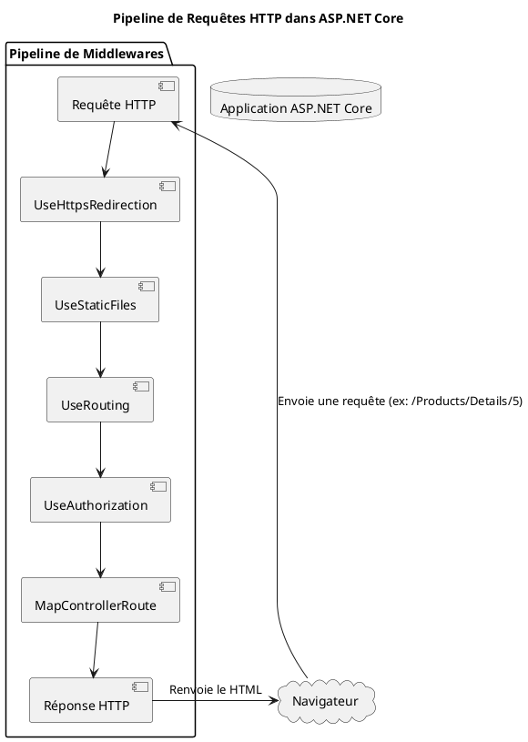
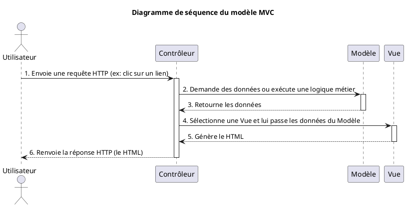
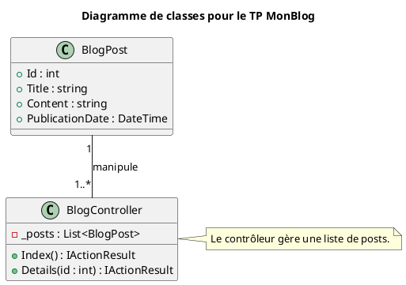

# Module 1 : Introduction et Fondamentaux d'ASP.NET Core - L'essentiel

### Objectifs Pédagogiques

À la fin de ce module, vous serez capable de :

* **Comprendre** l'écosystème .NET et ses avantages.
* **Distinguer** .NET Framework de la version moderne .NET (.NET Core et successeurs).
* **Créer** votre première application web avec le modèle MVC.
* **Analyser** la structure d'un projet ASP.NET Core.
* **Expliquer** le concept de pipeline de requêtes et le rôle des middlewares.
* **Maîtriser** le patron de conception MVC (Modèle-Vue-Contrôleur).

### Introduction : Pourquoi ASP.NET Core est incontournable ?

Imaginez que vous souhaitiez construire une maison. Vous pourriez partir de zéro, couper les arbres, fabriquer les
briques... ou vous pourriez utiliser un kit de construction moderne, avec des plans clairs, des matériaux préfabriqués
de haute qualité et des outils performants. Ce kit vous permettrait de bâtir plus vite une maison solide, sécurisée et
évolutive.

**ASP.NET Core est ce kit de construction pour les applications web.** C'est un framework puissant, open-source et
multiplateforme, soutenu par Microsoft et une immense communauté. Apprendre à l'utiliser, c'est se donner les moyens de
construire des applications web et des API performantes, des plus simples aux plus complexes, qui peuvent fonctionner
sur Windows, macOS ou Linux. C'est un choix stratégique pour votre carrière de développeur.

---

### 1. Le Framework .NET et ASP.NET Core : Un peu d'histoire

Vous avez déjà entendu parler de .NET, mais savez-vous ce qui se cache vraiment derrière ce nom ? Et pourquoi parle-t-on
de ".NET Core" ou de ".NET 8" plutôt que de ".NET Framework 4.8" ?

Pensez à l'évolution des voitures. Au début, il y avait des voitures robustes mais conçues pour un seul type de route et
de carburant, et souvent pour un seul pays. C'était **.NET Framework** : puissant, mais principalement lié à
l'écosystème Windows.

Puis sont arrivées les voitures modernes : plus légères, plus rapides, capables de rouler sur n'importe quelle route (
Windows, macOS, Linux), et beaucoup plus efficaces. C'est **.NET Core** (maintenant simplement appelé **.NET**). C'est
la refonte moderne, open-source et performante qui a tout changé.

ASP.NET Core est la partie de ce framework moderne dédiée à la construction d'applications web. Il unifie ce qui était
autrefois séparé :

<tabs>
<tab title="ASP.NET MVC (sur .NET Framework)">
    <strong>L'Ancien Monde :</strong>
    <ul>
        <li>Exclusif à Windows et au serveur web IIS.</li>
        <li>Framework "lourd" et monolithique.</li>
        <li>Performances en retrait par rapport aux standards modernes.</li>
        <li>Projets distincts pour les sites web (MVC) et les APIs (Web API).</li>
    </ul>
</tab>
<tab title="ASP.NET Core (sur .NET)">
    <strong>Le Présent et l'Avenir :</strong>
    <ul>
        <li><strong>Multiplateforme :</strong> Développez et déployez sur Windows, macOS, Linux.</li>
        <li><strong>Haute performance :</strong> Un des frameworks web les plus rapides du marché.</li>
        <li><strong>Modulaire et léger :</strong> Vous n'embarquez que ce dont vous avez besoin.</li>
        <li><strong>Unifié :</strong> Un seul framework pour créer des applications web (MVC, Razor Pages) et des APIs RESTful.</li>
        <li><strong>Open Source :</strong> Le code est sur GitHub, la communauté est très active.</li>
    </ul>
</tab>
</tabs>

**L'outillage du développeur .NET**

Pour travailler, vous aurez besoin :

* **Du SDK .NET :** Le kit de développement logiciel qui contient tout le nécessaire pour compiler et exécuter vos
  applications.
* **D'un éditeur de code ou IDE :**
    * **Visual Studio 2022 (Community est gratuit) :** L'IDE historique et le plus complet pour .NET.
    * **JetBrains Rider :** Une alternative payante très puissante et multiplateforme.
    * **Visual Studio Code :** Un éditeur de code léger et gratuit, avec d'excellentes extensions C# et .NET.
* **De la ligne de commande (CLI) `dotnet` :** Un outil formidable pour créer, construire, tester et publier vos projets
  sans dépendre d'un IDE.

---

### 2. Votre Première Application : "Hello, World!" nouvelle génération

Comment passer d'une page blanche à une application web fonctionnelle en quelques secondes ? Grâce aux modèles de projet
fournis par le CLI `dotnet`. C'est comme un kit de démarrage LEGO : les pièces de base et le plan sont déjà là, il ne
vous reste plus qu'à construire dessus.

<procedure title="Création de votre première application MVC">
<step>
    <p>Ouvrez un terminal ou une invite de commande.</p>
</step>
<step>
    <p>Créez un nouveau répertoire pour votre projet et naviguez à l'intérieur :</p>

    ```bash
    mkdir MonAppMvc
    cd MonAppMvc
    ```

</step>
<step>
    <p>Utilisez la commande magique du CLI <code>dotnet</code> pour créer un nouveau projet basé sur le modèle MVC :</p>

    ```bash
    dotnet new mvc
    ```
    <tip>
    Le CLI va générer tous les fichiers et la structure de base pour vous. C'est un gain de temps énorme !
    </tip>

</step>
<step>
    <p>Lancez votre application :</p>

    ```bash
    dotnet run
    ```

</step>
<step>
    <p>Ouvrez votre navigateur et allez à l'adresse indiquée dans le terminal (généralement <code>https://localhost:7xxx</code>). Félicitations, votre première application ASP.NET Core est en ligne !</p>
</step>
</procedure>

#### Analyse de la structure du projet

En ouvrant le dossier `MonAppMvc`, vous découvrirez une organisation très logique :

* `Program.cs` : Le cœur de votre application. C'est le point d'entrée, là où tout est configuré.
* `Controllers/` : Le dossier des "chefs d'orchestre". Chaque fichier ici gère un pan de votre application.
* `Views/` : Le dossier de la "présentation". C'est ici que se trouvent les fichiers HTML (avec une touche de C#) qui
  seront affichés à l'utilisateur.
* `Models/` : Le dossier des "données". Il contient les classes qui représentent les informations que votre application
  manipule.
* `wwwroot/` : Le seul dossier publiquement accessible. On y place les fichiers statiques : CSS, JavaScript, images,
  etc.
* `appsettings.json` : Le fichier de configuration de votre application (chaînes de connexion, paramètres, etc.).

#### Kestrel : Votre serveur web intégré

Quand vous lancez `dotnet run`, qui sert réellement les pages web ? C'est **Kestrel**. Kestrel est un serveur web
ultra-rapide et multiplateforme intégré à ASP.NET Core. Pensez à lui comme un portier efficace et discret qui accueille
chaque visiteur (requête HTTP) et le dirige à l'intérieur de votre application.

---

### 3. Au cœur du réacteur : Le Pipeline de Requêtes et les Middlewares

Maintenant que l'application tourne, que se passe-t-il exactement lorsqu'une requête HTTP arrive de votre navigateur ?

Imaginez une chaîne de montage dans une usine. Une pièce brute (la requête HTTP) entre d'un côté. Elle passe ensuite par
plusieurs postes de travail, où chaque ouvrier (un **middleware**) effectue une tâche spécifique : l'un la nettoie,
l'autre ajoute un composant, un troisième la vérifie, etc. À la fin, le produit fini (la réponse HTTP) sort de la
chaîne.

Le pipeline de requêtes d'ASP.NET Core fonctionne exactement comme ça. Il est défini dans le fichier `Program.cs`.

```c#
// Program.cs

var builder = WebApplication.CreateBuilder(args);

// Étape 1 : Configuration des services (les outils disponibles pour l'usine)
builder.Services.AddControllersWithViews();

var app = builder.Build();

// Étape 2 : Configuration du pipeline (la chaîne de montage)
if (!app.Environment.IsDevelopment())
{
    app.UseExceptionHandler("/Home/Error");
    // Empêche la navigateur d'utiliser HTTP, à n'utiliser qu'en production
    // Cette contrainte est persistante et vaut pour le domaine entier
    app.UseHsts();
}

app.UseHttpsRedirection(); // Middleware 1 : Redirige HTTP vers HTTPS
app.UseStaticFiles();      // Middleware 2 : Sert les fichiers de wwwroot/

app.UseRouting();          // Middleware 3 : Détermine quelle route utiliser

app.UseAuthorization();    // Middleware 4 : Vérifie les autorisations

// Middleware 5 : Exécute le point de terminaison trouvé par le routage
app.MapControllerRoute(
    name: "default",
    pattern: "{controller=Home}/{action=Index}/{id?}");

app.Run();
```

<tip>
**L'ordre des middlewares est crucial !** Par exemple, `UseRouting` doit venir avant `UseAuthorization`, car on doit savoir quelle route est visée avant de pouvoir en vérifier les permissions.
</tip>


Voici une visualisation de ce pipeline :



<warning title="ATTENTION">

<h1>Pourquoi éviter UseHsts() en développement ?</h1>

Le HSTS (**HTTP Strict Transport Security**) est un mécanisme de sécurité qui ordonne au navigateur de ne communiquer
avec un site qu'en utilisant uniquement le protocole **HTTPS**.

Bien que ce soit indispensable en production, l'activer dans votre environnement de développement local peut causer
plusieurs problèmes majeurs.

<h4>La persistance dans le navigateur</h4>

Le HSTS n'est pas une simple redirection temporaire. C'est une instruction que le navigateur **enregistre dans son cache
interne** pour une durée souvent très longue (généralement 1 an via le paramètre `max-age`).

Une fois que votre navigateur a reçu cette instruction pour `localhost` :

* Il refusera toute connexion en simple HTTP.
* Vous ne pourrez plus tester votre application sans certificat SSL valide, même si vous en avez besoin pour un débogage
  spécifique.

<h4>La pollution de "localhost"</h4>

Le HSTS s'applique au **domaine**. Comme la plupart de vos projets de développement utilisent `localhost`, si vous
activez le HSTS sur un seul de vos projets :

* **Tous vos autres projets** (qu'ils soient en .NET, Node.js, PHP, etc.) tournant sur `localhost` seront également
  forcés de passer en HTTPS.
* Si l'un de ces projets ne possède pas de certificat SSL configuré, vous ne pourrez plus y accéder, créant des erreurs
  de connexion difficiles à diagnostiquer.

<h4>La difficulté de suppression</h4>

Contrairement au cache classique ou aux cookies, le HSTS ne s'efface pas facilement. Pour supprimer une entrée HSTS sur
`localhost`, vous devez :

1. Aller dans les menus cachés du navigateur (ex: `chrome://net-internals/#hsts`).
2. Rechercher manuellement le domaine à supprimer.
   Cela rend le dépannage fastidieux pour vous et pour les autres développeurs de votre équipe.

<h4>Le risque de blocage définitif (Certificats auto-signés)</h4>

En développement, nous utilisons souvent des certificats auto-signés. Si le HSTS est actif et que votre certificat local
expire ou devient invalide, certains navigateurs bloquent totalement l'accès au site **sans proposer le bouton "Ignorer
le risque et continuer"**, car le HSTS interdit toute exception de sécurité.

---

<h4>Bonne pratique</h4>

Laissez toujours `app.UseHsts()` à l'intérieur de la condition de vérification de l'environnement :

```c#
if (!app.Environment.IsDevelopment())
{
    // Uniquement en production
    app.UseHsts();
}
```

En développement, contentez-vous de **`app.UseHttpsRedirection()`**, qui redirige le flux vers le HTTPS sans envoyer
l'en-tête de restriction permanente au navigateur.

</warning>

---

### 4. Le Modèle MVC : Organiser pour mieux régner

Pourquoi les dossiers `Controllers`, `Views` et `Models` ? Parce qu'ils sont la base du patron de conception **MVC (
Modèle-Vue-Contrôleur)**, une manière incroyablement efficace d'organiser le code d'une application web.

Pensez à un restaurant :

* **Le Modèle (Model)** : C'est la cuisine. Elle contient les ingrédients (données brutes) et les recettes (logique
  métier) pour préparer les plats. Le modèle ne se soucie pas de la présentation, seulement de la qualité et de la
  cohérence des plats. En code, ce sont vos classes C# (ex: `Product`, `User`).
* **La Vue (View)** : C'est la présentation du plat à table. L'assiette, la disposition des aliments, la décoration...
  La vue se charge de rendre le plat appétissant pour le client (l'utilisateur). Elle reçoit les données du modèle et
  les affiche. En code, ce sont vos fichiers `.cshtml`.
* **Le Contrôleur (Controller)** : C'est le serveur. Il prend la commande du client (la requête HTTP), la transmet à la
  cuisine (le modèle), récupère le plat préparé, et choisit comment le présenter au client (choisit la bonne vue). Il
  est le chef d'orchestre. En code, ce sont vos classes dans le dossier `Controllers/`.

Cette séparation des responsabilités rend votre code :

* **Plus facile à maintenir :** Changer l'apparence (Vue) n'impacte pas la logique métier (Modèle).
* **Plus facile à tester :** Vous pouvez tester votre logique métier indépendamment de l'interface utilisateur.
* **Plus facile à comprendre :** Chacun sait où trouver le code dont il a besoin.



#### Un exemple de MVC avec ASP.NETE Core

##### Le modèle

Ici, il s'agit d'une classe très simple qui ne fait que recevoir les données.

```c#
// Models/Person.cs
namespace MyApp.Models;

public classe Person(
    public string Name { get; set; },
    public string FirstName { get; set; },
    public string Job { get; set; }
);
```

Nous pourrions encore simplifier en utilisant un `Record`. Il s'agit d'une classe spécialisée qui possède les
caractéristiques suivantes :

- Immutable (on ne peut modifier les valeurs après l'initialisation)
- L'égalité s'effectue sur les valeurs et non sur les références à l'adresse mémoire
- Il est possible créer une copie d'un record avec `with` pour obtenir un nouveau record basé sur le premier.

```c#
// Copie de original en changeant une valeur
var updated = original with { Job = "Physicist" };
```

- Possède une implémentation automatique des méthodes suivantes : Equals, getHashCode, ToString

```c#
// Models/Person.cs
namespace MyApp.Models;

// Record = pratique pour un "data model" simple (immutable)
// (tu peux aussi faire une class classique)
public record Person(
    string Name,
    string FirstName,
    string Job
);
```

#### Le contrôleur

Le contrôleur est le chef d'orchestre, il travaille avec le modèle et envoie les données à la vue

```c#
// Controllers/PeopleController

using Microsoft.AspNetCore.Mvc;
using MyApp.Models;

namespace MyApp.Controllers;

public class PeopleController : Controller
{
    // Tableau statique : "base de données" en mémoire
    private static readonly Person[] People =
    [
        new Person("Curie", "Marie", "Physicist"),
        new Person("Turing", "Alan", "Mathematician"),
        new Person("Hopper", "Grace", "Computer scientist")
    ];

    // GET: /People
    public IActionResult Index()
    {
        return View(People);
    }

    // GET: /People/Details/0
    public IActionResult Details(int id)
    {
        if (id < 0 || id >= People.Length)
        {
            return NotFound();
        }

        Person person = People[id];
        return View(person);
    }
}
```

#### Les vues

```c#
// Views/People/Index.cshtml

@model MyApp.Models.Person[]

<h1>People</h1>

<ul>
@for (int i = 0; i < Model.Length; i++)
{
    var p = Model[i];
    <li>
        <a asp-controller="People"
           asp-action="Details"
           asp-route-id="@i">
            @p.FirstName @p.Name
        </a>
        — @p.Job
    </li>
}
</ul>

```

##### Explications

- `@model MyApp.Models.Person[]` : la vue attend un tableau.

- On boucle avec for pour avoir l’index i (qui sert d’id).

- Le lien utilise les Tag Helpers :

    - `asp-controller="People"` : le contrôleur
    - `asp-action="Details"` : la méthode ou action
    - `asp-route-id="@i"` : l'argument de l'action (paramètre de la route)

    - → génère une URL type `/People/Details/1`.

```c#
Views/People/Details.cshtml

@model MyApp.Models.Person

<h1>Person details</h1>

<p><strong>First name:</strong> @Model.FirstName</p>
<p><strong>Name:</strong> @Model.Name</p>
<p><strong>Job:</strong> @Model.Job</p>

<p>
    <a asp-controller="People" asp-action="Index">
        Back to list
    </a>
</p>

```

#### L'aiguillage (routing)

Dans `Program.cs`, il faut s'assurer que ce schéma de route est bien référencé.

```c#
app.MapControllerRoute(
    name: "default",
    pattern: "{controller=Home}/{action=Index}/{id?}"
);
```

#### Comment s'effectue le lien entre le contrôleur et la vue ?

Dans ce contrôleur, on ne fait que `return View(data)` sans qu'il soit jamais explicitement indiqué la vue.
Le lien s'effectue pas convention et dépend de la façon de nommer les classes et les méthodes.

A l'appel de la méthode `View` dans `PeopleController` ASP.NET Core suit cet ordre de recherche :

- `Views/People/Index.cshtml`
- `Views/Shared/Index.cshtml`

**Pourquoi People ?**
Parce que le controller s’appelle PeopleController.

**Pourquoi Index ?**
Parce que la méthode s’appelle Index.

**Si le fichier n'existe pas, on obtient une exception !**

> Il est heureusement possible de fonctionner autrement et de ne pas exposer au monde entier le nome des classes et
> des méthodes. Cependant, cette convention est pratique, nous verrons au chapitre sur le routage comment passer outre
> et définir nos propres routes.

---

### TP : Création d'un mini-blog

Mettons en pratique tout ce que nous venons de voir pour créer les fondations d'un blog. Nous n'utiliserons pas encore
de base de données, juste des données "en dur" dans le code.

#### Énoncé

**Objectif :** Créer une page qui liste des articles de blog et une page pour voir le détail d'un article.

<procedure>

<step title="Étape 1 : Créer le projet">

<p>Si ce n'est pas déjà fait, créez une nouvelle application MVC nommée <code>MonBlog</code>.</p>

```bash
dotnet new mvc -o MonBlog
cd MonBlog
```

</step>
<step title="Étape 2 : Créer le Modèle `BlogPost`">
<p>Dans le dossier <code>Models</code>, créez un nouveau fichier <code>BlogPost.cs</code>. Cette classe représentera un article de blog.</p>
<p>Elle doit contenir les propriétés suivantes :</p>
<ul>
    <li>Un identifiant (<code>Id</code> de type <code>int</code>)</li>
    <li>Un titre (<code>Title</code> de type <code>string</code>)</li>
    <li>Un contenu (<code>Content</code> de type <code>string</code>)</li>
    <li>Une date de publication (<code>PublicationDate</code> de type <code>DateTime</code>)</li>
</ul>
</step>
<step title="Étape 3 : Créer le Contrôleur `BlogController`">
<p>Dans le dossier <code>Controllers</code>, créez un nouveau fichier <code>BlogController.cs</code>.</p>
<p>Dans ce contrôleur :</p>
<ol>
    <li>Créez une liste privée d'objets <code>BlogPost</code> pour simuler une base de données. Initialisez-la avec 2 ou 3 articles.</li>
    <li>Créez une action <code>Index()</code> qui récupère tous les articles et les passe à une vue.</li>
    <li>Créez une action <code>Details(int id)</code> qui cherche un article par son <code>Id</code> et le passe à une vue.</li>
</ol>
</step>
<step title="Étape 4 : Créer les Vues">
<p>Dans le dossier <code>Views</code>, créez un nouveau dossier <code>Blog</code>.</p>
<ol>
    <li>À l'intérieur de <code>Views/Blog</code>, créez une vue <code>Index.cshtml</code>. Cette vue doit recevoir une liste de <code>BlogPost</code> et les afficher (titre et date). Chaque titre doit être un lien vers la page de détails de l'article.</li>
    <li>Créez également une vue <code>Details.cshtml</code>. Elle doit recevoir un seul <code>BlogPost</code> et afficher son titre, sa date de publication et son contenu.</li>
</ol>
</step>
</procedure>



#### Correction TP : Création d'un mini-blog {collapsible='true'}

<procedure>

<tabs>
<tab title="Models/BlogPost.cs">

```c#
// Models/BlogPost.cs
namespace MonBlog.Models
{
    // Représente un article de blog.
    // C'est une classe POCO (Plain Old CLR Object),
    // simple et centrée sur les données.
    public class BlogPost
    {
        public int Id { get; set; }
        public string Title { get; set; }
        public string Content { get; set; }
        public DateTime PublicationDate { get; set; }
    }
}
```

</tab>
<tab title="Controllers/BlogController.cs">

```c#
// Controllers/BlogController.cs
using Microsoft.AspNetCore.Mvc;
using MonBlog.Models;
using System.Collections.Generic;
using System.Linq;
using System;

namespace MonBlog.Controllers
{
    public class BlogController : Controller
    {
        // On simule une base de données avec une liste statique
        // pour que les données persistent entre les requêtes.
        private static List<BlogPost> _posts = new List<BlogPost>
        {
            new BlogPost
            {
                Id = 1,
                Title = "Découverte d'ASP.NET Core",
                Content = "Aujourd'hui nous explorons les bases...",
                PublicationDate = new DateTime(2023, 10, 26)
            },
            new BlogPost
            {
                Id = 2,
                Title = "Le modèle MVC en détail",
                Content = "Le Modèle-Vue-Contrôleur est un patron...",
                PublicationDate = new DateTime(2023, 10, 27)
            }
        };

        // Action pour afficher la liste de tous les articles
        // Accessible via /Blog ou /Blog/Index
        public IActionResult Index()
        {
            // On passe la liste complète à la vue.
            return View(_posts);
        }

        // Action pour afficher les détails d'un seul article
        // Accessible via /Blog/Details/1, /Blog/Details/2, etc.
        public IActionResult Details(int id)
        {
            // On utilise LINQ pour trouver le premier article
            // correspondant à l'ID.
            var post = _posts.FirstOrDefault(p => p.Id == id);

            // Si aucun article n'est trouvé, on retourne une erreur 404.
            if (post == null)
            {
                return NotFound();
            }

            // Si l'article est trouvé, on le passe à la vue "Details".
            return View(post);
        }
    }
}
```

</tab>
<tab title="Views/Blog/Index.cshtml">

```c#
@* Views/Blog/Index.cshtml *@
@* On déclare que cette vue attend une collection d'objets BlogPost *@
@model IEnumerable<MonBlog.Models.BlogPost>

@{
    ViewData["Title"] = "Mon Super Blog";
}

<h1>@ViewData["Title"]</h1>

<p>Bienvenue sur la liste de nos derniers articles.</p>

@* On boucle sur chaque article reçu dans le modèle *@
@foreach (var post in Model)
{
    <article>
        <h2>
            @* Tag Helper qui génère le lien vers l'action Details *@
            <a asp-controller="Blog" asp-action="Details" asp-route-id="@post.Id">
                @post.Title
            </a>
        </h2>
        <p>Publié le : @post.PublicationDate.ToShortDateString()</p>
    </article>
    <hr />
}
```

</tab>
<tab title="Views/Blog/Details.cshtml">

```c#
@* Views/Blog/Details.cshtml *@
@* Cette vue attend un seul objet BlogPost *@
@model MonBlog.Models.BlogPost

@{
    ViewData["Title"] = Model.Title;
}

<h1>@Model.Title</h1>

<div>
    <small>Publié le : @Model.PublicationDate.ToShortDateString()</small>
</div>
<hr />

<div class="post-content">
    @Model.Content
</div>
<hr />

@* Tag Helper pour créer un lien de retour vers la liste *@
<a asp-controller="Blog" asp-action="Index">Retour à la liste</a>
```

</tab>
</tabs>
</procedure>

Pour tester, lancez l'application (`dotnet run`) et naviguez vers `/blog`. Vous devriez voir la liste des articles.
Cliquez sur un titre pour voir la page de détails.

---

### Auto-évaluation

Prenez un moment pour vérifier vos acquis. Tentez de répondre à ces questions sans regarder le cours.

**Questions à choix multiples**

1. Quel est le principal avantage de .NET Core/.NET par rapport à .NET Framework ?

- a) Il est plus ancien et plus stable.
- b) Il est exclusivement pour Windows.
- c) Il est multiplateforme et open-source.
- d) Il ne permet de créer que des applications console.

2. Quel est le rôle du fichier `Program.cs` dans une application ASP.NET Core ?

- a) Définir le style CSS de l'application.
- b) Configurer les services et le pipeline de requêtes HTTP.
- c) Contenir la logique métier des modèles.
- d) Uniquement stocker la chaîne de connexion à la base de données.

3. Dans le patron MVC, quelle partie est responsable de la logique métier et de l'accès aux données ?

- a) La Vue
- b) Le Contrôleur
- c) Le Modèle
- d) Le Middleware

4. Quel est le nom du serveur web par défaut, intégré à ASP.NET Core ?

- a) IIS Express
- b) Nginx
- c) Apache
- d) Kestrel

**Questions ouvertes**

5. Avec vos propres mots, expliquez ce qu'est un middleware et donnez un exemple de son utilité.
6. Décrivez le flux d'une requête dans une application MVC, depuis le clic de l'utilisateur jusqu'à l'affichage de la
   page.
7. Pourquoi l'ordre des middlewares dans le pipeline est-il important ?

---

### Conclusion de "L'essentiel"

Félicitations ! Vous avez fait un grand pas aujourd'hui. Vous avez démystifié l'écosystème .NET, créé et lancé votre
première application web, et surtout, vous avez compris les trois piliers d'ASP.NET Core : la **structure du projet**,
le **pipeline de requêtes** et le patron **MVC**.

Ces concepts sont le socle sur lequel repose tout le reste. Comme pour une maison, des fondations solides vous
permettront de construire des étages supplémentaires sans risque.

Dans le prochain module, nous allons nous appuyer sur ces bases pour explorer en profondeur comment les requêtes sont
acheminées vers les bonnes actions de contrôleur et comment nous pouvons manipuler les données qui transitent entre
l'utilisateur et l'application.

### Projets Suggérés pour Pratiquer

1. **Portfolio Statique (Débutant)**
    * **Description :** Créez une application MVC simple pour présenter votre portfolio. Créez une page d'accueil, une
      page "À propos" et une page "Contact".
    * **Piste technique :** Utilisez un `HomeController` avec des actions `Index()`, `About()`, `Contact()`. Chaque
      action retournera une vue statique (sans modèle complexe).

2. **Gestionnaire de Recettes de Cuisine (Intermédiaire)**
    * **Description :** Créez une application pour lister vos recettes de cuisine préférées. La page d'accueil listera
      toutes les recettes, et en cliquant sur une recette, vous verrez les détails (ingrédients, étapes).
    * **Piste technique :** Suivez la structure du TP `MonBlog`. Créez un modèle `Recipe.cs`, un `RecipeController` avec
      une liste de recettes en dur, et les vues `Index.cshtml` et `Details.cshtml` correspondantes.

3. **Mini FAQ (Foire Aux Questions) (Intermédiaire)**
    * **Description :** Bâtissez un site qui affiche une liste de questions. Chaque question est un lien qui mène à une
      page de détails affichant la réponse.
    * **Piste technique :** Créez un modèle `FaqItem.cs` (contenant `Question` et `Answer`), un `FaqController` et les
      vues associées pour lister toutes les questions et afficher une réponse détaillée.