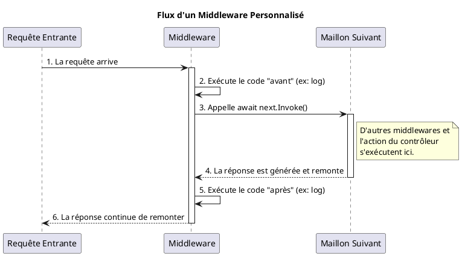

# Module 1 : Au-delà des Fondamentaux d'ASP.NET Core - Pour aller plus loin

### Objectifs Pédagogiques

À la fin de ce module complémentaire, vous saurez :

* **Différencier** le patron MVC du modèle Razor Pages et savoir quand utiliser l'un ou l'autre.
* **Gérer** la configuration de votre application de manière flexible grâce aux environnements.
* **Implémenter** un middleware personnalisé pour enrichir le pipeline de requêtes.
* **Utiliser** le patron de conception ViewModel pour créer des vues plus robustes et sécurisées.

### Introduction : Devenir un artisan du web

Dans la première partie, vous avez appris à utiliser un excellent kit de construction. Vous savez maintenant monter la
structure d'une maison rapidement. Mais que se passe-t-il si vous voulez une prise électrique à un endroit non prévu ?
Ou si vous voulez installer un système de domotique personnalisé ?

Cette section vous apprend à devenir cet artisan capable de personnaliser le kit. Vous allez apprendre à gérer la "
plomberie" (le pipeline), le "circuit électrique" (la configuration) et à agencer les pièces (MVC vs Razor Pages) de
manière optimale. Ces compétences sont essentielles pour construire des applications qui ne sont pas seulement
fonctionnelles, mais aussi maintenables, évolutives et sécurisées sur le long terme.

---

### 1. MVC n'est pas seul : Introduction à Razor Pages

Vous avez découvert MVC, le patron de conception historique et très puissant. Mais pour des pages simples, comme une
page "Contact" ou des conditions générales, le trio Contrôleur-Action-Vue peut parfois sembler un peu lourd. Et si on
pouvait avoir le fichier de code et le fichier d'affichage côte à côte ?

Imaginez que pour chaque plat au restaurant (une page web), vous ayez une fiche recette. Avec MVC, la liste des
ingrédients et les instructions de préparation (le Contrôleur) sont dans un grand livre de recettes central, tandis que
la photo du plat (la Vue) est dans un album séparé. C'est bien pour les recettes complexes.

**Razor Pages**, c'est une approche différente : la photo du plat et sa recette sont sur la même fiche, dos à dos. C'est
une approche centrée sur la page, parfaite pour les scénarios où la logique est étroitement liée à ce qui est affiché.

<tabs>
<tab title="Modèle MVC">
    <strong>Approche centrée sur le contrôleur.</strong>
    Une requête pour `/Products/Details/5` est gérée par la méthode `Details` du `ProductsController`. Ce contrôleur peut gérer de nombreuses actions (Index, Create, Edit, Delete...). La logique est centralisée.
</tab>
<tab title="Modèle Razor Pages">
    <strong>Approche centrée sur la page.</strong>
    Une requête pour `/Products/Details` est gérée par une paire de fichiers : `Details.cshtml` (la vue) et `Details.cshtml.cs` (le code, appelé "PageModel"). Toute la logique pour cette page est encapsulée au même endroit.
</tab>
</tabs>

#### Exemple : Une simple page "À Propos"

Avec Razor Pages, au lieu de créer un contrôleur et une vue, on crée deux fichiers dans un dossier `Pages` :

* `Pages/About.cshtml` : La partie affichage.
* `Pages/About.cshtml.cs` : La partie logique (le "code-behind").

**`Pages/About.cshtml.cs`**

```c#
using Microsoft.AspNetCore.Mvc.RazorPages;

namespace MonApp.Pages
{
    // Le PageModel contient la logique et les données de la page.
    public class AboutModel : PageModel
    {
        public string Message { get; private set; }

        // La méthode OnGet() est exécutée pour les requêtes HTTP GET.
        public void OnGet()
        {
            Message = "Ceci est une page de démonstration Razor Pages.";
        }
    }
}
```

**`Pages/About.cshtml`**

```c#
@page // Directive essentielle qui déclare ce fichier comme une Razor Page.
@model MonApp.Pages.AboutModel
@{
    ViewData["Title"] = "À Propos";
}

<h1>@ViewData["Title"]</h1>

<p>@Model.Message</p>
```

L'URL pour y accéder sera simplement `/About`. C'est simple et direct !

<warning>
Ne mélangez pas les dossiers <code>Pages</code> (pour Razor Pages) et <code>Views</code> (pour MVC) dans un même projet, sauf si vous savez précisément ce que vous faites. Un projet est généralement orienté soit MVC, soit Razor Pages, bien qu'il soit techniquement possible de faire cohabiter les deux.
</warning>

#### Exercice 2 : Convertir une page en Razor Page

Reprenez la page `Index` du `HomeController` du projet `MonAppMvc` par défaut. Recréez cette page en utilisant le modèle
Razor Pages.

##### Correction exercice 2 {collapsible='true'}

1. **Créez un dossier `Pages`** à la racine de votre projet.
2. Dans `Program.cs`, juste avant `app.Run()`, ajoutez le support des Razor Pages : `app.MapRazorPages();`.
3. Dans le dossier `Pages`, créez un fichier `Index.cshtml`.

   ```c#
   @page
   @model IndexModel
   @{
       ViewData["Title"] = "Home page";
   }

   <div class="text-center">
       <h1 class="display-4">Welcome</h1>
       <p>Learn about <a href="https://docs.microsoft.com/aspnet/core">
           building Web apps with ASP.NET Core
       </a>.</p>
   </div>
   ```

4. Dans le même dossier, créez le fichier `Index.cshtml.cs`.

   ```c#
   using Microsoft.AspNetCore.Mvc.RazorPages;
   using Microsoft.Extensions.Logging;

   namespace MonAppMvc.Pages
   {
       public class IndexModel : PageModel
       {
           private readonly ILogger<IndexModel> _logger;

           public IndexModel(ILogger<IndexModel> logger)
           {
               _logger = logger;
           }

           public void OnGet()
           {
               // Pas de logique particulière pour la page d'accueil
           }
       }
   }
   ```

5. Lancez l'application. Maintenant, l'URL `/` (la racine) est gérée par votre nouvelle Razor Page.

---

### 2. La configuration avancée : `appsettings.json` et les environnements

Votre application ne fonctionnera pas de la même manière sur votre machine de développement et sur le serveur de
production. En développement, vous utiliserez peut-être une base de données locale, tandis qu'en production, vous vous
connecterez à un serveur distant. Comment gérer ces différences sans changer le code ?

Pensez à votre application comme à un caméléon. Sur une branche verte (votre PC de dev), il est vert. Sur un rocher
gris (le serveur de production), il est gris. Il s'adapte à son environnement. ASP.NET Core gère ce concept nativement.

Le fichier principal est `appsettings.json`. Il contient les paramètres par défaut.

```json
{
  "Logging": {
    "LogLevel": {
      "Default": "Information",
      "Microsoft.AspNetCore": "Warning"
    }
  },
  "AllowedHosts": "*",
  "AppSettings": {
    "SiteTitle": "Mon Super Site (par défaut)"
  }
}
```

Ensuite, vous pouvez avoir des fichiers spécifiques à l'environnement, comme `appsettings.Development.json`. Les
paramètres de ce fichier **écraseront** ceux du fichier principal si l'application s'exécute en environnement de
développement.

**`appsettings.Development.json`**

```json
{
  "AppSettings": {
    "SiteTitle": "Mon Super Site (Mode Développement)"
  }
}
```

L'environnement est défini par la variable d'environnement `ASPNETCORE_ENVIRONMENT`.

#### Comment lire un paramètre de configuration ?

Le service `IConfiguration` est automatiquement disponible. Vous pouvez l'injecter dans un contrôleur (ou un PageModel)
pour y accéder.

```c#
// Dans un contrôleur
public class HomeController : Controller
{
    private readonly IConfiguration _configuration;

    // Injection de IConfiguration via le constructeur
    public HomeController(IConfiguration configuration)
    {
        _configuration = configuration;
    }

    public IActionResult Index()
    {
        // Lire une valeur simple
        var siteTitle = _configuration["AppSettings:SiteTitle"];
        
        // La stocker pour l'afficher dans la vue
        ViewData["SiteTitle"] = siteTitle;

        return View();
    }
}
```

#### Exercice 3 : Titre de blog configurable

Modifiez le TP `MonBlog` de la partie précédente.

1. Ajoutez un paramètre `BlogTitle` dans `appsettings.json`.
2. Injectez `IConfiguration` dans `BlogController`.
3. Lisez ce titre et passez-le à la vue `Index.cshtml` via `ViewData`.
4. Affichez ce titre dans la vue `Index.cshtml` à la place de celui qui était codé en dur.

##### Correction exercice 3 {collapsible='true'}

1. **`appsettings.json`**

   ```json
   {
     // ... autres paramètres
     "BlogSettings": {
       "BlogTitle": "Les Chroniques du Code"
     }
   }
   ```
2. **`Controllers/BlogController.cs`**

   ```c#
   public class BlogController : Controller
   {
       private readonly IConfiguration _configuration;
       private static List<BlogPost> _posts = new List<BlogPost> { /*...*/ };

       // Injection via le constructeur
       public BlogController(IConfiguration configuration)
       {
           _configuration = configuration;
       }

       public IActionResult Index()
       {
           // Lecture de la configuration
           var blogTitle = _configuration["BlogSettings:BlogTitle"];
           ViewData["Title"] = blogTitle; // On met le titre dans ViewData

           return View(_posts);
       }

       // ... méthode Details
   }
   ```
   <tip>
   N'oubliez pas d'ajouter <code>using Microsoft.Extensions.Configuration;</code> si nécessaire.
   </tip>

3. **`Views/Blog/Index.cshtml`**
   Le code de la vue n'a pas besoin de changer car nous utilisions déjà `ViewData["Title"]`. C'est maintenant la
   *valeur* de `ViewData["Title"]` qui est dynamique.

---

### 3. Devenez un maillon de la chaîne : Créer son propre Middleware

Nous avons vu le pipeline de requêtes comme une chaîne de montage. Mais que faire si vous avez besoin d'un poste de
travail personnalisé qui n'existe pas ? Par exemple, un poste qui mesure le temps de traitement de chaque requête. Vous
pouvez le construire vous-même en créant un **middleware**.

Un middleware est simplement un morceau de code qui se place dans le pipeline. Il reçoit la requête, peut effectuer une
action, puis doit décider s'il passe la requête au maillon suivant ou s'il met fin au traitement (en renvoyant une
réponse).

#### Exemple : Un middleware de logging simple

Ajoutons ce code dans `Program.cs`, juste après la ligne `var app = builder.Build();`.

```c#
// Program.cs

// ...
var app = builder.Build();

// Middleware personnalisé simple (inline)
app.Use(async (context, next) =>
{
    // Code à exécuter avant le maillon suivant
    Console.WriteLine($"[LOG] Requête entrante : {context.Request.Path}");

    // Passe la requête au maillon suivant de la chaîne
    await next.Invoke();

    // Code à exécuter après les maillons suivants (sur le chemin du retour)
    Console.WriteLine("[LOG] Requête sortante.");
});

// ... reste de la configuration du pipeline
app.UseHttpsRedirection();
// ...
```

Chaque requête passant par votre application affichera désormais son chemin dans la console.



#### Exercice 4 : Middleware de chronométrage

Créez un middleware qui mesure le temps de traitement total d'une requête et l'affiche dans la console.
**Indice :** Utilisez `System.Diagnostics.Stopwatch`.

##### Correction exercice 4 {collapsible='true'}

Dans `Program.cs`, ajoutez ce middleware au début de votre pipeline.

```c#
using System.Diagnostics;

// ...
var app = builder.Build();

app.Use(async (context, next) =>
{
    // Crée et démarre un chronomètre
    var stopwatch = new Stopwatch();
    stopwatch.Start();

    // Passe la main au maillon suivant
    await next.Invoke();

    // Arrête le chronomètre une fois que tout le reste a été traité
    stopwatch.Stop();
    
    // Récupère la durée
    var elapsedTime = stopwatch.ElapsedMilliseconds;

    // Affiche le résultat dans la console
    Console.WriteLine(
        $"[PERF] La requête {context.Request.Path} " +
        $"a pris {elapsedTime} ms."
    );
});

// ... reste du pipeline
```

Vous verrez maintenant le temps d'exécution de chaque requête dans votre console, ce qui est très utile pour le débogage
de performance.

---

### 4. Le "ViewModel" : L'intermédiaire indispensable

Dans le TP du blog, nous avons passé notre modèle de données `BlogPost` directement à la vue. C'est simple, mais cela
peut devenir problématique. Que se passe-t-il si votre modèle `BlogPost` contient des informations que vous ne voulez *
*pas** afficher, comme l'email de l'auteur ? Ou si votre vue a besoin d'afficher des données provenant de **plusieurs**
modèles ?

C'est là qu'intervient le **ViewModel**.

Imaginez le **Modèle** (ex: `BlogPost`) comme tous les ingrédients bruts dans la cuisine. La **Vue** est le plat servi
au client. Le **ViewModel** est le plateau du serveur : il ne contient que les ingrédients nécessaires pour *ce plat
spécifique*, arrangés de la manière la plus pratique pour la présentation.

Le ViewModel est une classe C# que vous créez sur mesure pour une vue.

**Bénéfices :**

* **Sécurité :** Vous n'exposez que les données nécessaires, prévenant les fuites d'informations.
* **Clarté :** La vue reçoit un objet qui contient exactement ce dont elle a besoin, ni plus, ni moins.
* **Flexibilité :** Vous pouvez agréger des données de plusieurs modèles ou ajouter de la logique de présentation (ex:
  formater une date) dans le ViewModel.

#### Exemple : Un ViewModel pour la liste des articles

Le contenu complet de l'article (`Content`) est lourd et inutile sur la page de liste. Créons un ViewModel pour
n'afficher qu'un résumé.

**1. Créer le ViewModel**
Dans le dossier `Models`, créez un sous-dossier `ViewModels`, puis le fichier `BlogPostSummaryViewModel.cs`.

```c#
// Models/ViewModels/BlogPostSummaryViewModel.cs
namespace MonBlog.Models.ViewModels
{
    public class BlogPostSummaryViewModel
    {
        public int Id { get; set; }
        public string Title { get; set; }
        public DateTime PublicationDate { get; set; }
        public string Teaser { get; set; } // Un court extrait du contenu
    }
}
```

**2. Utiliser le ViewModel dans le Contrôleur**

```c#
// Controllers/BlogController.cs
using MonBlog.Models.ViewModels; // Ne pas oublier le using !
using System.Linq;

// ...
public IActionResult Index()
{
    var postsForView = _posts.Select(post => new BlogPostSummaryViewModel
    {
        Id = post.Id,
        Title = post.Title,
        PublicationDate = post.PublicationDate,
        // On crée le teaser en prenant les 50 premiers caractères
        Teaser = post.Content.Length > 50 
            ? post.Content.Substring(0, 50) + "..." 
            : post.Content
    }).ToList();

    // On passe la liste de ViewModels à la vue, pas les modèles de données.
    return View(postsForView);
}
```

**3. Mettre à jour la Vue**
La vue `Index.cshtml` doit maintenant déclarer qu'elle attend une liste de `BlogPostSummaryViewModel`.

```c#
// Views/Blog/Index.cshtml
@model IEnumerable<MonBlog.Models.ViewModels.BlogPostSummaryViewModel>

// ...
@foreach (var post in Model)
{
    // ...
    <p>@post.Teaser</p> // On affiche le teaser
    // ...
}
```

---

### TP Avancé : Professionnaliser le mini-blog

Appliquons tous ces nouveaux concepts pour améliorer notre blog.

<procedure>
<step title="Étape 1 : Refactorisation avec un ViewModel de détail">
<p>Créez un <code>BlogPostDetailViewModel.cs</code> qui sera utilisé par la vue <code>Details</code>. Pour l'instant, il aura les mêmes propriétés que <code>BlogPost</code> (<code>Id</code>, <code>Title</code>, <code>Content</code>, <code>PublicationDate</code>). Modifiez l'action <code>Details</code> du <code>BlogController</code> et la vue <code>Details.cshtml</code> pour utiliser ce nouveau ViewModel. C'est une bonne pratique à prendre même si les propriétés sont identiques au début.</p>
</step>
<step title="Étape 2 : Ajouter un auteur configurable">
<p>Dans <code>appsettings.json</code>, ajoutez un paramètre <code>AuthorName</code>. Dans votre <code>BlogPostDetailViewModel</code>, ajoutez une propriété <code>AuthorName</code> de type <code>string</code>. Dans l'action <code>Details</code>, lisez ce nom depuis la configuration et peuplez la propriété du ViewModel. Enfin, affichez le nom de l'auteur dans la vue <code>Details.cshtml</code>.</p>
</step>
<step title="Étape 3 : Créer un Middleware pour les articles non trouvés">
<p>Créez un middleware personnalisé qui s'exécutera avant le routage. Si une requête contient <code>/Blog/Details/</code> suivi d'un ID qui n'existe pas dans votre liste d'articles, le middleware doit directement renvoyer une réponse "Article non trouvé !" avec un code 404, sans même atteindre le contrôleur. Pour les autres requêtes, il doit passer la main au maillon suivant.</p>
</step>
</procedure>

#### Correction TP Avancé : Professionnaliser le mini-blog {collapsible='true'}

<tabs>
<tab title="Étape 1 : ViewModel de détail">

**`Models/ViewModels/BlogPostDetailViewModel.cs`**

```c#
namespace MonBlog.Models.ViewModels
{
    public class BlogPostDetailViewModel
    {
        public int Id { get; set; }
        public string Title { get; set; }
        public string Content { get; set; }
        public DateTime PublicationDate { get; set; }
        // On prépare le terrain pour l'étape 2
        public string AuthorName { get; set; }
    }
}
```

**`Controllers/BlogController.cs` (Action Details modifiée)**

```c#
public IActionResult Details(int id)
{
    var post = _posts.FirstOrDefault(p => p.Id == id);
    if (post == null)
    {
        return NotFound();
    }

    var viewModel = new BlogPostDetailViewModel
    {
        Id = post.Id,
        Title = post.Title,
        Content = post.Content,
        PublicationDate = post.PublicationDate
    };

    return View(viewModel);
}
```

**`Views/Blog/Details.cshtml` (début du fichier)**

```c#
@model MonBlog.Models.ViewModels.BlogPostDetailViewModel
// Le reste du fichier est identique, il suffit de changer le type du modèle.
```

</tab>
<tab title="Étape 2 : Auteur configurable">

**`appsettings.json`**

```json
{
  // ...
  "BlogSettings": {
    "BlogTitle": "Les Chroniques du Code",
    "AuthorName": "Votre Nom"
    // Nouvelle ligne
  }
}
```

**`Controllers/BlogController.cs` (Action Details complétée)**

```c#
public IActionResult Details(int id)
{
    var post = _posts.FirstOrDefault(p => p.Id == id);
    if (post == null)
    {
        return NotFound();
    }

    var viewModel = new BlogPostDetailViewModel
    {
        Id = post.Id,
        Title = post.Title,
        Content = post.Content,
        PublicationDate = post.PublicationDate,
        // On lit la configuration et on l'assigne
        AuthorName = _configuration["BlogSettings:AuthorName"]
    };

    return View(viewModel);
}
```

**`Views/Blog/Details.cshtml` (ajout de l'auteur)**

```c#
// ... sous la date de publication
<div>
    <small>
        Publié le : @Model.PublicationDate.ToShortDateString() 
        par <strong>@Model.AuthorName</strong>
    </small>
</div>
// ...
```

</tab>
<tab title="Étape 3 : Middleware personnalisé">

**`Program.cs`**

```c#
// ...
var app = builder.Build();

// Notre nouveau middleware, placé avant app.UseRouting()
app.Use(async (context, next) =>
{
    var path = context.Request.Path.ToString();
    // On vérifie si l'URL correspond au pattern
    if (path.StartsWith("/Blog/Details/"))
    {
        // On essaie d'extraire l'ID
        if (int.TryParse(path.Split('/').Last(), out int id))
        {
            // On accède aux données "en dur" du contrôleur
            // NOTE : C'est une simplification. Dans une vraie app,
            // on utiliserait un service partagé.
            var postExists = MonBlog.Controllers.BlogController
                               .GetPosts()
                               .Any(p => p.Id == id);
            
            if (!postExists)
            {
                context.Response.StatusCode = 404; // Not Found
                await context.Response.WriteAsync("Article non trouvé !");
                return; // On arrête le pipeline ici.
            }
        }
    }

    // Si la condition n'est pas remplie, on continue normalement
    await next.Invoke();
});

// ... reste du pipeline, y compris app.UseRouting()
```

**`Controllers/BlogController.cs`**
Il faut rendre la liste des posts accessible de l'extérieur pour le middleware.

```c#
public class BlogController : Controller
{
    // On rend la liste publique et statique pour l'exemple
    public static List<BlogPost> _posts = new List<BlogPost> { /*...*/ };
    
    // Méthode helper pour y accéder
    public static List<BlogPost> GetPosts() => _posts;
    // ...
}
```

</tab>
</tabs>

---

### Conclusion

Excellent travail ! Vous avez ajouté des outils très puissants à votre panoplie de développeur ASP.NET Core. Vous
comprenez maintenant qu'il existe plusieurs manières de structurer vos pages avec **Razor Pages**, comment rendre votre
application adaptable avec la **configuration par environnement**, comment modifier le comportement des requêtes avec un
**middleware personnalisé**, et comment structurer vos données pour la présentation de manière propre et sécurisée grâce
aux **ViewModels**.

Ces concepts ne sont pas des gadgets. Ils sont au cœur des bonnes pratiques de développement logiciel et vous serviront
dans tous vos futurs projets. Ils sont la différence entre une application qui fonctionne et une application bien
conçue.

Dans le prochain module, nous plongerons dans les détails du routage, des contrôleurs et de la gestion des données des
formulaires, ce qui nous permettra de rendre notre application interactive.