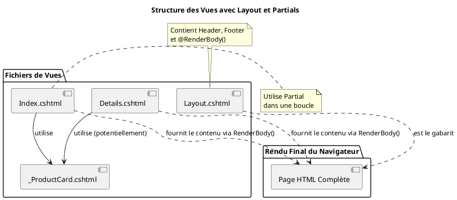
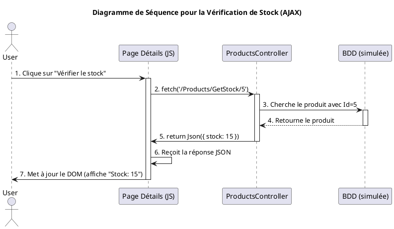

Bienvenue dans ce troisième module ! Jusqu'à présent, nous avons construit les coulisses de notre application : la
logique métier (Modèle) et le centre de commandement (Contrôleur). Aujourd'hui, nous allons nous occuper de la scène, de
ce que l'utilisateur voit et avec quoi il interagit. C'est le moment de donner vie à nos données en créant des
interfaces utilisateur belles, dynamiques et efficaces.

Nous allons devenir des designers d'interface, en apprenant le langage qui permet de fusionner la puissance de C# avec
la structure du HTML. Préparez-vous à rendre vos applications non seulement fonctionnelles, mais aussi agréables à
utiliser !

---

# Module 3 : La Vue avec Razor et Interactions Dynamiques - L'essentiel

### Objectifs Pédagogiques

À la fin de ce module, vous serez en mesure de :

* **Maîtriser** la syntaxe Razor pour mélanger C# et HTML de manière fluide.
* **Utiliser** les Tag Helpers pour générer du HTML propre et robuste.
* **Structurer** vos vues de manière professionnelle en utilisant des layouts et des vues partielles pour éviter la
  duplication de code.
* **Comprendre** le principe des appels AJAX pour rendre vos pages plus réactives.
* **Implémenter** une interaction simple entre le client (JavaScript) et le serveur (action de contrôleur) sans
  recharger la page.

### Introduction : Le peintre et sa toile

Imaginez que votre contrôleur est un artiste peintre. Il a préparé sa palette avec les plus belles couleurs (les données
du modèle). Mais comment transférer ces couleurs sur la toile (la page HTML) pour créer un chef-d'œuvre ? Tenter de "
peindre" du HTML en concaténant des chaînes de caractères dans le contrôleur serait long, fastidieux et très salissant.

C'est là qu'intervient **Razor**. Razor est le pinceau magique de l'artiste. C'est un moteur de vue qui vous permet,
directement sur votre toile HTML, d'appliquer les couleurs de votre palette C# avec des gestes simples et élégants. Il
vous permet de créer des interfaces riches et dynamiques, où la logique et la présentation cohabitent en parfaite
harmonie. Apprendre Razor, c'est apprendre à transformer des données brutes en une expérience utilisateur engageante.

---

### 1. La Syntaxe Razor : Le meilleur des deux mondes

Comment afficher le nom d'un produit dans un titre `<h1>` ? Comment faire une boucle sur une liste de produits pour
créer un tableau HTML ? Razor rend cela incroyablement simple grâce à un seul caractère : `@`.

Le symbole `@` est un interrupteur. Il dit au moteur Razor : "Attention, on arrête le HTML un instant, le code qui suit
est du C# !".

#### Afficher des variables

C'est l'utilisation la plus simple. Si votre vue reçoit un modèle, vous pouvez accéder à ses propriétés.

```c#
// Dans la vue, en haut du fichier :
@model Product

// Dans le corps du HTML :
<h1>@Model.Name</h1>
<p>Prix : @Model.Price.ToString("C")</p>
```

Razor est assez intelligent pour savoir où se termine l'expression C#. Pas besoin de point-virgule ou de caractère de
fin.

#### Structures de contrôle : `if`, `foreach`...

Vous avez besoin de logique dans votre vue ? La syntaxe est la même qu'en C#, préfixée par `@`.

```c#
@if (Model.Stock > 0)
{
    <p class="text-success">En stock !</p>
}
else
{
    <p class="text-danger">En rupture de stock.</p>
}

<ul>
    @foreach (var category in Model.Categories)
    {
        <li>@category</li>
    }
</ul>
```

<tip>
Razor est conçu pour la **logique d'affichage**. Évitez d'y mettre de la logique métier complexe (accès à la base de données, calculs lourds...). Cette logique doit rester dans le contrôleur ou le modèle.
</tip>

#### Les Tag Helpers : Vos assistants HTML

Les Tag Helpers sont l'une des fonctionnalités les plus puissantes d'ASP.NET Core. Ce sont des attributs spéciaux que
vous ajoutez à vos balises HTML, et qui sont traités côté serveur pour générer du HTML finalisé. Pensez-y comme des
assistants qui connaissent parfaitement votre application et vous aident à écrire du HTML sans erreur.

* **Générer des liens :**
    * **Avant :** `<a href="/Products/Details/5">Détails</a>` (fragile, cassé si les routes changent)
    * **Avec Tag Helper :** `<a asp-controller="Products" asp-action="Details" asp-route-id="5">Détails</a>` (robuste,
      s'adapte aux routes)

* **Générer des formulaires :**
    * **Avant :** `<label for="Name">Nom</label><input type="text" id="Name" name="Name">`
    * **Avec Tag Helper :** `<label asp-for="Name"></label><input asp-for="Name">` (génère le `for`, `id`, `name` et
      `value` pour vous !)

* **Afficher les erreurs de validation :**
    * **Avec Tag Helper :** `<span asp-validation-for="Name"></span>` (affiche automatiquement le message d'erreur pour
      le champ `Name` s'il y en a un).

Les Tag Helpers rendent vos vues plus lisibles, moins sujettes aux erreurs et plus faciles à maintenir.

#### Exercice 1 : Afficher une liste de courses

Dans une action de contrôleur, créez une `List<string>` contenant des articles de courses. Passez cette liste à une vue
et utilisez une boucle `@foreach` pour afficher chaque article dans un `<li>` d'une liste `<ul>`.

##### Correction exercice 1 {collapsible='true'}

**`Controllers/HomeController.cs` (nouvelle action)**

```c#
public IActionResult ShoppingList()
{
    var items = new List<string> 
    { 
        "Lait", "Pain", "Fromage", "Jus d'orange" 
    };
    
    // On passe la liste comme modèle à la vue
    return View(items);
}
```

**`Views/Home/ShoppingList.cshtml` (nouveau fichier)**

```c#
@model List<string>

@{
    ViewData["Title"] = "Liste de Courses";
}

<h1>@ViewData["Title"]</h1>

<p>Voici ce que vous devez acheter :</p>

<ul>
    @foreach (var item in Model)
    {
        <li>@item</li>
    }
</ul>
```

---

### 2. Structurer les Vues : Ne vous répétez pas !

**Le problème :** Votre site a 10 pages. Le header avec le logo et le menu de navigation, ainsi que le footer avec les
informations de contact, sont identiques sur chaque page. Allez-vous copier-coller ce code 10 fois ? Certainement pas !

C'est comme construire des maisons avec des LEGO. Vous n'allez pas réinventer la "brique 2x4" à chaque fois. Vous la
réutilisez. En développement web, on appelle ce principe **DRY (Don't Repeat Yourself)**.

#### Le Layout (`_Layout.cshtml`) : Le gabarit principal

Le fichier `_Layout.cshtml` (souvent dans `Views/Shared`) est le gabarit de votre site. C'est la structure de base (
header, footer, menu) dans laquelle toutes vos autres vues viendront s'insérer.

Pensez-y comme à un cadre photo. Le cadre (`_Layout`) est toujours le même, mais la photo à l'intérieur (
`la vue spécifique`) change.

```html
<!-- Views/Shared/_Layout.cshtml -->
<!DOCTYPE html>
<html>
<head>
    <title>@ViewData["Title"] - Mon App</title>
    <!-- Liens CSS, etc. -->
</head>
<body>
<header>
    <!-- Menu de navigation -->
</header>

<main>
    @RenderBody() <!-- C'est ici que la vue spécifique sera insérée -->
</main>

<footer>
    <!-- Informations de contact -->
</footer>
<!-- Liens JS, etc. -->
</body>
</html>
```

La directive `@RenderBody()` est le cœur du système. C'est l'emplacement réservé pour le contenu de la page spécifique.

#### Les Vues Partielles (`_Partial.cshtml`) : Les composants réutilisables

**Le problème :** Sur plusieurs pages, vous affichez les informations d'un produit de la même manière (une "carte" avec
son image, son nom, son prix). Encore une fois, pas de copier-coller !

**La solution :** Une vue partielle. C'est un morceau de code Razor réutilisable que vous pouvez appeler depuis n'
importe quelle autre vue. Le préfixe `_` est une convention pour indiquer que ce n'est pas une vue complète.

**`Views/Shared/_ProductCard.cshtml`**

```html
@model Product

<div class="card">
    
    <div class="card-body">
        <h5 class="card-title">@Model.Name</h5>
        <p class="card-text">@Model.Price.ToString("C")</p>
        <a asp-action="Details" asp-controller="Products"
           asp-route-id="@Model.Id" class="btn btn-primary">
            Voir
        </a>
    </div>
</div>
```

**Comment l'utiliser dans la vue `Index.cshtml` ?**

```html
@model IEnumerable
<Product>

    @foreach (var product in Model)
    {
    @* On appelle la vue partielle pour chaque produit *@
    <partial name="_ProductCard" model="product"/>
    }
```



---

### 3. Interactions Côté Client avec AJAX

**Le problème :** L'utilisateur veut juste "liker" un article de blog. Faut-il recharger toute la page juste pour ça ?
C'est lent, lourd et l'expérience utilisateur est mauvaise.

Imaginez que vous êtes au restaurant et que vous voulez juste de l'eau. Vous n'allez pas payer l'addition, sortir, puis
re-rentrer pour commander de l'eau. Vous faites un simple signe au serveur, qui vous l'apporte discrètement. C'est ça, *
*AJAX (Asynchronous JavaScript and XML)**.

C'est une technique qui permet à votre page web (via JavaScript) de communiquer avec le serveur en arrière-plan, sans
interrompre l'utilisateur.

**Le flux AJAX :**

1. **Déclencheur :** L'utilisateur clique sur un bouton.
2. **JavaScript :** Le code JS s'exécute. Il utilise l'API `fetch` pour envoyer une requête HTTP à une action de
   contrôleur spécifique.
3. **Contrôleur :** L'action reçoit la requête. Elle fait son travail (ex: enregistrer le "like" en base de données).
4. **Réponse :** Au lieu de retourner une `View()`, l'action retourne des données brutes, généralement au format **JSON
   **. Pour cela, on utilise `return Json(data)`.
5. **JavaScript (Callback) :** Le code JS reçoit la réponse JSON. Il met alors à jour une petite partie de la page (ex:
   il incrémente le compteur de likes et change la couleur du bouton).

#### Exemple simple : Obtenir l'heure du serveur

**L'Action du Contrôleur**
Elle doit retourner un `JsonResult`.

```c#
// Dans un contrôleur, par exemple HomeController
public IActionResult GetServerTime()
{
    var data = new 
    { 
        time = DateTime.Now.ToLongTimeString(),
        message = "Heure récupérée avec succès !"
    };
    return Json(data);
}
```

**La Vue (HTML et JavaScript)**

```html

<button id="timeButton">Quelle heure est-il ?</button>
<p>L'heure du serveur est : <strong id="timeResult">...</strong></p>

@section Scripts {
<script>
    document.getElementById("timeButton").addEventListener("click", function () {
        // 1. On envoie la requête à notre action
        fetch('/Home/GetServerTime')
                .then(response => response.json()) // 2. On convertit la réponse en JSON
                .then(data => {
                    // 3. On met à jour le HTML avec les données reçues
                    document.getElementById("timeResult").innerText = data.time;
                    console.log(data.message);
                })
                .catch(error => console.error('Erreur:', error));
    });
</script>
}
```

<tip>

La section `@section Scripts` est un emplacement spécial défini dans le `_Layout.cshtml` par défaut, qui permet de placer les scripts à la fin du `<body>` pour de meilleures performances.

</tip>

---

### TP : Améliorer notre gestionnaire de produits

Nous allons appliquer ces trois concepts pour rendre notre application de gestion de produits plus professionnelle et
dynamique.

#### Énoncé

<procedure>
<step title="Étape 1 : Mettre en place un Layout">
<p>Assurez-vous que votre projet a un fichier <code>_Layout.cshtml</code> dans <code>Views/Shared</code>. Modifiez-le pour ajouter un menu de navigation simple avec des liens (utilisant des Tag Helpers) vers la page d'accueil et la liste des produits (<code>/Products</code>).</p>
</step>
<step title="Étape 2 : Refactoriser la liste avec une Vue Partielle">
<p>Dans la vue <code>Products/Index.cshtml</code>, la logique d'affichage d'un produit dans le tableau est répétée. Créez une vue partielle <code>_ProductRow.cshtml</code> qui reçoit un objet <code>Product</code> et génère une seule ligne du tableau (une balise <code>&lt;tr&gt;</code> avec ses <code>&lt;td&gt;</code>). Utilisez cette vue partielle dans la boucle <code>@foreach</code> de la vue <code>Index</code>.</p>
</step>
<step title="Étape 3 : Ajouter un bouton de vérification de stock AJAX">
<p>Dans la vue <code>Products/Details.cshtml</code>, ajoutez un bouton "Vérifier le stock actuel". Quand on clique dessus, un appel AJAX doit être fait à une nouvelle action <code>GetStock(int id)</code> dans le <code>ProductsController</code>. Cette action retournera le stock actuel en JSON. Le JavaScript mettra à jour le texte sur la page pour afficher le stock sans recharger la page.</p>
</step>
</procedure>



#### Correction TP : Améliorer notre gestionnaire de produits {collapsible='true'}

<tabs>
<tab title="Étape 1 : Layout">

**`Views/Shared/_Layout.cshtml` (extrait du `<body>`)**

```html
<body>
    <header>
        <nav class="navbar navbar-expand-sm navbar-light bg-white border-bottom">
            <div class="container">
                <a class="navbar-brand" asp-area="" asp-controller="Home" 
                   asp-action="Index">MonAppMvc</a>
                <div class="navbar-collapse collapse d-sm-inline-flex">
                    <ul class="navbar-nav flex-grow-1">
                        <li class="nav-item">
                            <a class="nav-link text-dark" asp-controller="Home" 
                               asp-action="Index">Accueil</a>
                        </li>
                        <li class="nav-item">
                            <a class="nav-link text-dark" asp-controller="Products" 
                               asp-action="Index">Produits</a>
                        </li>
                    </ul>
                </div>
            </div>
        </nav>
    </header>
    <div class="container">
        <main role="main" class="pb-3">
            @RenderBody()
        </main>
    </div>
    <!-- ... footer et scripts ... -->
</body>
```
</tab>
<tab title="Étape 2 : Vue Partielle">

**`Views/Products/_ProductRow.cshtml` (nouveau fichier)**

```html
@model MonAppMvc.Models.Product

<tr>
    <td>@Model.Name</td>
    <td>@Model.Price.ToString("C")</td>
    <td>@Model.Stock</td>
    <td>
        <a asp-action="Details" asp-route-id="@Model.Id">Détails</a>
    </td>
</tr>
```

**`Views/Products/Index.cshtml` (modifié)**

```html
@model IEnumerable
<MonAppMvc.Models.Product>

    <!-- ... en-têtes ... -->
    <table class="table">
        <thead>
        <tr>
            <th>Nom</th>
            <th>Prix</th>
            <th>Stock</th>
            <th></th>
        </tr>
        </thead>
        <tbody>
        @foreach (var item in Model) {
        @* Utilisation de la vue partielle *@
        <partial name="_ProductRow" model="item"/>
        }
        </tbody>
    </table>
```

</tab>
<tab title="Étape 3 : AJAX Stock">
**`Controllers/ProductsController.cs` (nouvelle action)**
```c#
// Ajouté à la fin du contrôleur
[HttpGet]
public IActionResult GetStock(int id)
{
    var product = _products.FirstOrDefault(p => p.Id == id);
    if (product == null)
    {
        return NotFound();
    }

    // On retourne un objet anonyme qui sera sérialisé en JSON
    return Json(new { currentStock = product.Stock });

}

```

**`Views/Products/Details.cshtml` (modifié)**
```html
@model MonAppMvc.Models.Product
<!-- ... affichage des détails ... -->
<dl class="row">
    <!-- ... autres propriétés ... -->
    <dt class="col-sm-2">En Stock</dt>
    <dd class="col-sm-10" id="stockDisplay">@Model.Stock</dd>
</dl>

<button id="checkStockBtn" data-productid="@Model.Id" class="btn btn-info">
    Vérifier le stock actuel
</button>
<!-- ... liens de retour ... -->

@section Scripts {
<script>
    document.getElementById("checkStockBtn").addEventListener("click", function() {
        // On récupère l'ID du produit stocké dans un attribut data-*
        const productId = this.dataset.productid;
        
        fetch(`/Products/GetStock/${productId}`)
            .then(response => {
                if (!response.ok) {
                    throw new Error("Produit non trouvé");
                }
                return response.json();
            })
            .then(data => {
                const stockElement = document.getElementById("stockDisplay");
                stockElement.innerText = data.currentStock;
                stockElement.style.color = "blue"; // Feedback visuel
            })
            .catch(error => {
                console.error("Erreur lors de la vérification du stock:", error);
                document.getElementById("stockDisplay").innerText = "Erreur";
            });
    });
</script>
}
```

</tab>
</tabs>

---

### Auto-évaluation

1. Quel symbole est utilisé en Razor pour passer du HTML au C# ?
   a) `#`
   b) `$`
   c) `%`
   d) `@`

2. Quel est le principal avantage d'un Tag Helper comme `<a asp-controller="Home" asp-action="Index">` par rapport à
   `<a href="/Home/Index">` ?
   a) C'est plus court à écrire.
   b) Il génère une URL qui s'adapte automatiquement aux changements de configuration du routage.
   c) Il fonctionne mieux sur mobile.
   d) Il permet d'ajouter du style CSS directement.

3. À quoi sert la directive `@RenderBody()` dans un fichier `_Layout.cshtml` ?
   a) À exécuter le code JavaScript de la page.
   b) À définir le corps (`<body>`) de la page HTML.
   c) À marquer l'emplacement où le contenu de la vue spécifique sera inséré.
   d) À rendre une vue partielle.

4. Lors d'un appel AJAX, quel type de réponse une action de contrôleur doit-elle typiquement retourner ?
   a) `View()`
   b) `RedirectToAction()`
   c) `JsonResult`
   d) `FileResult`

5. Expliquez le principe DRY et comment les layouts et les vues partielles aident à le respecter.
6. Décrivez, dans l'ordre, les 5 étapes principales du flux d'un appel AJAX (du clic de l'utilisateur à la mise à jour
   de la page).
7. Quelle est la différence entre une vue et une vue partielle ? Dans quel cas utiliseriez-vous l'une plutôt que l'
   autre ?

---

### Conclusion de "L'essentiel"

Félicitations ! Vous venez de compléter le triptyque MVC. Vous savez maintenant comment construire la partie visible de
l'iceberg. Vous avez appris à utiliser **Razor** pour dynamiser vos pages, à garder votre code propre et maintenable
avec les **layouts et vues partielles**, et à rendre vos applications plus fluides et modernes grâce à **AJAX**.

Ces compétences sont absolument fondamentales pour tout développeur web. Elles vous permettent de créer des expériences
utilisateur de qualité, qui sont non seulement fonctionnelles mais aussi rapides et agréables à utiliser.

Dans le prochain module, nous aborderons des sujets d'architecture logicielle plus avancés, comme l'injection de
dépendances et les services, qui nous permettront de construire des applications encore plus robustes et évolutives.

### Projets Suggérés pour Pratiquer

1. **Galerie de Photos (Débutant/Intermédiaire)**
    * **Description :** Créez une page qui affiche une grille de vignettes de photos. Chaque vignette est générée par
      une vue partielle.
    * **Piste technique :** Créez un modèle `Photo` (Id, Title, ImageUrl). Dans le contrôleur, créez une liste de photos
      en dur. La vue `Index` boucle sur cette liste et appelle une vue partielle `_PhotoThumbnail.cshtml` pour chaque
      photo.

2. **Section de Commentaires "Live" (Intermédiaire)**
    * **Description :** Sous un article de blog (vous pouvez réutiliser le TP du module 1), ajoutez un formulaire pour
      poster un commentaire. La soumission du formulaire doit se faire en AJAX. Le nouveau commentaire doit apparaître
      dans la liste sans recharger la page.
    * **Piste technique :** Créez une action `[HttpPost] AddComment(int postId, string commentText)` qui sauvegarde le
      commentaire (en mémoire) et retourne le nouveau commentaire en JSON. Le JavaScript intercepte la soumission du
      formulaire, fait un `fetch` vers cette action, et à la réception de la réponse, crée dynamiquement le HTML du
      nouveau commentaire et l'ajoute à la liste.