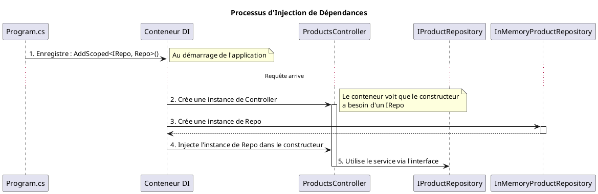

Absolument. Passons au quatrième module. C'est un de mes préférés, car il marque le passage d'un développeur qui "fait
fonctionner les choses" à un architecte logiciel qui "construit des systèmes durables".

Jusqu'à présent, nous avons assemblé les murs, les sols et les plafonds. Aujourd'hui, nous allons installer le système
nerveux central et la plomberie intelligente de notre application. Ce sont des concepts qui, une fois maîtrisés,
transformeront radicalement la qualité, la robustesse et la maintenabilité de votre code. Accrochez-vous, nous entrons
dans le cœur de l'ingénierie logicielle moderne !

---

# Module 4 : L'Architecture Interne : Services et Injection de Dépendances - L'essentiel

### Objectifs Pédagogiques

À la fin de ce module, vous serez en mesure de :

* **Expliquer** le principe de l'Inversion de Dépendances (DI) et ses avantages.
* **Utiliser** le conteneur de services intégré d'ASP.NET Core pour enregistrer et résoudre des dépendances.
* **Différencier** les durées de vie des services (`Singleton`, `Scoped`, `Transient`) et choisir la bonne pour chaque
  situation.
* **Comprendre** le rôle des filtres pour exécuter du code de manière transversale.
* **Implémenter** un filtre d'action personnalisé pour ajouter un comportement à vos actions sans les modifier.

### Introduction : Construire pour le changement

Imaginez que vous construisez une voiture. Vous pourriez souder le moteur directement au châssis. Ça fonctionnerait !
Mais que se passe-t-il le jour où vous voulez changer le moteur pour un plus puissant, ou simplement le réparer ? Vous
seriez obligé de tout découper et de tout reconstruire. C'est lent, risqué et coûteux.

Un ingénieur automobile moderne ne fait jamais ça. Il utilise des **interfaces** standardisées : des points de montage,
des connecteurs électriques, des durites. Le moteur est une boîte noire qui respecte ces standards. On peut ainsi le
remplacer facilement, sans impacter le reste de la voiture.

En logiciel, c'est exactement pareil. "Souder" vos composants en utilisant l'opérateur `new` (
`var service = new MonService();`) crée un couplage fort. L'**Injection de Dépendances** est le standard d'ingénierie
qui vous permet de connecter vos composants de manière flexible, les rendant interchangeables, testables et faciles à
maintenir. C'est la compétence fondamentale qui vous permettra de construire des applications qui évoluent avec le
temps, au lieu de s'effondrer sous leur propre poids.

---

### 1. L'Inversion de Dépendances (Dependency Injection - DI)

**Le problème :** Votre `ProductsController` a besoin d'accéder à la liste des produits. Dans notre TP, nous avons mis
cette liste directement dans le contrôleur. C'est un début, mais ce n'est pas idéal. Le contrôleur ne devrait pas être
responsable de la gestion des données. Et si demain, on voulait aller chercher les produits dans une base de données au
lieu d'une liste en mémoire ? On devrait modifier le contrôleur.

**Le code "avant" (couplage fort) :**

```c#
public class ProductsController : Controller
{
    // Le contrôleur est RESPONSABLE de la création de sa dépendance.
    private readonly ProductRepository _repository = new ProductRepository();

    public IActionResult Index()
    {
        var products = _repository.GetAll();
        return View(products);
    }
}
```

**La solution :** Inverser le contrôle. Le contrôleur ne crée plus ses dépendances. Il les **demande**. Il annonce : "
J'ai besoin de quelque chose qui sait comment gérer les produits". Il ne se soucie pas de *comment* cette chose
fonctionne, seulement qu'elle respecte un contrat (une interface).

#### Comment ça marche ? Le trio gagnant

Le DI repose sur trois piliers :

1. **Le Service :** La classe qui fait le travail (ex: `ProductRepository`).
2. **L'Interface (le contrat) :** Elle définit *ce que* le service peut faire, mais pas *comment*. (ex:
   `IProductRepository` avec une méthode `GetAll()`). Le service implémente cette interface.
3. **Le Conteneur de Services (l'injecteur) :** C'est le grand chef d'orchestre d'ASP.NET Core. Au démarrage de
   l'application, on lui dit : "Quand quelqu'un demande un `IProductRepository`, donne-lui une instance de
   `ProductRepository`". C'est l'**enregistrement**. Ensuite, quand une requête arrive et qu'un `ProductsController` est
   créé, le conteneur voit qu'il a besoin d'un `IProductRepository` dans son constructeur, et il lui fournit
   automatiquement. C'est l'**injection**.

**Le code "après" (couplage faible) :**

**1. L'Interface (le contrat)**

```c#
public interface IProductRepository
{
    IEnumerable<Product> GetAll();
    Product GetById(int id);
}
```

**2. Le Service (l'implémentation)**

```c#
public class InMemoryProductRepository : IProductRepository
{
    private static List<Product> _products = new List<Product> { /* ... */ };
    
    public IEnumerable<Product> GetAll() => _products;
    public Product GetById(int id) => _products.FirstOrDefault(p => p.Id == id);
}
```

**3. L'Enregistrement (dans `Program.cs`)**

```c#
var builder = WebApplication.CreateBuilder(args);

// On dit au conteneur comment résoudre la dépendance.
builder.Services.AddScoped<IProductRepository, InMemoryProductRepository>();

builder.Services.AddControllersWithViews();
// ...
```

**4. L'Injection (dans le contrôleur)**

```c#
public class ProductsController : Controller
{
    private readonly IProductRepository _repository;

    // Le contrôleur DEMANDE sa dépendance via son constructeur.
    public ProductsController(IProductRepository repository)
    {
        _repository = repository;
    }

    public IActionResult Index()
    {
        // Il l'utilise sans savoir comment elle est implémentée.
        var products = _repository.GetAll();
        return View(products);
    }
}
```

Maintenant, si vous voulez passer à une base de données, il vous suffit de créer une classe `SqlProductRepository` qui
implémente `IProductRepository` et de changer **une seule ligne** dans `Program.cs`. Le contrôleur, lui, n'a pas besoin
d'être modifié. C'est ça, la puissance du DI.



#### Durées de vie des services : Combien de temps vit votre service ?

Quand vous enregistrez un service, vous devez spécifier sa "durée de vie". C'est une instruction pour le conteneur sur
la manière de gérer les instances.

Pensez à la distribution de boissons lors d'un événement :

* `AddTransient()` (**transitoire**) : C'est comme un gobelet en plastique. Chaque fois que quelqu'un demande une
  boisson, on lui donne un nouveau gobelet. Léger, à usage unique.
    * **Usage :** Pour des services légers, sans état (ex: un service qui envoie des emails).
* `AddScoped()` (**portée limitée**) : C'est comme une chope de bière consignée. On vous en donne une au début de la
  soirée (la requête HTTP). Vous utilisez la même chope pour toutes vos boissons pendant la soirée. À la fin, vous la
  rendez.
    * **Usage :** Le plus courant dans les applications web. Parfait pour les services qui doivent maintenir un état
      pendant toute la durée d'une requête, comme un contexte de base de données (`DbContext`).
* `AddSingleton()` (**unique**) : C'est la grande fontaine à eau au milieu de la salle. Il n'y en a qu'une pour tout
  l'événement (toute la durée de vie de l'application), et tout le monde l'utilise.
    * **Usage :** Pour les services qui sont coûteux à créer et qui peuvent être partagés par tous, comme un service de
      logging ou de gestion de cache.

<tabs>
<tab title="Transient">
Un nouvel objet est créé chaque fois qu'il est demandé.
<code>builder.Services.AddTransient&lt;IMyService, MyService&gt;();</code>
</tab>
<tab title="Scoped">
Un seul objet est créé par requête HTTP.
<code>builder.Services.AddScoped&lt;IMyService, MyService&gt;();</code>
</tab>
<tab title="Singleton">
Un seul objet est créé pour toute la durée de vie de l'application.
<code>builder.Services.AddSingleton&lt;IMyService, MyService&gt;();</code>
</tab>
</tabs>

#### Exercice 1 : Créer un service de messagerie

Créez un service simple qui fournit un message de bienvenue.

1. Créez une interface `IMessageService` avec une méthode `GetWelcomeMessage()`.
2. Créez une classe `WelcomeMessageService` qui implémente l'interface et retourne "Bienvenue !".
3. Enregistrez ce service avec une durée de vie `Scoped` dans `Program.cs`.
4. Injectez-le dans `HomeController` et utilisez-le pour afficher le message sur la page d'accueil via `ViewData`.

##### Correction exercice 1 {collapsible='true'}

1. **`Interfaces/IMessageService.cs` (créez un dossier `Interfaces`)**
   ```c#
   namespace MonAppMvc.Interfaces
   {
       public interface IMessageService
       {
           string GetWelcomeMessage();
       }
   }
   ```
2. **`Services/WelcomeMessageService.cs` (créez un dossier `Services`)**
   ```c#
   using MonAppMvc.Interfaces;

   namespace MonAppMvc.Services
   {
       public class WelcomeMessageService : IMessageService
       {
           public string GetWelcomeMessage()
           {
               return "Bienvenue sur notre application gérée par un service !";
           }
       }
   }
   ```
3. **`Program.cs`**
   ```c#
   // N'oubliez pas les usings en haut du fichier
   using MonAppMvc.Interfaces;
   using MonAppMvc.Services;
   
   // ...
   builder.Services.AddScoped<IMessageService, WelcomeMessageService>();
   // ...
   ```
4. **`Controllers/HomeController.cs`**
   ```c#
   public class HomeController : Controller
   {
       private readonly ILogger<HomeController> _logger;
       private readonly IMessageService _messageService;

       public HomeController(ILogger<HomeController> logger, 
                             IMessageService messageService)
       {
           _logger = logger;
           _messageService = messageService;
       }

       public IActionResult Index()
       {
           ViewData["Welcome"] = _messageService.GetWelcomeMessage();
           return View();
       }
       // ...
   }
   ```
5. **`Views/Home/Index.cshtml` (ajoutez cette ligne)**
   ```html
   <h2 class="display-5">@ViewData["Welcome"]</h2>
   ```

---

### 2. Les Filtres (`Filters`) : Le garde du corps de vos actions

**Le problème :** Vous voulez enregistrer (loguer) dans un fichier chaque fois qu'une action de votre
`ProductsController` est exécutée. Vous pourriez ajouter une ligne de code au début et à la fin de chaque action (
`Index`, `Details`, `Create`...). Mais c'est répétitif et ça pollue la logique de votre action.

**La solution :** Un filtre d'action. C'est un morceau de code qui peut "s'enrouler" autour de l'exécution d'une action.
Pensez-y comme à un garde du corps qui se tient à la porte du bureau d'un VIP (l'action). Il peut faire des
vérifications avant que quelqu'un n'entre (`OnActionExecuting`) et après qu'il ne sorte (`OnActionExecuted`).

Les filtres sont un concept clé de la **Programmation Orientée Aspect (AOP)**. Ils permettent de gérer des
préoccupations transversales (logging, authentification, caching, gestion des erreurs) sans modifier le code métier.

#### Créer un Filtre d'Action

1. **La Classe :** Créez une classe qui implémente `IActionFilter`.

   ```c#
   using Microsoft.AspNetCore.Mvc.Filters;
   using System.Diagnostics;

   public class LogActionFilter : IActionFilter
   {
       // Exécuté AVANT l'action
       public void OnActionExecuting(ActionExecutingContext context)
       {
           var actionName = context.ActionDescriptor.DisplayName;
           Debug.WriteLine($"[LOG FILTER] - Exécution de {actionName}...");
       }

       // Exécuté APRÈS l'action
       public void OnActionExecuted(ActionExecutedContext context)
       {
           var actionName = context.ActionDescriptor.DisplayName;
           Debug.WriteLine($"[LOG FILTER] - Fin d'exécution de {actionName}.");
       }
   }
   ```
2. **L'Application :** Vous pouvez appliquer un filtre de deux manières :
    * **En tant qu'attribut** sur un contrôleur (pour toutes ses actions) ou sur une action spécifique.

     ```c#
     [LogActionFilter] // Appliqué à tout le contrôleur
     public class ProductsController : Controller
     { // ... }
     ```
    * **Globalement** pour toute l'application dans `Program.cs`.

     ```c#
     builder.Services.AddControllersWithViews(options =>
     {
         options.Filters.Add<LogActionFilter>();
     });
     ```

<tip>
Il existe plusieurs types de filtres qui s'exécutent à différents moments du pipeline : autorisation, ressource, action, résultat, exception. Le filtre d'action est le plus courant.
</tip>

---

### TP : Architecturer le gestionnaire de produits

Nous allons appliquer les principes de DI et des filtres pour rendre notre `ProductsController` beaucoup plus propre et
professionnel.

<procedure>
<step title="Étape 1 : Créer l'abstraction du dépôt">
<p>Créez une interface <code>IProductRepository</code> et une classe <code>InMemoryProductRepository</code> qui l'implémente. Déplacez la liste statique de produits et la logique pour les récupérer (<code>GetAll</code>, <code>GetById</code>, <code>Add</code>) du contrôleur vers cette nouvelle classe de dépôt.</p>
</step>
<step title="Étape 2 : Enregistrer et Injecter le service">
<p>Dans <code>Program.cs</code>, enregistrez votre <code>InMemoryProductRepository</code> en tant que service <code>Singleton</code> (puisque nos données sont en mémoire et doivent persister).
Injectez <code>IProductRepository</code> dans le constructeur de <code>ProductsController</code> et utilisez-le pour remplacer l'accès direct à la liste.</p>
</step>
<step title="Étape 3 : Créer un filtre de validation">
<p>L'action <code>Create</code> (POST) vérifie <code>ModelState.IsValid</code>. Si elle n'est pas valide, elle retourne la vue. C'est un code répétitif. Créez un filtre d'action nommé <code>ValidateModelFilter</code>. Dans <code>OnActionExecuting</code>, ce filtre vérifiera si <code>ModelState</code> est valide. Si ce n'est pas le cas, il doit court-circuiter le pipeline en définissant <code>context.Result = new ViewResult { ... }</code>, renvoyant l'utilisateur au formulaire sans même exécuter l'action.</p>
</step>
<step title="Étape 4 : Appliquer le filtre">
<p>Appliquez votre nouveau filtre <code>[ValidateModelFilter]</code> uniquement sur l'action <code>Create</code> (POST). Vous pouvez maintenant retirer la vérification <code>if (!ModelState.IsValid)</code> de l'action, la rendant plus simple et centrée sur sa logique métier.</p>
</step>
</procedure>

#### Correction TP : Architecturer le gestionnaire de produits {collapsible='true'}

<tabs>
<tab title="Étape 1 : Dépôt">

**`Interfaces/IProductRepository.cs`**

```c#
using MonAppMvc.Models;
using System.Collections.Generic;

namespace MonAppMvc.Interfaces
{
public interface IProductRepository
{
IEnumerable<Product> GetAll();
Product GetById(int id);
void Add(Product product);
}
}
```

**`Services/InMemoryProductRepository.cs`**

```c#
using MonAppMvc.Interfaces;
using MonAppMvc.Models;
using System.Collections.Generic;
using System.Linq;

namespace MonAppMvc.Services
{
    public class InMemoryProductRepository : IProductRepository
    {
        private readonly List<Product> _products = new List<Product>
        {
            new Product { Id=1, Name="Livre C#", Price=29.99m, Stock=50 },
            new Product { Id=2, Name="Clavier", Price=120m, Stock=15 }
        };

        public IEnumerable<Product> GetAll() => _products;

        public Product GetById(int id) => _products.FirstOrDefault(p => p.Id == id);
        
        public void Add(Product product)
        {
            var newId = _products.Any() ? _products.Max(p => p.Id) + 1 : 1;
            product.Id = newId;
            _products.Add(product);
        }
    }
}
```

</tab>

<tab title="Étape 2 : DI">

**`Program.cs`**

```c#
// Usings...
using MonAppMvc.Interfaces;
using MonAppMvc.Services;
// ...
builder.Services.AddSingleton<IProductRepository, InMemoryProductRepository>();
// ...
```

**`Controllers/ProductsController.cs`**

```c#
public class ProductsController : Controller
{
    private readonly IProductRepository _repository;

    public ProductsController(IProductRepository repository)
    {
        _repository = repository;
    }

    public IActionResult Index()
    {
        var products = _repository.GetAll();
        return View(products);
    }

    // ... autres actions à mettre à jour pour utiliser _repository ...
    // Exemple pour Create :
    [HttpPost]
    public IActionResult Create(ProductCreateModel model)
    {
        if (ModelState.IsValid) // On le laisse pour l'instant
        {
            var newProduct = new Product { /* ... map from model ... */ };
            _repository.Add(newProduct);
            return RedirectToAction(nameof(Index));
        }
        return View(model);
    }
}
```

</tab>
<tab title="Étape 3 : Filtre">

**`Filters/ValidateModelFilter.cs` (créez un dossier `Filters`)**

```c#
using Microsoft.AspNetCore.Mvc;
using Microsoft.AspNetCore.Mvc.Filters;
using Microsoft.AspNetCore.Mvc.ViewFeatures;

namespace MonAppMvc.Filters
{
    public class ValidateModelFilter : IActionFilter
    {
        public void OnActionExecuting(ActionExecutingContext context)
        {
            if (!context.ModelState.IsValid)
            {
                // Le modèle n'est pas valide. On court-circuite l'action.
                var controller = context.Controller as Controller;
                if (controller != null)
                {
                    // On récupère le modèle qui a été envoyé à l'action
                    var model = context.ActionArguments.Values.FirstOrDefault();
                    context.Result = controller.View(model);
                }
            }
        }

        public void OnActionExecuted(ActionExecutedContext context)
        {
            // Rien à faire après
        }
    }
}
```

</tab>

<tab title="Étape 4 : Appliquer">

**`Controllers/ProductsController.cs` (action `Create` POST)**

```c#
// ... using MonAppMvc.Filters;

// ...
[HttpPost]
[ValidateAntiForgeryToken]
[ServiceFilter(typeof(ValidateModelFilter))] // Applique le filtre
public IActionResult Create(ProductCreateModel model)
{
// Plus besoin de "if (ModelState.IsValid)" ici !

    var newProduct = new Product
    {
        Name = model.Name,
        Price = model.Price,
        Stock = model.Stock
    };
    _repository.Add(newProduct);
    return RedirectToAction(nameof(Index));
}
```

<warning>

Pour qu'un filtre puisse lui-même utiliser l'injection de dépendances, il doit être enregistré dans le conteneur (
`builder.Services.AddScoped<ValidateModelFilter>();`) et appliqué avec `[ServiceFilter(typeof(ValidateModelFilter))]`.

</warning>

</tab>
</tabs>

---

### Auto-évaluation

1. Quel est le principal bénéfice de l'Injection de Dépendances ?
- a) Améliorer les performances de l'application.
- b) Réduire le couplage entre les composants.
- c) Simplifier la syntaxe du C#.
- d) Sécuriser l'application contre les attaques SQL.

2. Quelle durée de vie de service est la plus appropriée pour un contexte de base de données EF Core (`DbContext`) ?
- a) `Singleton`
- b) `Scoped`
- c) `Transient`
- d) `Static`

3. Où enregistre-t-on les services pour l'injection de dépendances ?
- a) Dans le constructeur du contrôleur.
- b) Dans le fichier `appsettings.json`.
- c) Dans le fichier `_Layout.cshtml`.
- d) Dans le fichier `Program.cs`.

4. Un filtre d'action (`IActionFilter`) s'exécute :
- a) Seulement avant l'action.
- b) Seulement après l'action.
- c) Avant et après l'action.
- d) Pendant l'exécution de l'action.

5. Expliquez avec vos propres mots la différence entre `Singleton`, `Scoped` et `Transient`.
6. Pourquoi est-il préférable d'injecter une interface (`IProductRepository`) plutôt qu'une classe concrète (
   `InMemoryProductRepository`) ?
7. Décrivez un cas d'utilisation concret pour un filtre, autre que le logging ou la validation de modèle.

---

### Conclusion

Félicitations, vous avez franchi une étape majeure ! Vous ne voyez plus une application comme un bloc monolithique, mais
comme un assemblage de composants spécialisés et interchangeables. Vous savez maintenant comment utiliser l'**Injection
de Dépendances** pour écrire un code propre, découplé et infiniment plus facile à tester et à maintenir.

Vous avez également découvert la puissance des **Filtres** pour séparer les préoccupations techniques (comme le logging,
la validation) de votre logique métier, rendant vos contrôleurs et vos actions plus clairs et plus ciblés.

Ces principes d'architecture sont le fondement de la plupart des frameworks modernes. Les maîtriser vous ouvre les
portes du développement d'applications d'entreprise robustes et évolutives.

Dans le prochain module, nous allons enfin nous connecter à une véritable base de données avec Entity Framework Core.
Vous verrez comment le principe de DI est crucial pour gérer proprement la connexion à la base de données.