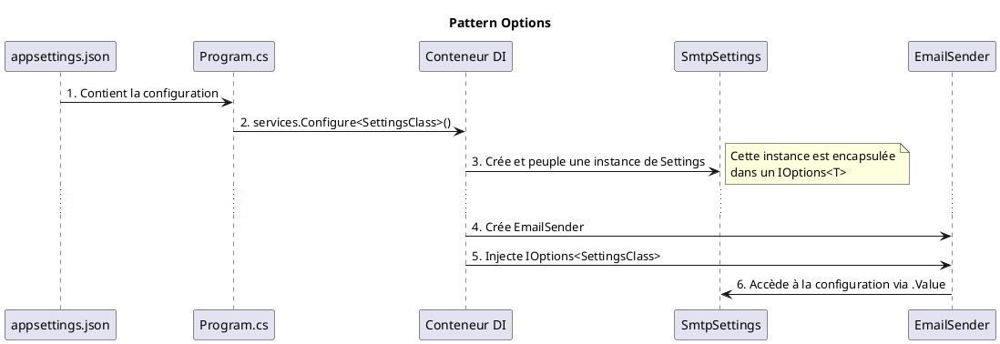

Parfait, nous allons maintenant pousser le bouchon plus loin. Vous avez appris les règles de l'architecture logicielle, il est temps d'apprendre les techniques des maîtres artisans.

Dans la partie essentielle, nous avons mis en place la plomberie de base et les gardes du corps. Dans cette section, nous allons construire un système de configuration sur mesure pour nos composants, apprendre à gérer des situations plus complexes où plusieurs services peuvent faire le même travail, et mettre en place des équipes d'intervention d'urgence pour notre application. Ce sont des techniques qui vous donneront un contrôle et une finesse exceptionnels dans la conception de vos applications.

---

# Module 4 : Architecture Avancée : Maîtrise des Services et des Filtres - Pour aller plus loin

### Objectifs Pédagogiques

À la fin de ce module complémentaire, vous serez capable de :

*   **Utiliser** le pattern Options pour injecter de la configuration de manière fortement typée et sécurisée.
*   **Gérer** des scénarios où plusieurs classes implémentent la même interface en injectant `IEnumerable<T>`.
*   **Implémenter** des filtres asynchrones pour les opérations I/O.
*   **Créer** un filtre d'exception pour centraliser la gestion des erreurs de manière robuste.
*   **Contrôler** l'ordre d'exécution de vos filtres.

### Introduction : Devenir un ingénieur système

Vous savez maintenant comment connecter des composants standards. C'est excellent. Mais que se passe-t-il lorsque vos composants ont besoin de réglages fins et spécifiques ? Ou lorsque vous avez plusieurs types de moteurs pour votre voiture et que vous voulez pouvoir tous les utiliser ?

Cette section vous apprend à devenir un ingénieur système. Vous n'allez plus seulement connecter des "boîtes noires", vous allez concevoir la manière dont ces boîtes sont configurées, comment elles interagissent dans des scénarios complexes, et comment l'ensemble du système réagit en cas de défaillance. Ce sont des compétences cruciales pour construire des applications qui ne sont pas seulement bien conçues, mais aussi résilientes, configurables et prêtes pour les défis du monde réel.

---

### 1. Le Pattern Options : Donnez des réglages à vos services

**Le problème :** Votre service `EmailSender` a besoin de paramètres : l'adresse du serveur SMTP, le port, un nom d'utilisateur et un mot de passe. Comment les lui fournir ? Vous pourriez injecter `IConfiguration` et lire les valeurs une par une (`_config["Smtp:Server"]`). C'est fastidieux, sujet aux erreurs de frappe ("magic strings") et ça ne vous donne aucun typage fort.

**La solution :** Le pattern `IOptions<T>`. C'est une manière élégante de mapper une section de votre fichier `appsettings.json` à une classe C# (un POCO). Cette classe de configuration peut ensuite être injectée directement dans votre service.

C'est comme donner à votre service une petite télécommande pré-programmée (`IOptions<SmtpSettings>`) au lieu de lui donner le manuel de 500 pages de la télévision (`IConfiguration`) et de lui demander de trouver les bons réglages lui-même.

**Le processus :**

1.  **Le JSON (`appsettings.json`) :** Structurez votre configuration.
    ```json
    "SmtpSettings": {
      "Server": "smtp.example.com",
      "Port": 587,
      "SenderEmail": "noreply@example.com"
    }
    ```
2.  **La Classe C# (POCO) :** Créez une classe qui correspond exactement à cette structure.
    ```c#
    // Dans un dossier "Configuration" par exemple
    public class SmtpSettings
    {
        public string Server { get; set; }
        public int Port { get; set; }
        public string SenderEmail { get; set; }
    }
    ```
3.  **L'Enregistrement (`Program.cs`) :** Liez la classe à la section du JSON.
    ```c#
    // On charge la section "SmtpSettings" dans notre classe SmtpSettings
    builder.Services.Configure<SmtpSettings>(
        builder.Configuration.GetSection("SmtpSettings")
    );
    ```
4.  **L'Injection :** Injectez `IOptions<SmtpSettings>` dans votre service. La configuration est accessible via la propriété `.Value`.
    ```c#
    public class EmailSender
    {
        private readonly SmtpSettings _settings;

        public EmailSender(IOptions<SmtpSettings> options)
        {
            _settings = options.Value; // On accède à l'objet configuré
        }

        public void SendEmail()
        {
            Console.WriteLine($"Envoi depuis {_settings.SenderEmail} " +
                              $"via le serveur {_settings.Server}:{_settings.Port}");
        }
    }
    ```
C'est propre, fortement typé, et votre service ne dépend plus de `IConfiguration` mais seulement des réglages dont il a besoin.



---

### 2. Gérer Plusieurs Implémentations d'une Interface

**Le problème :** Votre application doit envoyer des notifications, mais par plusieurs canaux : email, SMS, et push mobile. Vous créez une interface `INotificationService` et trois classes qui l'implémentent : `EmailNotifier`, `SmsNotifier`, `PushNotifier`. Comment pouvez-vous appeler les trois en même temps sans devoir les injecter un par un ?

**La solution :** Injecter une collection. Le conteneur de DI d'ASP.NET Core est assez intelligent. Si vous enregistrez plusieurs services pour la même interface et que vous demandez ensuite un `IEnumerable<IMonInterface>`, il vous donnera une collection contenant une instance de chaque service enregistré.

C'est comme demander à un manager : "Donnez-moi tous vos employés qui ont la compétence 'notification'". Il vous renvoie l'équipe au complet, et vous pouvez leur assigner la tâche.

**Le processus :**
1.  **L'Interface et les Implémentations :**
    ```c#
    public interface INotificationService { void Notify(string message); }
    public class EmailNotifier : INotificationService { /* ... */ }
    public class SmsNotifier : INotificationService { /* ... */ }
    ```
2.  **L'Enregistrement (`Program.cs`) :** Enregistrez chaque implémentation pour la même interface.
    ```c#
    builder.Services.AddTransient<INotificationService, EmailNotifier>();
    builder.Services.AddTransient<INotificationService, SmsNotifier>();
    ```
3.  **L'Injection et l'Utilisation :** Injectez `IEnumerable<INotificationService>`.
    ```c#
    public class OrderProcessor
    {
        private readonly IEnumerable<INotificationService> _notifiers;

        public OrderProcessor(IEnumerable<INotificationService> notifiers)
        {
            _notifiers = notifiers;
        }

        public void ProcessOrder()
        {
            // ... logique de commande ...
            foreach (var notifier in _notifiers)
            {
                notifier.Notify("Votre commande a été traitée !");
            }
        }
    }
    ```
Cette technique est incroyablement puissante pour créer des systèmes extensibles. Pour ajouter un nouveau canal de notification, il suffit de créer la classe et de l'enregistrer. Aucun autre code n'a besoin d'être modifié. C'est l'**Open/Closed Principle** en action.

#### Exercice 2 : Un système de notifications pour le blog

Créez un mini-système de notification pour votre blog.
1.  Créez une interface `INewPostNotifier` avec une méthode `Notify(BlogPost post)`.
2.  Créez deux implémentations : `ConsoleNotifier` (qui écrit dans la console) et `LogFileNotifier` (qui simule une écriture dans un fichier).
3.  Enregistrez les deux services.
4.  Injectez `IEnumerable<INewPostNotifier>` dans votre `BlogController`.
5.  Dans l'action `Create` (POST), après avoir créé un nouvel article, parcourez la collection de notificateurs et appelez leur méthode `Notify`.

##### Correction exercice 2 {collapsible='true'}

1.  **Interface et Services**
    ```c#
    // Interfaces/INewPostNotifier.cs
    public interface INewPostNotifier { void Notify(BlogPost post); }

    // Services/ConsoleNotifier.cs
    public class ConsoleNotifier : INewPostNotifier
    {
        public void Notify(BlogPost post)
        {
            Console.WriteLine($"[CONSOLE] Nouvel article publié: '{post.Title}'");
        }
    }

    // Services/LogFileNotifier.cs
    public class LogFileNotifier : INewPostNotifier
    {
        public void Notify(BlogPost post)
        {
            // Simulation
            Debug.WriteLine($"[LOGFILE] Écriture du log pour l'article ID {post.Id}");
        }
    }
    ```
2.  **`Program.cs`**
    ```c#
    builder.Services.AddTransient<INewPostNotifier, ConsoleNotifier>();
    builder.Services.AddTransient<INewPostNotifier, LogFileNotifier>();
    ```
3.  **`Controllers/BlogController.cs`**
    ```c#
    public class BlogController : Controller
    {
        private readonly IBlogRepository _repository;
        private readonly IEnumerable<INewPostNotifier> _notifiers;

        public BlogController(IBlogRepository repository, 
                              IEnumerable<INewPostNotifier> notifiers)
        {
            _repository = repository;
            _notifiers = notifiers;
        }

        // ...
        [HttpPost]
        public IActionResult Create(BlogPostCreateModel model)
        {
            // ... validation ...
            var newPost = new BlogPost { /* ... */ };
            _repository.Add(newPost);
            
            // Notification !
            foreach(var notifier in _notifiers)
            {
                notifier.Notify(newPost);
            }

            return RedirectToAction("Index");
        }
    }
    ```

---

### 3. Filtres d'Exception et Filtres Asynchrones

#### Filtres d'Exception : L'équipe d'intervention d'urgence

**Le problème :** Une erreur non gérée se produit au fin fond de votre application. Le résultat est une page d'erreur moche et peu informative pour l'utilisateur, et peut-être une perte d'information cruciale pour le débogage.

**La solution :** Un filtre d'exception (`IExceptionFilter`). C'est un filtre global qui agit comme un filet de sécurité. Il attrape toutes les exceptions qui n'ont pas été gérées plus bas dans la pile d'appels. C'est l'endroit idéal pour :
1.  **Logger l'exception** avec tous les détails.
2.  **Présenter une page d'erreur** conviviale à l'utilisateur.

```c#
// Filters/GlobalExceptionFilter.cs
public class GlobalExceptionFilter : IExceptionFilter
{
    private readonly ILogger<GlobalExceptionFilter> _logger;

    public GlobalExceptionFilter(ILogger<GlobalExceptionFilter> logger)
    {
        _logger = logger;
    }

    public void OnException(ExceptionContext context)
    {
        // 1. Logger l'erreur
        _logger.LogError(context.Exception, "Une erreur non gérée est survenue.");
        
        // 2. Présenter une vue d'erreur
        var result = new ViewResult { ViewName = "Error" };
        // On peut passer des infos à la vue Error via son ViewModel
        result.ViewData = new ViewDataDictionary(
            new EmptyModelMetadataProvider(), 
            context.ModelState);
        result.ViewData.Model = new ErrorViewModel { /* ... */ };

        context.Result = result;
        
        // 3. Marquer l'exception comme gérée
        context.ExceptionHandled = true;
    }
}
```
Vous l'enregistrez ensuite globalement dans `Program.cs` comme les autres filtres.

#### Filtres Asynchrones

**Le problème :** Votre filtre de log a besoin d'écrire dans une base de données, une opération asynchrone. Mais `IActionFilter` est synchrone. Si vous faites un appel `async` dedans, vous bloquerez le thread.

**La solution :** Utilisez les interfaces de filtres asynchrones, comme `IAsyncActionFilter`. Elles exposent une seule méthode qui vous permet d'utiliser `await`.

```c#
public class AsyncLoggingFilter : IAsyncActionFilter
{
    public async Task OnActionExecutionAsync(
        ActionExecutingContext context,
        ActionExecutionDelegate next)
    {
        // Code AVANT l'action
        Console.WriteLine("Avant l'action (async)");

        // Exécute la suite du pipeline (l'action et les autres filtres)
        var resultContext = await next();

        // Code APRÈS l'action
        if (resultContext.Exception == null)
        {
            Console.WriteLine("Après l'action (async)");
        }
    }
}
```
C'est la version moderne et non-bloquante des filtres, à privilégier dès que vous avez des opérations I/O.

---

### Conclusion

Vous avez fait un bond de géant. Vous ne vous contentez plus d'utiliser l'injection de dépendances, vous l'utilisez comme un véritable architecte pour créer des systèmes configurables (`IOptions`), extensibles (avec `IEnumerable<T>`) et résilients (avec les filtres d'exception).

Ces patterns ne sont pas spécifiques à ASP.NET Core. Ce sont des piliers de l'ingénierie logicielle que vous retrouverez partout. Savoir les identifier et les mettre en œuvre est une compétence extrêmement précieuse qui vous permettra de concevoir des applications robustes, capables de s'adapter aux changements et de résister aux imprévus.

Le prochain module est l'un des plus attendus : nous allons enfin connecter notre belle architecture à une base de données réelle en utilisant Entity Framework Core. Vous verrez alors comment tous ces principes (DI, services, dépôts) s'assemblent pour créer une couche d'accès aux données professionnelle.