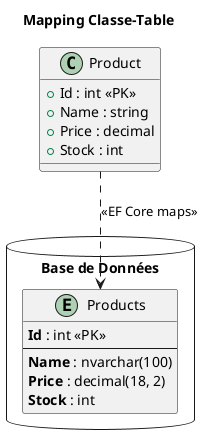

# Module 5 : Accès aux Données avec Entity Framework Core - L'essentiel

### Objectifs Pédagogiques

À la fin de ce module, vous serez capable de :

* **Expliquer** ce qu'est un ORM et ses avantages.
* **Modéliser** vos données en utilisant l'approche "Code-First".
* **Configurer** la connexion à une base de données via le `DbContext`.
* **Utiliser** les migrations pour créer et faire évoluer le schéma de votre base de données en synchronisation avec
  votre code.
* **Implémenter** des opérations CRUD (Create, Read, Update, Delete) de manière efficace.
* **Écrire** des requêtes complexes en utilisant LINQ pour interroger la base de données.

### Introduction : Le traducteur universel

Imaginez que vous devez négocier un contrat important avec un partenaire qui parle une langue complètement différente (
le SQL). Vous pourriez passer des mois à apprendre cette langue, avec le risque de faire des contresens (bugs) ou des
impairs culturels (failles de sécurité comme l'injection SQL).

Ou alors... vous pourriez engager un traducteur expert. Un professionnel qui comprend parfaitement votre langue (le C#)
et la langue de votre partenaire (le SQL). Vous lui donnez vos instructions en C#, et il les traduit en SQL parfait,
optimisé et sécurisé.

**Entity Framework Core (EF Core) est ce traducteur expert.** C'est un **ORM (Object-Relational Mapper)**. Il fait le
pont entre le monde des objets de votre application (vos classes C#) et le monde relationnel de votre base de données (
les tables, les lignes, les colonnes). En utilisant EF Core, vous manipulerez vos données comme de simples objets C#, et
il se chargera de toute la complexité de la communication avec la base de données. C'est un gain de productivité et de
sécurité phénoménal.

---

### 1. Concepts Fondamentaux d'un ORM

#### Qu'est-ce qu'un ORM ?

Un ORM est une technique de programmation qui crée une "couche d'abstraction" entre votre code orienté objet et une base
de données relationnelle. Il mappe les concepts pour vous :

| Monde Objet (C#)           | Monde Relationnel (SQL)  |
|:---------------------------|:-------------------------|
| Classe (`Product`)         | Table (`Products`)       |
| Propriété (`Name`)         | Colonne (`Name`)         |
| Instance d'objet           | Ligne dans la table      |
| Collection (`List<Order>`) | Relation (Clé étrangère) |

#### Approches de Développement

Il y a plusieurs façons de travailler avec un ORM, mais l'une est devenue le standard moderne :

<tabs>
<tab title="Code-First (l'approche moderne)">
    <strong>Vous écrivez vos classes C# en premier.</strong> Vous définissez vos modèles de données comme de simples classes (POCOs). Ensuite, vous demandez à EF Core de générer la base de données à partir de votre code. C'est l'approche que nous allons utiliser.
    <br/>
    <strong>Avantages :</strong> Vous restez dans le monde C#, votre code est la source de vérité, et c'est très rapide pour démarrer et faire évoluer un projet.
</tab>
<tab title="Database-First">
    <strong>La base de données existe déjà.</strong> Vous pointez EF Core vers une base de données existante, et il génère les classes C# pour vous.
    <br/>
    <strong>Avantages :</strong> Idéal pour travailler avec des bases de données d'entreprise existantes (legacy).
</tab>
</tabs>

---

### 2. Modélisation des Données (Code-First)

Pour commencer avec Code-First, nous avons besoin de deux choses principales.

#### Le `DbContext` : Votre session de travail

Le `DbContext` est la classe la plus importante dans EF Core. C'est le portail vers votre base de données. Pensez-y
comme à votre session de travail : il représente une connexion à la base, suit les modifications que vous faites sur les
objets, et coordonne l'enregistrement de ces modifications.

```c#
using Microsoft.EntityFrameworkCore;
using MonAppMvc.Models;

// Créez un dossier "Data" pour cette classe
namespace MonAppMvc.Data
{
    public class ApplicationDbContext : DbContext
    {
        public ApplicationDbContext(DbContextOptions<ApplicationDbContext> options)
            : base(options)
        {
        }

        // Chaque DbSet représente une table dans la base de données.
        public DbSet<Product> Products { get; set; }
    }
}
```

À ajouter dans `Program.cs` pour rendre le contexte injectable et configurer la connexion.

```c#
// Program.cs
// Ajouter le DbContext avec SQLite
builder.Services.AddDbContext<ApplicationDbContext>(options =>
    options.UseSqlite(builder.Configuration.GetConnectionString("DefaultConnection")));

```

Dans `appsettings.json`, il faut définir la connexion
```json
"ConnectionStrings": {
  "DefaultConnection": "Data Source=products.db"
}
```


Il faut également ne pas oublier de charger les dépendances suivantes avec Nuget

```
dotnet add package Microsoft.EntityFrameworkCore.Sqlite
dotnet add package Microsoft.EntityFrameworkCore.Design
```

#### Les Entités (`DbSet<T>`) : Les plans de vos tables

Une entité est une classe C# simple (un **POCO** - Plain Old CLR Object) qui représente une table. Vous déclarez chaque
entité comme une propriété `DbSet<T>` dans votre `DbContext`.

**Comment configurer les entités ?**

EF Core est intelligent et utilise des **conventions**. Par exemple, une propriété nommée `Id` ou `ProductId` sera
automatiquement configurée comme la clé primaire de la table. Mais pour plus de contrôle, on utilise les **Data
Annotations**.

```c#
// Models/Product.cs
using System.ComponentModel.DataAnnotations;
using System.ComponentModel.DataAnnotations.Schema;

public class Product
{
    // [Key] est implicite grâce à la convention de nommage "Id",
    // mais on peut l'ajouter pour être explicite.
    public int Id { get; set; }

    [Required] // Sera NOT NULL dans la base de données
    [MaxLength(100)] // Sera NVARCHAR(100)
    public string Name { get; set; }
    
    [Column(TypeName = "decimal(18, 2)")] // Spécifie le type SQL exact
    public decimal Price { get; set; }

    public int Stock { get; set; }
}
```



##### Mapping des entités

Comme nous pouvons nous en douter, .NET effectue une bonne partie du mapping par convention.
Voici un récapitulatif des règles de conversion appliquées.


| Convention                | Comportement    | Exemple                     |
|---------------------------|-----------------|-----------------------------|
| **Nom de propriété `Id`** | Clé primaire    | `public int Id`             |
| **Nom `ClasseId`**        | Clé primaire    | `public int ProductId`      |
| **Type `string`**         | `nvarchar(max)` | `public string Name`        |
| **Type `int`**            | `int NOT NULL`  | `public int Stock`          |
| **Type `int?`**           | `int NULL`      | `public int? Quantity`      |
| **Propriété navigation**  | Foreign Key     | `public Category Category`  |
| **Collection**            | Relation 1-N    | `public List<Order> Orders` |


Ce n'est que pour les cas particuliers que nous aurons recours au annotations dans l'entité

###### **Data Annotations - Catalogue complet :**

**Clés et identité :**
```c#
[Key] // Clé primaire explicite
public int ProductCode { get; set; }

[DatabaseGenerated(DatabaseGeneratedOption.None)] // Pas d'auto-increment
public int Id { get; set; }

[DatabaseGenerated(DatabaseGeneratedOption.Identity)] // Auto-increment
[DatabaseGenerated(DatabaseGeneratedOption.Computed)] // Calculé par la BDD
```


**DatabaseGeneratedOption.Identity** est utilisé pour les colonnes à auto-incrémentation. La base de données génère 
automatiquement une nouvelle valeur lors de l'insertion d'une nouvelle ligne. C'est typiquement utilisé pour les clés primaires de type entier. Par exemple, si vous insérez un nouvel utilisateur, la base de données lui attribuera automatiquement l'ID 1, puis 2, puis 3, etc. Cette valeur est générée une seule fois à la création et ne change plus.
**DatabaseGeneratedOption.Computed** est utilisé pour les colonnes dont la valeur est calculée par la base de données 
selon une formule ou une expression. Cette valeur peut être générée à l'insertion et recalculée à chaque modification. Par exemple, une colonne qui concatène automatiquement le prénom et le nom, ou une colonne de timestamp qui se met à jour automatiquement, ou encore une colonne qui calcule le prix TTC à partir du prix HT. Chaque fois que vous modifiez la ligne, la base de données peut recalculer cette valeur.
En résumé : Identity génère une valeur unique à la création (souvent un compteur), tandis que Computed calcule une valeur selon une règle métier définie dans la base de données, potentiellement à chaque modification.

**Exemple**

**L'entité**
```c#
public class Produit
{
public int Id { get; set; }
public string Nom { get; set; }
public decimal PrixHT { get; set; }
public decimal TauxTVA { get; set; } // En pourcentage (ex: 20)

    [DatabaseGenerated(DatabaseGeneratedOption.Computed)]
    public decimal PrixTTC { get; set; }
}
```

**Le contexte**
```c#
// Version SQL Server
protected override void OnModelCreating(ModelBuilder modelBuilder)
{
    modelBuilder.Entity<Produit>()
        .Property(p => p.PrixTTC)
        .HasComputedColumnSql("[PrixHT] * (1 + [TauxTVA] / 100)");
}

// Version PostgreSQL
protected override void OnModelCreating(ModelBuilder modelBuilder)
{
    modelBuilder.Entity<Produit>()
        .Property(p => p.PrixTTC)
        .HasComputedColumnSql("\"PrixHT\" * (1 + \"TauxTVA\" / 100.0) STORED");
}

// Version SQLite
protected override void OnModelCreating(ModelBuilder modelBuilder)
{
    modelBuilder.Entity<Produit>()
        .Property(p => p.PrixTTC)
        .HasComputedColumnSql("PrixHT * (1 + TauxTVA / 100.0) STORED");
}

// Version MYSQL
protected override void OnModelCreating(ModelBuilder modelBuilder)
{
    modelBuilder.Entity<Produit>()
        .Property(p => p.PrixTTC)
        .HasComputedColumnSql("`PrixHT` * (1 + `TauxTVA` / 100) STORED");
}
```

La syntaxe des règles de calcul est donc différente d'un SGBDR à l'autre, ce qui risque de poser un problème si l'on 
veut changer de moteur de persistance (par exemple PostgreSQL en production et SQLite pour le dev et les tests).

**Solution pour gérer les syntaxes multiples**

```c#
protected override void OnModelCreating(ModelBuilder modelBuilder)
{
    var dbProvider = Database.ProviderName;
    
    // Formule pour Prix TTC
    string formulaPrixTTC = dbProvider switch
    {
        "Microsoft.EntityFrameworkCore.SqlServer" => 
            "[PrixHT] * (1 + [TauxTVA] / 100)",
        "Microsoft.EntityFrameworkCore.Sqlite" => 
            "PrixHT * (1 + TauxTVA / 100.0) STORED",
        "Npgsql.EntityFrameworkCore.PostgreSQL" => 
            "\"PrixHT\" * (1 + \"TauxTVA\" / 100.0) STORED",
        "Pomelo.EntityFrameworkCore.MySql" => 
            "`PrixHT` * (1 + `TauxTVA` / 100) STORED",
        _ => throw new NotSupportedException($"Provider {dbProvider} non supporté")
    };
   
    
    modelBuilder.Entity<Produit>()
        .Property(p => p.PrixTTC)
        .HasComputedColumnSql(formulaPrixTTC);
}
```


###### **Contraintes de colonnes :**

```c#
[Required] // NOT NULL
[Required(ErrorMessage = "Le nom est obligatoire")]
public string Name { get; set; }

[MaxLength(100)] // VARCHAR(100)
[StringLength(100, MinimumLength = 3)]
public string Name { get; set; }

[Column(TypeName = "decimal(18,2)")] // Type SQL précis
public decimal Price { get; set; }

[Column("ProductName")] // Nom de colonne différent
public string Name { get; set; }
```

###### **Index et contraintes :**

```c#
[Index(nameof(Email), IsUnique = true)] // Index unique
public class User
{
    public string Email { get; set; }
}

[ConcurrencyCheck] // Vérification de concurrence
public string Name { get; set; }

[Timestamp] // Colonne timestamp pour optimistic concurrency
public byte[] RowVersion { get; set; }
```

Ces annotations servent à gérer la **concurrence optimiste** (optimistic concurrency) dans Entity Framework.

**[ConcurrencyCheck]**

Indique qu'Entity Framework doit **vérifier que la valeur de cette propriété n'a pas changé** entre la lecture et la mise à jour.

**Exemple :**
```c#
public class Produit
{
    public int Id { get; set; }
    
    [ConcurrencyCheck]
    public string Name { get; set; }
    
    public decimal Prix { get; set; }
}
```

**Scénario :**

1. Utilisateur A lit le produit : `Name = "iPhone", Prix = 999`
2. Utilisateur B lit le même produit : `Name = "iPhone", Prix = 999`
3. Utilisateur A change le prix à 1099 et sauvegarde ✅
4. Utilisateur B change le nom à "iPhone 15" et essaie de sauvegarder

Quand B sauvegarde, EF génère :
```sql
UPDATE Produits 
SET Name = 'iPhone 15', Prix = 999 
WHERE Id = 1 AND Name = 'iPhone'  -- ⚠️ Vérifie que Name n'a pas changé
```

Si le `Name` a été modifié, la condition `WHERE` ne trouve aucune ligne → `DbUpdateConcurrencyException`

---

**[Timestamp] / RowVersion**

Crée une **colonne spéciale automatiquement incrémentée par la base de données** à chaque modification.

**Méthode recommandée pour la concurrence optimiste**

**Exemple :**

```c#
public class Produit
{
    public int Id { get; set; }
    public string Name { get; set; }
    public decimal Prix { get; set; }
    
    [Timestamp]
    public byte[] RowVersion { get; set; }
}
```

**Scénario :**

1. Utilisateur A lit : `RowVersion = 0x00000001`
2. Utilisateur B lit : `RowVersion = 0x00000001`
3. Utilisateur A modifie et sauvegarde → `RowVersion` devient `0x00000002` automatiquement
4. Utilisateur B essaie de sauvegarder :

```sql
UPDATE Produits 
SET Name = 'iPhone 15', Prix = 999 
WHERE Id = 1 AND RowVersion = 0x00000001  -- ⚠️ Cette version n'existe plus !
```

La mise à jour échoue → `DbUpdateConcurrencyException`

---

**Comparaison**

| Aspect | [ConcurrencyCheck] | [Timestamp] |
|--------|-------------------|-------------|
| **Propriétés vérifiées** | La propriété marquée uniquement | Toutes les modifications |
| **Gestion** | Manuelle (vous gérez la valeur) | Automatique (DB gère) |
| **Performance** | Peut vérifier plusieurs colonnes | Une seule colonne |
| **Type** | N'importe quel type | `byte[]` uniquement |
| **Usage recommandé** | Cas spécifiques | **Recommandé en général** |

---

**Gestion des exceptions de concurrence**

```c#
try
{
    await context.SaveChangesAsync();
}
catch (DbUpdateConcurrencyException ex)
{
    // Récupérer les valeurs actuelles de la DB
    var entry = ex.Entries.Single();
    var databaseValues = await entry.GetDatabaseValuesAsync();
    
    if (databaseValues == null)
    {
        // L'entité a été supprimée
        Console.WriteLine("L'entité a été supprimée par un autre utilisateur");
    }
    else
    {
        // Conflits : décider quoi faire
        
        // Option 1 : Écraser les changements de l'autre utilisateur
        entry.OriginalValues.SetValues(databaseValues);
        await context.SaveChangesAsync();
        
        // Option 2 : Abandonner et recharger
        entry.Reload();
        
        // Option 3 : Fusionner les changements manuellement
        var currentValues = entry.CurrentValues;
        // Logique de fusion personnalisée...
    }
}
```

---

**Combinaison des deux annotations**

Vous pouvez utiliser les deux en même temps :

```c#
public class Produit
{
    public int Id { get; set; }
    
    [ConcurrencyCheck]
    public string Name { get; set; }  // Ne doit pas changer
    
    public decimal Prix { get; set; }  // Peut changer
    
    [Timestamp]
    public byte[] RowVersion { get; set; }  // Détecte tout changement
}
```

###### **Propriétés spéciales :**

```c#
[NotMapped] // Ne pas créer de colonne
public decimal TotalValue => Price * Stock;

[ForeignKey("CategoryId")] // Clé étrangère explicite
public Category Category { get; set; }

[InverseProperty("Products")] // Relation inverse
public Category Category { get; set; }
```

###### **Exemple complet d'entité :**

```c#
[Table("tbl_Products")] // Nom de table personnalisé
[Index(nameof(Sku), IsUnique = true)]
public class Product
{
    [Key]
    [DatabaseGenerated(DatabaseGeneratedOption.Identity)]
    public int Id { get; set; }

    [Required(ErrorMessage = "Le nom est obligatoire")]
    [StringLength(100, MinimumLength = 3)]
    [Column("ProductName")]
    public string Name { get; set; }

    [Required]
    [StringLength(20)]
    [RegularExpression(@"^[A-Z]{3}-\d{4}$")]
    public string Sku { get; set; }

    [Column(TypeName = "decimal(18,2)")]
    [Range(0.01, 999999.99)]
    public decimal Price { get; set; }

    [Range(0, int.MaxValue)]
    public int Stock { get; set; }

    [StringLength(500)]
    public string? Description { get; set; }

    [DataType(DataType.DateTime)]
    public DateTime CreatedAt { get; set; } = DateTime.Now;

    [DataType(DataType.DateTime)]
    public DateTime? UpdatedAt { get; set; }

    [NotMapped]
    public bool IsInStock => Stock > 0;

    [NotMapped]
    public decimal TotalValue => Price * Stock;

    // Relations
    public int CategoryId { get; set; }
    
    [ForeignKey("CategoryId")]
    public Category Category { get; set; }

    [Timestamp]
    public byte[] RowVersion { get; set; }
}
```

---

#### Variante avec Postgresql

Pour postgresql, il faut installer le SGBDR, le plus simple est d'utiliser Docker.

**docker-compose.yml**
```yaml
services:
  postgres:
    image: postgres:16
    environment:
      - POSTGRES_USER=user
      - POSTGRES_PASSWORD=123
      - POSTGRES_DB=webDB
    ports:
      - "5432:5432"
    volumes:
      - postgres_data:/var/lib/postgresql/data

volumes:
  postgres_data:
```
Et ne pas oublier d'installer la dépendance `NuGet`.

```
dotnet add package Npgsql.EntityFrameworkCore.PostgreSQL
```

**appsettings.json**
```json
"ConnectionStrings": {
  "DefaultConnection": "Host=localhost;Database=WebDB;Username=user;Password=123"
}
```

**Program.cs**

```c#
builder.Services.AddDbContext<ApplicationDbContext>(options =>
    options.UseNpgsql(builder.Configuration.GetConnectionString("DefaultConnection")));
```

#### Variante avec SQL Server

Pour SQL Server, il faut aussi installer le SGBDR.

**docker-compose.yml**
```yaml
services:
  sqlserver:
    image: mcr.microsoft.com/mssql/server:2022-latest
    environment:
      - ACCEPT_EULA=Y
      - SA_PASSWORD=12345678
    ports:
      - "1433:1433"
    volumes:
      - sqlserver_data:/var/opt/mssql

volumes:
  sqlserver_data:
```
Et ne pas oublier d'installer la dépendance `NuGet`.

```
dotnet add package Microsoft.EntityFrameworkCore.SqlServer
```

**appsettings.json**
```json
"ConnectionStrings": {
"DefaultConnection": "Server=localhost,1433;Database=webDB;User Id=sa;Password=12345678;
TrustServerCertificate=True"
}
```

**Program.cs**

```c#
builder.Services.AddDbContext<ApplicationDbContext>(options =>
    options.UseSqlServer(builder.Configuration.GetConnectionString("DefaultConnection")));
```

### 3. Gestion de la Base de Données : Les Migrations

**Le problème :** Vous venez d'ajouter une propriété `Description` à votre classe `Product`. Comment mettre à jour la
base de données pour qu'elle ait une nouvelle colonne `Description` sans perdre toutes les données existantes ?

**La solution :** Les Migrations. Une migration est un "journal de modifications". C'est un fichier de code C# qui
décrit exactement comment passer de l'ancien état de votre base de données au nouvel état.

Pensez à un architecte qui modifie les plans d'un bâtiment en construction. Il ne crie pas "ajoutez une fenêtre !". Il
publie une révision du plan (une migration) qui dit précisément : "Sur le mur nord du 2ème étage, à 3 mètres du coin
est, créer une ouverture de 1m x 1.5m".

<procedure title="Le cycle de vie d'une migration">
<step>
    <p>Vous modifiez vos classes d'entités dans votre code C#.</p>
</step>
<step>
    <p>Vous ouvrez la console du Gestionnaire de Paquets (dans Visual Studio) ou un terminal et vous exécutez la commande :</p>

    ```powershell
    # Pour Package Manager Console
    Add-Migration NomDeLaMigration

    # Pour le CLI dotnet
    dotnet ef migrations add NomDeLaMigration
    ```

<p>EF Core compare votre modèle actuel à celui de la dernière migration et génère un nouveau fichier de migration avec le code C# pour appliquer les changements.</p>

</step>
<step>
    <p>Vous inspectez le fichier de migration pour vous assurer qu'il est correct.</p>
</step>
<step>
    <p>Vous appliquez la migration à la base de données avec la commande :</p>

    ```powershell
    # Pour Package Manager Console
    Update-Database

    # Pour le CLI dotnet
    dotnet ef database update
    ```

</step>
</procedure>


####  Bonnes pratiques : Nommer les migrations EF Core

Le nom d'une migration doit décrire précisément **le changement** apporté au schéma, sans avoir à lire le code.

##### La règle d'or : [Verbe] + [Sujet] + [Propriété]

Utilisez l'anglais (standard) ou le français, mais restez cohérent. Utilisez toujours le **PascalCase**.

| Action                  | Modèle de nom                  | Exemple                 |
|:------------------------|:-------------------------------|:------------------------|
| **Création**            | `InitialCreate`                | `InitialCreate`         |
| **Ajouter une table**   | `Add[Table]Table`              | `AddProductsTable`      |
| **Ajouter une colonne** | `Add[Champ]To[Table]`          | `AddSkuToProducts`      |
| **Supprimer**           | `Remove[Champ]From[Table]`     | `RemoveAgeFromUsers`    |
| **Modifier**            | `Update` / `Rename` / `Change` | `RenameLabelToTitle`    |
| **Index / Clé**         | `Add[Type]To[Table]`           | `AddUniqueIndexToEmail` |

##### À éviter (Bad Practices)

* **Les noms vagues :** `Migration1`, `UpdateDatabase`, `FixBug`, `Changes`.
* **Les noms trop longs :** Si vous avez plus de 4 ou 5 mots, votre migration est probablement trop complexe (
  divisez-la).
* **L'horodatage :** Inutile de mettre la date, EF Core l'ajoute automatiquement en préfixe du fichier.

##### Principes clés

* **Atomicité :** Une migration doit idéalement ne concerner qu'une seule entité ou un groupe de changements liés.
* **Réversibilité :** Posez-vous la question : "Le nom permet-il de savoir exactement ce qui sera annulé en cas de
  Rollback ?"

##### Astuce : Correction

Si vous avez nommé une migration par erreur et qu'elle n'a pas encore été appliquée (`database update`) :

```bash
dotnet ef migrations remove
```

*Cela supprime la dernière migration locale, vous permettant de la recréer avec un nom correct.*

##### Récapitulatif des Commandes essentielles de migration

**1. Créer une migration**

```powershell
# Package Manager Console
Add-Migration NomDeLaMigration

# CLI .NET
dotnet ef migrations add NomDeLaMigration

# Exemples de noms
Add-Migration InitialCreate
Add-Migration AddDescriptionToProducts
Add-Migration CreateOrdersTable
```

**2. Appliquer les migrations**

```powershell
# Package Manager Console
Update-Database

# CLI .NET
dotnet ef database update

# Appliquer jusqu'à une migration spécifique
Update-Database -Migration NomMigration

# Revenir en arrière
Update-Database -Migration PreviousMigration
```

**3. Supprimer la dernière migration**

```powershell
# Package Manager Console (si pas encore appliquée)
Remove-Migration

# CLI .NET
dotnet ef migrations remove
```

**4. Générer un script SQL**

```powershell
# Package Manager Console
Script-Migration

# CLI .NET
dotnet ef migrations script

# Script pour une migration spécifique
Script-Migration -From InitialCreate -To AddDescriptionToProducts
```

**5. Lister les migrations**

```powershell
# CLI .NET
dotnet ef migrations list
```

**Anatomie d'une migration :**

```c#
// Migrations/20240209123456_AddDescriptionToProducts.cs
public partial class AddDescriptionToProducts : Migration
{
    // Méthode Up : Applique les changements
    protected override void Up(MigrationBuilder migrationBuilder)
    {
        migrationBuilder.AddColumn<string>(
            name: "Description",
            table: "Products",
            type: "nvarchar(500)",
            maxLength: 500,
            nullable: true);
    }

    // Méthode Down : Annule les changements
    protected override void Down(MigrationBuilder migrationBuilder)
    {
        migrationBuilder.DropColumn(
            name: "Description",
            table: "Products");
    }
}
```
---

### 4. Opérations CRUD (Create, Read, Update, Delete)

Une fois tout en place, interagir avec la base de données devient un jeu d'enfant. Tout se passe via votre instance de
`DbContext`.

**L'étape la plus importante : `SaveChanges()`**

Rien de ce que vous faites n'est envoyé à la base de données tant que vous n'appelez pas `_context.SaveChanges()`. EF
Core travaille avec un "patron d'unité de travail". Il suit toutes vos modifications en mémoire et, lorsque vous appelez
`SaveChanges()`, il les envoie toutes en une seule transaction efficace. C'est le bouton "Enregistrer" de votre session
de travail.

```c#
// Exemple d'utilisation dans un dépôt
public class EfProductRepository : IProductRepository
{
    private readonly ApplicationDbContext _context;

    public EfProductRepository(ApplicationDbContext context)
    {
        _context = context;
    }

    // CREATE
    public void Add(Product product)
    {
        _context.Products.Add(product);
        _context.SaveChanges(); // Enregistre l'ajout
    }

    // READ (un seul)
    public Product GetById(int id)
    {
        // Find est optimisé pour la recherche par clé primaire
        return _context.Products.Find(id);
    }

    // READ (tous)
    public IEnumerable<Product> GetAll()
    {
        return _context.Products.ToList();
    }

    // UPDATE
    public void Update(Product product)
    {
        _context.Products.Update(product);
        _context.SaveChanges(); // Enregistre la modification
    }

    // DELETE
    public void Delete(int id)
    {
        var product = _context.Products.Find(id);
        if (product != null)
        {
            _context.Products.Remove(product);
            _context.SaveChanges(); // Enregistre la suppression
        }
    }
}
```

#### Liste des opérations du CRUD

##### 4.1 Create - Ajouter des Données

**Méthodes pour ajouter :**

**1. Add() pour une entité**

```c#
public void AddProduct(Product product)
{
    // 1. Ajouter au contexte (en mémoire)
    _context.Products.Add(product);
    
    // 2. Sauvegarder (exécute SQL INSERT)
    _context.SaveChanges();
}

// Utilisation
var newProduct = new Product
{
    Name = "Laptop",
    Price = 999.99m,
    Stock = 10
};
_context.Products.Add(newProduct);
_context.SaveChanges();

// L'Id est maintenant rempli automatiquement
Console.WriteLine($"Produit créé avec Id: {newProduct.Id}");
```

**2. AddRange() pour plusieurs entités**

```c#
var products = new List<Product>
{
    new Product { Name = "Mouse", Price = 29.99m, Stock = 50 },
    new Product { Name = "Keyboard", Price = 79.99m, Stock = 30 },
    new Product { Name = "Monitor", Price = 299.99m, Stock = 15 }
};

_context.Products.AddRange(products);
_context.SaveChanges();
```

**3. Version asynchrone (recommandée)**

```c#
public async Task AddProductAsync(Product product)
{
    await _context.Products.AddAsync(product);
    await _context.SaveChangesAsync();
}
```

**États des entités :**

```c#
// État initial
var product = new Product { Name = "Test" };
// État: Detached (non suivi)

_context.Products.Add(product);
// État: Added (sera inséré au SaveChanges)

_context.SaveChanges();
// État: Unchanged (synchronisé avec la base)
```

##### 4.2 Read - Lire des Données

**Méthodes de lecture :**

**1. Récupérer tout**

```c#
// ⚠️ Attention : charge TOUT en mémoire
var allProducts = _context.Products.ToList();

// ✅ Meilleur : avec filtre
var activeProducts = _context.Products
    .Where(p => p.Stock > 0)
    .ToList();
```

**2. Récupérer par clé primaire (Find)**

```c#
// ✅ Optimisé : cherche d'abord dans le cache
var product = _context.Products.Find(5);

// Équivalent mais moins optimisé
var product = _context.Products
    .FirstOrDefault(p => p.Id == 5);
```

**3. Requêtes avec conditions**

```c#
// Premier élément qui correspond
var firstExpensive = _context.Products
    .FirstOrDefault(p => p.Price > 100);

// Single (erreur si 0 ou plus de 1)
var uniqueProduct = _context.Products
    .Single(p => p.Sku == "PROD-001");

// Any (vérifier l'existence)
bool hasExpensive = _context.Products
    .Any(p => p.Price > 1000);

// Count
int productCount = _context.Products.Count();
int expensiveCount = _context.Products
    .Count(p => p.Price > 100);
```

**4. Projection (Select)**

```c#
// Ne récupérer que certaines colonnes
var productNames = _context.Products
    .Select(p => p.Name)
    .ToList();

// Projection vers un type anonyme
var productSummaries = _context.Products
    .Select(p => new 
    { 
        p.Name, 
        p.Price,
        InStock = p.Stock > 0
    })
    .ToList();

// Projection vers un DTO
var productDtos = _context.Products
    .Select(p => new ProductDto
    {
        Name = p.Name,
        Price = p.Price
    })
    .ToList();
```

**5. Tri et pagination**

```c#
// Tri
var sortedProducts = _context.Products
    .OrderBy(p => p.Price)
    .ToList();

var sortedDesc = _context.Products
    .OrderByDescending(p => p.Price)
    .ThenBy(p => p.Name)
    .ToList();

// Pagination
int pageSize = 10;
int pageNumber = 1;

var pagedProducts = _context.Products
    .OrderBy(p => p.Id)
    .Skip((pageNumber - 1) * pageSize)
    .Take(pageSize)
    .ToList();
```

**6. Chargement de relations**

```c#
// Eager Loading (chargement immédiat)
var products = _context.Products
    .Include(p => p.Category)
    .ToList();

// Plusieurs niveaux
var products = _context.Products
    .Include(p => p.Category)
    .Include(p => p.Orders)
        .ThenInclude(o => o.Customer)
    .ToList();

// Lazy Loading (chargement paresseux - nécessite configuration)
var product = _context.Products.Find(1);
// Category chargée automatiquement lors de l'accès
var categoryName = product.Category.Name;

// Explicit Loading (chargement explicite)
var product = _context.Products.Find(1);
_context.Entry(product)
    .Reference(p => p.Category)
    .Load();
```

##### 4.3 Update - Modifier des Données

**Méthode 1 : Charger puis modifier**

```c#
// 1. Charger l'entité
var product = _context.Products.Find(5);

if (product != null)
{
    // 2. Modifier les propriétés
    product.Name = "Updated Name";
    product.Price = 149.99m;
    
    // 3. Sauvegarder (UPDATE automatique)
    _context.SaveChanges();
}
```

**Méthode 2 : Update() direct**

```c#
// Quand on a déjà l'objet complet
var product = new Product
{
    Id = 5,
    Name = "Updated",
    Price = 149.99m,
    Stock = 20
};

// Marque comme modifié
_context.Products.Update(product);
_context.SaveChanges();

// ⚠️ Met à jour TOUTES les colonnes
```

**Méthode 3 : Modification partielle**

```c#
// Ne modifier que certaines propriétés
var product = _context.Products.Find(5);
product.Price = 149.99m;

// Ou via Entry
_context.Entry(product).Property(p => p.Price).IsModified = true;
_context.SaveChanges();
```

**UpdateRange() pour plusieurs :**

```c#
var products = _context.Products
    .Where(p => p.Stock < 10)
    .ToList();

foreach (var product in products)
{
    product.Stock += 100;
}

_context.UpdateRange(products);
_context.SaveChanges();
```

##### 4.4 Delete - Supprimer des Données

**Méthode 1 : Charger puis supprimer**

```c#
var product = _context.Products.Find(5);

if (product != null)
{
    _context.Products.Remove(product);
    _context.SaveChanges();
}
```

**Méthode 2 : Suppression sans chargement**

```c#
// Créer une entité avec juste l'Id
var product = new Product { Id = 5 };

// Attacher et marquer comme supprimé
_context.Products.Attach(product);
_context.Products.Remove(product);
_context.SaveChanges();
```

**RemoveRange() pour plusieurs :**

```c#
var oldProducts = _context.Products
    .Where(p => p.CreatedAt < DateTime.Now.AddYears(-5))
    .ToList();

_context.Products.RemoveRange(oldProducts);
_context.SaveChanges();
```

**Soft Delete (suppression logique) :**

```c#
// Ajouter une propriété
public class Product
{
    public bool IsDeleted { get; set; }
}

// "Supprimer"
var product = _context.Products.Find(5);
product.IsDeleted = true;
_context.SaveChanges();

// Filtrer partout
var activeProducts = _context.Products
    .Where(p => !p.IsDeleted)
    .ToList();
```

#### Exercice 2 : Implémenter la suppression

Dans le code ci-dessus, l'implémentation de `Delete` est déjà fournie. Votre tâche est d'ajouter une action
`Delete(int id)` (POST) et une vue `Delete.cshtml` à votre `ProductsController` pour permettre à un utilisateur de
supprimer un produit. La vue doit afficher les détails du produit et demander confirmation.

##### Correction exercice 2 {collapsible='true'}

**`Controllers/ProductsController.cs`**

```c#
// GET: Products/Delete/5
public IActionResult Delete(int id)
{
    var product = _repository.GetById(id);
    if (product == null)
    {
        return NotFound();
    }
    return View(product);
}

// POST: Products/Delete/5
[HttpPost, ActionName("Delete")]
[ValidateAntiForgeryToken]
public IActionResult DeleteConfirmed(int id)
{
    _repository.Delete(id);
    return RedirectToAction(nameof(Index));
}
```

**`Views/Products/Delete.cshtml`**

```html
@model MonAppMvc.Models.Product

@{ ViewData["Title"] = "Supprimer"; }

<h1>Supprimer</h1>
<h3>Êtes-vous sûr de vouloir supprimer ceci ?</h3>
<div>
    <h4>Produit</h4>
    <hr/>
    <dl class="row">
        <dt class="col-sm-2">@Html.DisplayNameFor(model => model.Name)</dt>
        <dd class="col-sm-10">@Html.DisplayFor(model => model.Name)</dd>
    </dl>

    <form asp-action="Delete">
        <input type="hidden" asp-for="Id"/>
        <input type="submit" value="Supprimer" class="btn btn-danger"/> |
        <a asp-action="Index">Retour à la liste</a>
    </form>
</div>
```

---

### 5. Requêtage avec LINQ

C'est là que la magie opère. Au lieu d'écrire du SQL, vous écrivez des requêtes en utilisant **LINQ (Language-Integrated
Query)**, une fonctionnalité de C#. EF Core traduit ce C# en SQL optimisé pour vous.

```c#
// Obtenir tous les produits de plus de 50€, triés par nom
var expensiveProducts = _context.Products
    .Where(p => p.Price > 50)
    .OrderBy(p => p.Name)
    .ToList();

// Projeter pour ne récupérer que le nom et le prix
var productNamesAndPrices = _context.Products
    .Select(p => new { p.Name, p.Price })
    .ToList();
```

#### 5.1 Opérateurs essentiels

**1. Filtrage**
```c#
// Where
var filtered = _context.Products
    .Where(p => p.Price > 50 && p.Stock > 0);

// Conditions multiples
var complex = _context.Products
    .Where(p => p.Price > 50)
    .Where(p => p.Stock > 0)
    .Where(p => p.Name.Contains("Laptop"));
```

**2. Tri**
```c#
// OrderBy, OrderByDescending
var sorted = _context.Products
    .OrderBy(p => p.Price);

// Tri multiple
var multiSort = _context.Products
    .OrderBy(p => p.Category.Name)
    .ThenByDescending(p => p.Price)
    .ThenBy(p => p.Name);
```

**3. Projection**
```c#
// Select
var names = _context.Products
    .Select(p => p.Name);

var dtos = _context.Products
    .Select(p => new ProductDto
    {
        Name = p.Name,
        Price = p.Price,
        CategoryName = p.Category.Name
    });
```

**4. Agrégation**
```c#
// Count
int count = _context.Products.Count();
int expensiveCount = _context.Products.Count(p => p.Price > 100);

// Sum
decimal totalValue = _context.Products.Sum(p => p.Price * p.Stock);

// Average
decimal avgPrice = _context.Products.Average(p => p.Price);

// Min, Max
decimal minPrice = _context.Products.Min(p => p.Price);
decimal maxPrice = _context.Products.Max(p => p.Price);
```

**5. Groupement**
```c#
// GroupBy
var grouped = _context.Products
    .GroupBy(p => p.CategoryId)
    .Select(g => new
    {
        CategoryId = g.Key,
        Count = g.Count(),
        TotalValue = g.Sum(p => p.Price * p.Stock)
    })
    .ToList();
```

**6. Jointures**
```c#
// Join explicite (rarement nécessaire avec EF)
var joined = _context.Products
    .Join(
        _context.Categories,
        product => product.CategoryId,
        category => category.Id,
        (product, category) => new
        {
            ProductName = product.Name,
            CategoryName = category.Name
        }
    );

// Meilleur choix : Utiliser Include
var products = _context.Products
    .Include(p => p.Category)
    .ToList();
```

#### 5.2 Exécution Différée vs. Immédiate

C'est un concept crucial. Une requête LINQ n'est **pas** exécutée tant que vous ne "consommez" pas les résultats.

* **Différée :** `var query = _context.Products.Where(p => p.Stock < 10);`
    * À ce stade, **aucune requête n'a été envoyée à la base de données**. Vous avez juste construit un plan de requête.
* **Immédiate :** `var lowStockProducts = query.ToList();`
    * C'est l'appel à `.ToList()` (ou `.FirstOrDefault()`, `.Count()`, etc.) qui déclenche l'envoi de la requête SQL à
      la base et la récupération des données.

Cette exécution différée permet à EF Core de construire des requêtes SQL très complexes et optimisées en enchaînant les
appels LINQ.

**Méthodes qui forcent l'exécution immédiate :**

| Méthode                | Retourne          | Quand utiliser          |
|------------------------|-------------------|-------------------------|
| `ToList()`             | `List<T>`         | Tout charger en mémoire |
| `ToArray()`            | `T[]`             | Array nécessaire        |
| `ToDictionary()`       | `Dictionary<K,V>` | Lookup rapide           |
| `FirstOrDefault()`     | `T`               | Premier élément         |
| `SingleOrDefault()`    | `T`               | Élément unique          |
| `Count()`              | `int`             | Compter                 |
| `Any()`                | `bool`            | Vérifier existence      |
| `Sum()`, `Max()`, etc. | Valeur            | Agrégation              |


**IQueryable vs IEnumerable :**

```c#
// ✅ IQueryable : Filtrage côté base de données
IQueryable<Product> query = _context.Products;
query = query.Where(p => p.Price > 50); // SQL WHERE
var results = query.ToList(); // SQL exécuté avec WHERE

// ❌ IEnumerable : Filtrage côté application
IEnumerable<Product> enumerable = _context.Products.ToList(); // Charge TOUT
enumerable = enumerable.Where(p => p.Price > 50); // Filtre en mémoire
var results = enumerable.ToList();
```

**Piège courant :**

```c#
// Mauvais : N+1 queries
var products = _context.Products.ToList(); // 1 query
foreach (var product in products)
{
    var category = _context.Categories.Find(product.CategoryId); // N queries
}

// Bon : 1 query avec JOIN
var products = _context.Products
    .Include(p => p.Category)
    .ToList(); // 1 query
```

#### 5.3 Requêtes Avancées

**1. Recherche textuelle**

```c#
// Contient
var laptops = _context.Products
    .Where(p => p.Name.Contains("Laptop"))
    .ToList();

// Commence par
var aProducts = _context.Products
    .Where(p => p.Name.StartsWith("A"))
    .ToList();

// Case insensitive
var search = "laptop";
var results = _context.Products
    .Where(p => EF.Functions.Like(p.Name, $"%{search}%"))
    .ToList();
```

**2. Dates**

```c#
// Produits créés aujourd'hui
var today = DateTime.Today;
var todayProducts = _context.Products
    .Where(p => p.CreatedAt >= today && p.CreatedAt < today.AddDays(1))
    .ToList();

// Ce mois
var thisMonth = new DateTime(DateTime.Now.Year, DateTime.Now.Month, 1);
var monthProducts = _context.Products
    .Where(p => p.CreatedAt >= thisMonth)
    .ToList();
```

**3. Sous-requêtes**

```c#
// Produits des catégories qui ont plus de 10 produits
var popularCategories = _context.Categories
    .Where(c => c.Products.Count() > 10)
    .ToList();

// Produits sans commandes
var unsoldProducts = _context.Products
    .Where(p => !p.Orders.Any())
    .ToList();
```

**4. SQL brut (si nécessaire)**

```c#
// FromSqlRaw pour requêtes complexes
var products = _context.Products
    .FromSqlRaw("SELECT * FROM Products WHERE Price > {0}", 50)
    .ToList();

// FromSqlInterpolated (recommandé, protégé injection)
var minPrice = 50;
var products = _context.Products
    .FromSqlInterpolated($"SELECT * FROM Products WHERE Price > {minPrice}")
    .ToList();

// Peut être combiné avec LINQ
var filtered = _context.Products
    .FromSqlRaw("SELECT * FROM Products WHERE Stock > 0")
    .Where(p => p.Price > 100)
    .OrderBy(p => p.Name)
    .ToList();
```
---

### TP : Remplacer le dépôt en mémoire par EF Core

Le moment est venu. Nous allons prendre notre projet de gestion de produits et remplacer son dépôt en mémoire par un
vrai dépôt qui utilise une base de données SQL Server LocalDB.

<procedure>
<step title="Étape 1 : Installer les paquets NuGet">
<p>Via la console du gestionnaire de paquets ou le gestionnaire NuGet, installez :</p>
<ul>
    <li><code>Microsoft.EntityFrameworkCore.SqlServer</code> : Le fournisseur pour SQL Server.</li>
    <li><code>Microsoft.EntityFrameworkCore.Tools</code> : Les outils pour les migrations.</li>
</ul>
</step>
<step title="Étape 2 : Créer le DbContext et configurer la chaîne de connexion">
<p>Créez la classe <code>ApplicationDbContext</code> comme vu plus haut.
Dans <code>appsettings.json</code>, ajoutez une chaîne de connexion :</p>
<code-block lang="json">
"ConnectionStrings": {
  "DefaultConnection": "Server=(localdb)\\mssqllocaldb;Database=MonAppMvcDb;Trusted_Connection=True;MultipleActiveResultSets=true"
}
</code-block>
</step>
<step title="Étape 3 : Configurer le DbContext dans `Program.cs`">
<p>Enregistrez votre DbContext dans le conteneur de services.</p>
</step>
<step title="Étape 4 : Lancer les migrations">
<p>Ajoutez les Data Annotations à votre modèle <code>Product</code>.
Exécutez <code>Add-Migration InitialCreate</code> puis <code>Update-Database</code>.</p>
</step>
<step title="Étape 5 : Créer `EfProductRepository`">
<p>Créez une nouvelle classe de dépôt qui implémente <code>IProductRepository</code> mais qui utilise le <code>DbContext</code> injecté pour faire les opérations CRUD.</p>
</step>
<step title="Étape 6 : Mettre à jour l'Injection de Dépendances">
<p>Dans <code>Program.cs</code>, changez la ligne qui enregistre le dépôt pour utiliser votre nouvelle classe <code>EfProductRepository</code> au lieu de <code>InMemoryProductRepository</code>.</p>
</step>
</procedure>

#### Correction TP : Remplacer le dépôt en mémoire par EF Core {collapsible='true'}

<tabs>
<tab title="Program.cs">

```c#
// using MonAppMvc.Data;
// using Microsoft.EntityFrameworkCore;
// using MonAppMvc.Interfaces;
// using MonAppMvc.Services; // Pour le nouveau dépôt

var builder = WebApplication.CreateBuilder(args);

// 1. Configuration de la chaîne de connexion
var connectionString = builder.Configuration.GetConnectionString("DefaultConnection");

// 2. Enregistrement du DbContext
builder.Services.AddDbContext<ApplicationDbContext>(options =>
options.UseSqlServer(connectionString));

// 3. Remplacement de l'ancien dépôt par le nouveau
// builder.Services.AddSingleton<IProductRepository, InMemoryProductRepository>();
builder.Services.AddScoped<IProductRepository, EfProductRepository>();

builder.Services.AddControllersWithViews();
var app = builder.Build();
// ...

```

</tab>
<tab title="EfProductRepository.cs">

```c#
using MonAppMvc.Data;
using MonAppMvc.Interfaces;
using MonAppMvc.Models;
using System.Collections.Generic;
using System.Linq;

namespace MonAppMvc.Services
{
    public class EfProductRepository : IProductRepository
    {
        private readonly ApplicationDbContext _context;

        public EfProductRepository(ApplicationDbContext context)
        {
            _context = context;
        }

        public void Add(Product product)
        {
            _context.Products.Add(product);
            _context.SaveChanges();
        }

        public void Delete(int id)
        {
            var product = GetById(id);
            if (product != null)
            {
                _context.Products.Remove(product);
                _context.SaveChanges();
            }
        }

        public IEnumerable<Product> GetAll()
        {
            return _context.Products.ToList();
        }

        public Product GetById(int id)
        {
            return _context.Products.Find(id);
        }

        public void Update(Product product)
        {
            _context.Products.Update(product);
            _context.SaveChanges();
        }
    }
}
```

</tab>
</tabs>
Lancez l'application. Elle devrait fonctionner exactement comme avant, mais cette fois, vos données sont persistantes !

---

### Auto-évaluation

1. Que signifie "Code-First" ?

- a) On écrit le code SQL avant le code C#.
- b) On écrit les classes C# avant de générer la base de données.
- c) Le code est la chose la plus importante.
- d) On ne doit écrire que du code, pas de configuration.

2. Quelle classe représente votre session avec la base de données ?

- a) `DbSet<T>`
- b) `Entity`
- c) `DbContext`
- d) `Migration`

3. Quelle commande applique une migration en attente à la base de données ?

- a) `Add-Migration`
- b) `SaveChanges`
- c) `Update-Database`
- d) `New-Database`

4. Quand la requête SQL est-elle réellement envoyée à la base de données dans ce code :
   `var query = context.Products.Where(p => p.Price > 10);` ?

- a) Immédiatement à la fin de la ligne.
- b) Jamais.
- c) Lorsque la variable `query` est utilisée dans une boucle ou convertie (ex: `.ToList()`).
- d) Au démarrage de l'application.

5. Expliquez le rôle de la commande `Add-Migration` et ce qu'elle produit.
6. Pourquoi est-il généralement préférable d'utiliser `Find(id)` plutôt que `FirstOrDefault(p => p.Id == id)` pour
   récupérer une entité par sa clé primaire ?
7. Décrivez le "Patron d'Unité de Travail" (Unit of Work) et comment `SaveChanges()` l'implémente.

---

### Conclusion

Un immense bravo ! Vous venez de maîtriser l'une des compétences les plus demandées et les plus puissantes de l'
écosystème .NET. Vous savez maintenant comment modéliser des données, créer une base de données à partir de votre code,
la faire évoluer de manière sûre avec les **migrations**, et la manipuler avec la simplicité et la puissance de **LINQ
**.

En intégrant EF Core à notre architecture basée sur le pattern Repository et l'Injection de Dépendances, vous avez
construit une couche d'accès aux données professionnelle, robuste et facile à maintenir.

Dans le prochain module, nous allons changer de perspective. Nous avons construit une excellente application web MVC. Il
est maintenant temps d'apprendre à exposer nos données et notre logique métier au monde extérieur en construisant une *
*API RESTful**, la pierre angulaire des applications modernes.