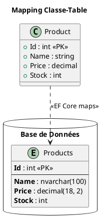

# Module 5 : Accès aux Données avec Entity Framework Core - L'essentiel

### Objectifs Pédagogiques

À la fin de ce module, vous serez capable de :

* **Expliquer** ce qu'est un ORM et ses avantages.
* **Modéliser** vos données en utilisant l'approche "Code-First".
* **Configurer** la connexion à une base de données via le `DbContext`.
* **Utiliser** les migrations pour créer et faire évoluer le schéma de votre base de données en synchronisation avec
  votre code.
* **Implémenter** des opérations CRUD (Create, Read, Update, Delete) de manière efficace.
* **Écrire** des requêtes complexes en utilisant LINQ pour interroger la base de données.

### Introduction : Le traducteur universel

Imaginez que vous devez négocier un contrat important avec un partenaire qui parle une langue complètement différente (
le SQL). Vous pourriez passer des mois à apprendre cette langue, avec le risque de faire des contresens (bugs) ou des
impairs culturels (failles de sécurité comme l'injection SQL).

Ou alors... vous pourriez engager un traducteur expert. Un professionnel qui comprend parfaitement votre langue (le C#)
et la langue de votre partenaire (le SQL). Vous lui donnez vos instructions en C#, et il les traduit en SQL parfait,
optimisé et sécurisé.

**Entity Framework Core (EF Core) est ce traducteur expert.** C'est un **ORM (Object-Relational Mapper)**. Il fait le
pont entre le monde des objets de votre application (vos classes C#) et le monde relationnel de votre base de données (
les tables, les lignes, les colonnes). En utilisant EF Core, vous manipulerez vos données comme de simples objets C#, et
il se chargera de toute la complexité de la communication avec la base de données. C'est un gain de productivité et de
sécurité phénoménal.

---

### 1. Concepts Fondamentaux d'un ORM

#### Qu'est-ce qu'un ORM ?

Un ORM est une technique de programmation qui crée une "couche d'abstraction" entre votre code orienté objet et une base
de données relationnelle. Il mappe les concepts pour vous :

| Monde Objet (C#)           | Monde Relationnel (SQL)  |
|:---------------------------|:-------------------------|
| Classe (`Product`)         | Table (`Products`)       |
| Propriété (`Name`)         | Colonne (`Name`)         |
| Instance d'objet           | Ligne dans la table      |
| Collection (`List<Order>`) | Relation (Clé étrangère) |

#### Approches de Développement

Il y a plusieurs façons de travailler avec un ORM, mais l'une est devenue le standard moderne :

<tabs>
<tab title="Code-First (l'approche moderne)">
    <strong>Vous écrivez vos classes C# en premier.</strong> Vous définissez vos modèles de données comme de simples classes (POCOs). Ensuite, vous demandez à EF Core de générer la base de données à partir de votre code. C'est l'approche que nous allons utiliser.
    <br/>
    <strong>Avantages :</strong> Vous restez dans le monde C#, votre code est la source de vérité, et c'est très rapide pour démarrer et faire évoluer un projet.
</tab>
<tab title="Database-First">
    <strong>La base de données existe déjà.</strong> Vous pointez EF Core vers une base de données existante, et il génère les classes C# pour vous.
    <br/>
    <strong>Avantages :</strong> Idéal pour travailler avec des bases de données d'entreprise existantes (legacy).
</tab>
</tabs>

---

### 2. Modélisation des Données (Code-First)

Pour commencer avec Code-First, nous avons besoin de deux choses principales.

#### Le `DbContext` : Votre session de travail

Le `DbContext` est la classe la plus importante dans EF Core. C'est le portail vers votre base de données. Pensez-y
comme à votre session de travail : il représente une connexion à la base, suit les modifications que vous faites sur les
objets, et coordonne l'enregistrement de ces modifications.

```c#
using Microsoft.EntityFrameworkCore;
using MonAppMvc.Models;

// Créez un dossier "Data" pour cette classe
namespace MonAppMvc.Data
{
    public class ApplicationDbContext : DbContext
    {
        public ApplicationDbContext(DbContextOptions<ApplicationDbContext> options)
            : base(options)
        {
        }

        // Chaque DbSet représente une table dans la base de données.
        public DbSet<Product> Products { get; set; }
    }
}
```

#### Les Entités (`DbSet<T>`) : Les plans de vos tables

Une entité est une classe C# simple (un **POCO** - Plain Old CLR Object) qui représente une table. Vous déclarez chaque
entité comme une propriété `DbSet<T>` dans votre `DbContext`.

**Comment configurer les entités ?**

EF Core est intelligent et utilise des **conventions**. Par exemple, une propriété nommée `Id` ou `ProductId` sera
automatiquement configurée comme la clé primaire de la table. Mais pour plus de contrôle, on utilise les **Data
Annotations**.

```c#
// Models/Product.cs
using System.ComponentModel.DataAnnotations;
using System.ComponentModel.DataAnnotations.Schema;

public class Product
{
    // [Key] est implicite grâce à la convention de nommage "Id",
    // mais on peut l'ajouter pour être explicite.
    public int Id { get; set; }

    [Required] // Sera NOT NULL dans la base de données
    [MaxLength(100)] // Sera NVARCHAR(100)
    public string Name { get; set; }
    
    [Column(TypeName = "decimal(18, 2)")] // Spécifie le type SQL exact
    public decimal Price { get; set; }

    public int Stock { get; set; }
}
```



---

### 3. Gestion de la Base de Données : Les Migrations

**Le problème :** Vous venez d'ajouter une propriété `Description` à votre classe `Product`. Comment mettre à jour la
base de données pour qu'elle ait une nouvelle colonne `Description` sans perdre toutes les données existantes ?

**La solution :** Les Migrations. Une migration est un "journal de modifications". C'est un fichier de code C# qui
décrit exactement comment passer de l'ancien état de votre base de données au nouvel état.

Pensez à un architecte qui modifie les plans d'un bâtiment en construction. Il ne crie pas "ajoutez une fenêtre !". Il
publie une révision du plan (une migration) qui dit précisément : "Sur le mur nord du 2ème étage, à 3 mètres du coin
est, créer une ouverture de 1m x 1.5m".

<procedure title="Le cycle de vie d'une migration">
<step>
    <p>Vous modifiez vos classes d'entités dans votre code C#.</p>
</step>
<step>
    <p>Vous ouvrez la console du Gestionnaire de Paquets (dans Visual Studio) ou un terminal et vous exécutez la commande :</p>

    ```powershell
    # Pour Package Manager Console
    Add-Migration NomDeLaMigration

    # Pour le CLI dotnet
    dotnet ef migrations add NomDeLaMigration
    ```
    <p>EF Core compare votre modèle actuel à celui de la dernière migration et génère un nouveau fichier de migration avec le code C# pour appliquer les changements.</p>

</step>
<step>
    <p>Vous inspectez le fichier de migration pour vous assurer qu'il est correct.</p>
</step>
<step>
    <p>Vous appliquez la migration à la base de données avec la commande :</p>

    ```powershell
    # Pour Package Manager Console
    Update-Database

    # Pour le CLI dotnet
    dotnet ef database update
    ```

</step>
</procedure>

---

### 4. Opérations CRUD (Create, Read, Update, Delete)

Une fois tout en place, interagir avec la base de données devient un jeu d'enfant. Tout se passe via votre instance de
`DbContext`.

**L'étape la plus importante : `SaveChanges()`**

Rien de ce que vous faites n'est envoyé à la base de données tant que vous n'appelez pas `_context.SaveChanges()`. EF
Core travaille avec un "patron d'unité de travail". Il suit toutes vos modifications en mémoire et, lorsque vous appelez
`SaveChanges()`, il les envoie toutes en une seule transaction efficace. C'est le bouton "Enregistrer" de votre session
de travail.

```c#
// Exemple d'utilisation dans un dépôt
public class EfProductRepository : IProductRepository
{
    private readonly ApplicationDbContext _context;

    public EfProductRepository(ApplicationDbContext context)
    {
        _context = context;
    }

    // CREATE
    public void Add(Product product)
    {
        _context.Products.Add(product);
        _context.SaveChanges(); // Enregistre l'ajout
    }

    // READ (un seul)
    public Product GetById(int id)
    {
        // Find est optimisé pour la recherche par clé primaire
        return _context.Products.Find(id);
    }

    // READ (tous)
    public IEnumerable<Product> GetAll()
    {
        return _context.Products.ToList();
    }

    // UPDATE
    public void Update(Product product)
    {
        _context.Products.Update(product);
        _context.SaveChanges(); // Enregistre la modification
    }

    // DELETE
    public void Delete(int id)
    {
        var product = _context.Products.Find(id);
        if (product != null)
        {
            _context.Products.Remove(product);
            _context.SaveChanges(); // Enregistre la suppression
        }
    }
}
```

#### Exercice 2 : Implémenter la suppression

Dans le code ci-dessus, l'implémentation de `Delete` est déjà fournie. Votre tâche est d'ajouter une action
`Delete(int id)` (POST) et une vue `Delete.cshtml` à votre `ProductsController` pour permettre à un utilisateur de
supprimer un produit. La vue doit afficher les détails du produit et demander confirmation.

##### Correction exercice 2 {collapsible='true'}

**`Controllers/ProductsController.cs`**

```c#
// GET: Products/Delete/5
public IActionResult Delete(int id)
{
    var product = _repository.GetById(id);
    if (product == null)
    {
        return NotFound();
    }
    return View(product);
}

// POST: Products/Delete/5
[HttpPost, ActionName("Delete")]
[ValidateAntiForgeryToken]
public IActionResult DeleteConfirmed(int id)
{
    _repository.Delete(id);
    return RedirectToAction(nameof(Index));
}
```

**`Views/Products/Delete.cshtml`**

```html
@model MonAppMvc.Models.Product

@{ ViewData["Title"] = "Supprimer"; }

<h1>Supprimer</h1>
<h3>Êtes-vous sûr de vouloir supprimer ceci ?</h3>
<div>
    <h4>Produit</h4>
    <hr/>
    <dl class="row">
        <dt class="col-sm-2">@Html.DisplayNameFor(model => model.Name)</dt>
        <dd class="col-sm-10">@Html.DisplayFor(model => model.Name)</dd>
    </dl>

    <form asp-action="Delete">
        <input type="hidden" asp-for="Id"/>
        <input type="submit" value="Supprimer" class="btn btn-danger"/> |
        <a asp-action="Index">Retour à la liste</a>
    </form>
</div>
```

---

### 5. Requêtage avec LINQ

C'est là que la magie opère. Au lieu d'écrire du SQL, vous écrivez des requêtes en utilisant **LINQ (Language-Integrated
Query)**, une fonctionnalité de C#. EF Core traduit ce C# en SQL optimisé pour vous.

```c#
// Obtenir tous les produits de plus de 50€, triés par nom
var expensiveProducts = _context.Products
    .Where(p => p.Price > 50)
    .OrderBy(p => p.Name)
    .ToList();

// Projeter pour ne récupérer que le nom et le prix
var productNamesAndPrices = _context.Products
    .Select(p => new { p.Name, p.Price })
    .ToList();
```

#### Exécution Différée vs. Immédiate

C'est un concept crucial. Une requête LINQ n'est **pas** exécutée tant que vous ne "consommez" pas les résultats.

* **Différée :** `var query = _context.Products.Where(p => p.Stock < 10);`
    * À ce stade, **aucune requête n'a été envoyée à la base de données**. Vous avez juste construit un plan de requête.
* **Immédiate :** `var lowStockProducts = query.ToList();`
    * C'est l'appel à `.ToList()` (ou `.FirstOrDefault()`, `.Count()`, etc.) qui déclenche l'envoi de la requête SQL à
      la base et la récupération des données.

Cette exécution différée permet à EF Core de construire des requêtes SQL très complexes et optimisées en enchaînant les
appels LINQ.

---

### TP : Remplacer le dépôt en mémoire par EF Core

Le moment est venu. Nous allons prendre notre projet de gestion de produits et remplacer son dépôt en mémoire par un
vrai dépôt qui utilise une base de données SQL Server LocalDB.

<procedure>
<step title="Étape 1 : Installer les paquets NuGet">
<p>Via la console du gestionnaire de paquets ou le gestionnaire NuGet, installez :</p>
<ul>
    <li><code>Microsoft.EntityFrameworkCore.SqlServer</code> : Le fournisseur pour SQL Server.</li>
    <li><code>Microsoft.EntityFrameworkCore.Tools</code> : Les outils pour les migrations.</li>
</ul>
</step>
<step title="Étape 2 : Créer le DbContext et configurer la chaîne de connexion">
<p>Créez la classe <code>ApplicationDbContext</code> comme vu plus haut.
Dans <code>appsettings.json</code>, ajoutez une chaîne de connexion :</p>
<code-block lang="json">
"ConnectionStrings": {
  "DefaultConnection": "Server=(localdb)\\mssqllocaldb;Database=MonAppMvcDb;Trusted_Connection=True;MultipleActiveResultSets=true"
}
</code-block>
</step>
<step title="Étape 3 : Configurer le DbContext dans `Program.cs`">
<p>Enregistrez votre DbContext dans le conteneur de services.</p>
</step>
<step title="Étape 4 : Lancer les migrations">
<p>Ajoutez les Data Annotations à votre modèle <code>Product</code>.
Exécutez <code>Add-Migration InitialCreate</code> puis <code>Update-Database</code>.</p>
</step>
<step title="Étape 5 : Créer `EfProductRepository`">
<p>Créez une nouvelle classe de dépôt qui implémente <code>IProductRepository</code> mais qui utilise le <code>DbContext</code> injecté pour faire les opérations CRUD.</p>
</step>
<step title="Étape 6 : Mettre à jour l'Injection de Dépendances">
<p>Dans <code>Program.cs</code>, changez la ligne qui enregistre le dépôt pour utiliser votre nouvelle classe <code>EfProductRepository</code> au lieu de <code>InMemoryProductRepository</code>.</p>
</step>
</procedure>

#### Correction TP : Remplacer le dépôt en mémoire par EF Core {collapsible='true'}

<tabs>
<tab title="Program.cs">

```c#
// using MonAppMvc.Data;
// using Microsoft.EntityFrameworkCore;
// using MonAppMvc.Interfaces;
// using MonAppMvc.Services; // Pour le nouveau dépôt

var builder = WebApplication.CreateBuilder(args);

// 1. Configuration de la chaîne de connexion
var connectionString = builder.Configuration.GetConnectionString("DefaultConnection");

// 2. Enregistrement du DbContext
builder.Services.AddDbContext<ApplicationDbContext>(options =>
options.UseSqlServer(connectionString));

// 3. Remplacement de l'ancien dépôt par le nouveau
// builder.Services.AddSingleton<IProductRepository, InMemoryProductRepository>();
builder.Services.AddScoped<IProductRepository, EfProductRepository>();

builder.Services.AddControllersWithViews();
var app = builder.Build();
// ...

```
</tab>
<tab title="EfProductRepository.cs">

```c#
using MonAppMvc.Data;
using MonAppMvc.Interfaces;
using MonAppMvc.Models;
using System.Collections.Generic;
using System.Linq;

namespace MonAppMvc.Services
{
    public class EfProductRepository : IProductRepository
    {
        private readonly ApplicationDbContext _context;

        public EfProductRepository(ApplicationDbContext context)
        {
            _context = context;
        }

        public void Add(Product product)
        {
            _context.Products.Add(product);
            _context.SaveChanges();
        }

        public void Delete(int id)
        {
            var product = GetById(id);
            if (product != null)
            {
                _context.Products.Remove(product);
                _context.SaveChanges();
            }
        }

        public IEnumerable<Product> GetAll()
        {
            return _context.Products.ToList();
        }

        public Product GetById(int id)
        {
            return _context.Products.Find(id);
        }

        public void Update(Product product)
        {
            _context.Products.Update(product);
            _context.SaveChanges();
        }
    }
}
```

</tab>
</tabs>
Lancez l'application. Elle devrait fonctionner exactement comme avant, mais cette fois, vos données sont persistantes !

---

### Auto-évaluation

1. Que signifie "Code-First" ?
   a) On écrit le code SQL avant le code C#.
   b) On écrit les classes C# avant de générer la base de données.
   c) Le code est la chose la plus importante.
   d) On ne doit écrire que du code, pas de configuration.

2. Quelle classe représente votre session avec la base de données ?
   a) `DbSet<T>`
   b) `Entity`
   c) `DbContext`
   d) `Migration`

3. Quelle commande applique une migration en attente à la base de données ?
   a) `Add-Migration`
   b) `SaveChanges`
   c) `Update-Database`
   d) `New-Database`

4. Quand la requête SQL est-elle réellement envoyée à la base de données dans ce code :
   `var query = context.Products.Where(p => p.Price > 10);` ?
   a) Immédiatement à la fin de la ligne.
   b) Jamais.
   c) Lorsque la variable `query` est utilisée dans une boucle ou convertie (ex: `.ToList()`).
   d) Au démarrage de l'application.

5. Expliquez le rôle de la commande `Add-Migration` et ce qu'elle produit.
6. Pourquoi est-il généralement préférable d'utiliser `Find(id)` plutôt que `FirstOrDefault(p => p.Id == id)` pour
   récupérer une entité par sa clé primaire ?
7. Décrivez le "Patron d'Unité de Travail" (Unit of Work) et comment `SaveChanges()` l'implémente.

---

### Conclusion

Un immense bravo ! Vous venez de maîtriser l'une des compétences les plus demandées et les plus puissantes de l'
écosystème .NET. Vous savez maintenant comment modéliser des données, créer une base de données à partir de votre code,
la faire évoluer de manière sûre avec les **migrations**, et la manipuler avec la simplicité et la puissance de **LINQ
**.

En intégrant EF Core à notre architecture basée sur le pattern Repository et l'Injection de Dépendances, vous avez
construit une couche d'accès aux données professionnelle, robuste et facile à maintenir.

Dans le prochain module, nous allons changer de perspective. Nous avons construit une excellente application web MVC. Il
est maintenant temps d'apprendre à exposer nos données et notre logique métier au monde extérieur en construisant une *
*API RESTful**, la pierre angulaire des applications modernes.