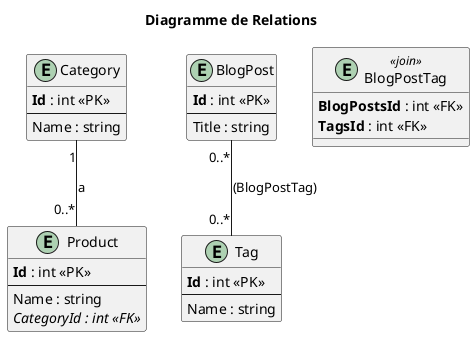

Absolument ! Maintenant que vous maîtrisez les fondations solides de l'accès aux données, il est temps de devenir un
véritable expert.

Dans la partie essentielle, vous avez appris à utiliser EF Core comme un excellent outil de traduction. Vous savez
donner des ordres simples et obtenir des résultats. Dans cette partie, nous allons apprendre les subtilités de la
langue, comment optimiser la traduction, gérer des conversations complexes et éviter les malentendus coûteux. Nous
allons explorer les relations entre les données, les techniques de chargement avancées et les stratégies pour améliorer
les performances.

---

# Module 5 : Maîtrise d'Entity Framework Core - Pour aller plus loin

### Objectifs Pédagogiques

À la fin de ce module complémentaire, vous serez capable de :

* **Modéliser** et **configurer** les relations entre entités (un-à-plusieurs, plusieurs-à-plusieurs).
* **Utiliser** la Fluent API pour des configurations de modèle complexes.
* **Différencier** et **implémenter** les stratégies de chargement de données associées (Eager, Explicit, Lazy Loading).
* **Exécuter** des requêtes SQL brutes en toute sécurité quand LINQ ne suffit pas.
* **Comprendre** et **utiliser** le suivi des modifications (`Change Tracker`) d'EF Core.
* **Mettre en place** une stratégie de concurrence optimiste pour gérer les conflits de modification.

### Introduction : De l'architecte au maître d'œuvre

Vous savez maintenant construire les pièces d'une maison et les poser sur des fondations solides. C'est le travail de l'
architecte. Mais comment ces pièces s'assemblent-elles réellement ? Comment la plomberie de la salle de bain se
connecte-t-elle au réseau principal ? Comment s'assurer que si l'on déplace un mur, la structure entière ne s'effondre
pas ?

C'est le travail du maître d'œuvre. Cette section vous apprend à gérer les **relations** complexes entre vos données, à
contrôler finement la manière dont elles sont chargées pour optimiser les performances, et à mettre en place des
mécanismes pour gérer les conflits lorsque plusieurs personnes travaillent sur les mêmes données en même temps. Ce sont
des compétences avancées qui vous permettront de construire des applications de grande envergure, performantes et
résilientes face aux complexités du monde réel.

---

### 1. Gestion des Relations entre Entités

Vos données ne vivent pas de manière isolée. Un produit appartient à une catégorie, une commande contient plusieurs
lignes de produits, etc. EF Core excelle dans la gestion de ces relations.

#### Relation Un-à-Plusieurs (One-to-Many)

C'est la relation la plus commune. Un `Category` peut avoir plusieurs `Product`, mais un `Product` n'a qu'une seule
`Category`.

1. **Modélisation :** On utilise des **propriétés de navigation**.
   ```c#
   public class Category
   {
       public int Id { get; set; }
       public string Name { get; set; }

       // Propriété de navigation : une catégorie a une collection de produits.
       public ICollection<Product> Products { get; set; } = new List<Product>();
   }

   public class Product
   {
       public int Id { get; set; }
       public string Name { get; set; }
       // ...

       // Clé étrangère vers la table Categories
       public int CategoryId { get; set; }
       
       // Propriété de navigation : un produit a une seule catégorie.
       public Category Category { get; set; }
   }
   ```
   EF Core est assez intelligent pour comprendre cette relation par convention. Il voit `CategoryId` et la propriété
   `Category` et fait le lien.

#### Relation Plusieurs-à-Plusieurs (Many-to-Many)

Un `BlogPost` peut avoir plusieurs `Tag`, et un `Tag` peut être associé à plusieurs `BlogPost`.

* **Avant EF Core 5 :** Il fallait créer manuellement une table de jonction (`BlogPostTag`).
* **Depuis EF Core 5 :** C'est beaucoup plus simple ! EF Core peut gérer la table de jonction pour vous.

  ```c#
  public class BlogPost
  {
      public int Id { get; set; }
      public string Title { get; set; }
      
      // Propriété de navigation de collection
      public ICollection<Tag> Tags { get; set; } = new List<Tag>();
  }
  
  public class Tag
  {
      public int Id { get; set; }
      public string Name { get; set; }
      
      // Propriété de navigation de collection
      public ICollection<BlogPost> BlogPosts { get; set; } = new List<Tag>();
  }
  ```
  Il suffit d'ajouter les `DbSet` correspondants dans le `DbContext`, et EF Core créera automatiquement une table de
  jonction `BlogPostTag` en arrière-plan.



#### La Fluent API : Le contrôle absolu

Les Data Annotations sont pratiques, mais pour des configurations complexes (index, clés composites, noms de
table/colonne personnalisés), elles sont limitées. La **Fluent API** vous donne un contrôle total sur le modèle. Vous
surchargez la méthode `OnModelCreating` dans votre `DbContext`.

```c#
protected override void OnModelCreating(ModelBuilder modelBuilder)
{
    base.OnModelCreating(modelBuilder); // Toujours appeler la base

    // Configure la table Product
    modelBuilder.Entity<Product>(entity =>
    {
        // Définit un index sur le nom pour accélérer les recherches
        entity.HasIndex(p => p.Name).IsUnique();

        // Configure la relation avec Category de manière explicite
        entity.HasOne(p => p.Category)         // Un Produit a une Catégorie
              .WithMany(c => c.Products)       // Une Catégorie a plusieurs Produits
              .HasForeignKey(p => p.CategoryId) // La clé étrangère est CategoryId
              .OnDelete(DeleteBehavior.Restrict); // Empêche la suppression
                                                  // d'une catégorie si des
                                                  // produits y sont liés
    });
}
```

---

### 2. Stratégies de Chargement des Données

**Le problème :** Quand vous chargez un `Product`, voulez-vous charger sa `Category` en même temps ? La réponse est "ça
dépend". Charger trop de données est inefficace. Ne pas en charger assez vous obligera à faire des allers-retours
supplémentaires à la base de données.

EF Core propose plusieurs stratégies pour gérer cela :

<tabs>
<tab title="Eager Loading (Chargement Anticipé)">
    <strong>Principe :</strong> Vous demandez explicitement de charger les données associées dans la même requête.
    <br/>
    <strong>Comment :</strong> Avec la méthode <code>.Include()</code>.
    <br/>
    <strong>Exemple :</strong>
    <code-block lang="c#">
    // Génère une seule requête SQL avec une jointure (JOIN)
    var productsWithCategories = _context.Products
        .Include(p => p.Category)
        .ToList();
    </code-block>
    <br/>
    <strong>Quand l'utiliser :</strong> Quand vous savez que vous aurez <strong>toujours</strong> besoin des données associées. C'est la stratégie la plus courante et souvent la plus performante.
</tab>
<tab title="Explicit Loading (Chargement Explicite)">
    <strong>Principe :</strong> Vous chargez d'abord l'entité principale. Plus tard, si vous en avez besoin, vous demandez à EF Core de charger ses données associées.
    <br/>
    <strong>Comment :</strong> Avec la méthode <code>.Entry().Reference().Load()</code> ou <code>.Collection().Load()</code>.
    <br/>
    <strong>Exemple :</strong>
    <code-block lang="c#">
    var product = _context.Products.Find(1); // Requête 1
    // ... un peu de logique ...
    if (userNeedsCategoryInfo)
    {
        _context.Entry(product).Reference(p => p.Category).Load(); // Requête 2
    }
    </code-block>
    <br/>
    <strong>Quand l'utiliser :</strong> Quand vous n'avez besoin des données associées que dans certains cas conditionnels.
</tab>
<tab title="Lazy Loading (Chargement Paresseux)">
    <strong>Principe :</strong> Magique, mais dangereux. Les données associées sont chargées automatiquement dès que vous essayez d'y accéder.
    <br/>
    <strong>Comment :</strong> Nécessite une configuration (paquet NuGet <code>Microsoft.EntityFrameworkCore.Proxies</code>) et que les propriétés de navigation soient déclarées <code>virtual</code>.
    <br/>
    <strong>Exemple :</strong>
    <code-block lang="c#">
    var product = _context.Products.Find(1); // Requête 1
    // ...
    // Le simple fait d'accéder à product.Category déclenche une nouvelle
    // requête SQL en arrière-plan !
    string categoryName = product.Category.Name; // Requête 2
    </code-block>
    <br/>
    <strong>Quand l'utiliser :</strong> À utiliser avec une extrême prudence. Très pratique en développement, mais peut causer le problème du "N+1 query", où une simple boucle génère des centaines de requêtes à la base de données.
</tab>
</tabs>

<warning>
**Bonne pratique :** Privilégiez toujours l'**Eager Loading** (`.Include()`) par défaut. C'est la stratégie la plus explicite et la plus contrôlable en termes de performance.
</warning>

#### Exercice 3 : Afficher la catégorie du produit

Modifiez le dépôt `EfProductRepository` et le `ProductsController` pour que la page `Details` d'un produit affiche aussi
le nom de sa catégorie.

1. Ajoutez les modèles `Category` et les propriétés de navigation.
2. Créez une nouvelle migration pour ajouter la table `Categories` et la clé étrangère.
3. Modifiez la méthode `GetById` du dépôt pour utiliser `Include` afin de charger la catégorie.
4. Affichez le nom de la catégorie dans la vue `Details.cshtml`.

##### Correction exercice 3 {collapsible='true'}

1. **Modèles `Product.cs` et `Category.cs`** (mis à jour comme dans l'exemple "One-to-Many" ci-dessus). Ajoutez
   également `public DbSet<Category> Categories { get; set; }` dans votre `ApplicationDbContext`.

2. **Migrations :**
    * `dotnet ef migrations add AddCategoryAndProductRelation`
    * `dotnet ef database update`

3. **`Services/EfProductRepository.cs`**
   ```c#
   public Product GetById(int id)
   {
       // On utilise Include pour charger la catégorie en même temps
       return _context.Products
                      .Include(p => p.Category)
                      .FirstOrDefault(p => p.Id == id);
   }
   ```
4. **`Views/Products/Details.cshtml`**
   ```html
   <dl class="row">
       <!-- ... autres propriétés ... -->
       <dt class="col-sm-2">Catégorie</dt>
       <dd class="col-sm-10">@Model.Category?.Name</dd> <!-- L'opérateur ?. 
                                                       est une sécurité si la
                                                       catégorie est nulle -->
   </dl>
   ```

---

### 3. Le Suivi des Modifications (`Change Tracker`)

EF Core est intelligent. Quand vous récupérez une entité de la base, il en garde une "photographie" de son état initial.
Quand vous appelez `SaveChanges()`, il compare l'état actuel de l'entité avec la photo. S'il y a une différence, il
génère une requête `UPDATE`. Sinon, il ne fait rien. C'est le travail du **Change Tracker**.

Cela signifie que pour une mise à jour, vous n'avez pas besoin d'appeler `.Update()` si l'entité est déjà suivie.

```c#
public void ChangeProductName(int id, string newName)
{
    // 1. L'entité est chargée, le Change Tracker la surveille.
    var product = _context.Products.Find(id);

    if (product != null)
    {
        // 2. On modifie une propriété. Le Change Tracker détecte la différence.
        product.Name = newName;

        // 3. SaveChanges() génère un UPDATE pour la colonne Name uniquement.
        // Pas besoin d'appeler _context.Update(product) !
        _context.SaveChanges();
    }
}
```

Parfois, vous voulez juste lire des données sans jamais les modifier. Dans ce cas, vous pouvez désactiver le suivi pour
améliorer les performances.

```c#
public IEnumerable<Product> GetAllForDisplay()
{
    // AsNoTracking() dit à EF Core de ne pas suivre ces entités.
    // C'est plus rapide car il n'y a pas de "photographies" à prendre.
    return _context.Products.AsNoTracking().ToList();
}
```

<tip>
**Bonne pratique :** Utilisez `.AsNoTracking()` pour toutes vos requêtes de lecture seule.
</tip>

---

### Conclusion

Félicitations, vous avez maintenant une compréhension profonde et nuancée du fonctionnement d'Entity Framework Core.
Vous ne vous contentez plus de l'utiliser, vous le maîtrisez.

Savoir modéliser des **relations**, choisir la bonne **stratégie de chargement**, configurer le modèle avec la **Fluent
API** et optimiser les requêtes avec `.AsNoTracking()` sont des compétences qui transformeront la qualité et la
performance de vos applications. Vous êtes maintenant équipé pour gérer des schémas de données complexes et pour
construire une couche d'accès aux données qui est non seulement fonctionnelle, mais aussi efficace et optimisée.

Dans le prochain module, nous allons pivoter pour construire des APIs RESTful. Vous verrez que le travail que nous avons
fait ici pour construire une couche de données solide avec le pattern Repository est un prérequis indispensable pour
créer des APIs propres et bien structurées.