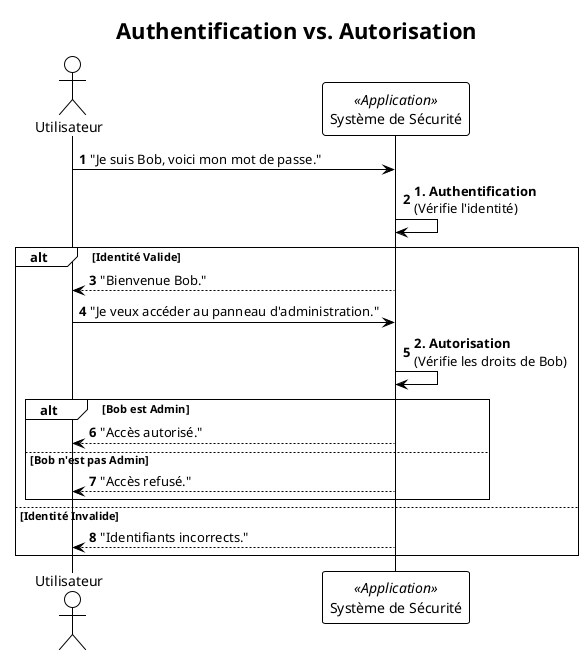

Absolument. C'est une excellente idée de dédier un module entier à la sécurité, car c'est un sujet trop important pour
être survolé. Voici le nouveau Module 7, qui s'insère avant le déploiement.

---

# Module 7 : Sécuriser vos Applications Web - L'essentiel

### Objectifs Pédagogiques

À la fin de ce module, vous serez capable de :

* **Différencier** les concepts fondamentaux d'Authentification (AuthN) et d'Autorisation (AuthZ).
* **Intégrer** ASP.NET Core Identity pour ajouter un système complet de gestion des utilisateurs à une application MVC.
* **Sécuriser** des contrôleurs et des actions en utilisant des attributs comme `[Authorize]`.
* **Comprendre** et **prévenir** les deux attaques web les plus courantes : Cross-Site Scripting (XSS) et Cross-Site
  Request Forgery (CSRF).
* **Expliquer** le rôle crucial du protocole HTTPS.

### Introduction : La sécurité de votre maison

Vous avez bâti une magnifique maison (votre application). Elle est fonctionnelle, bien agencée et prête à accueillir des
visiteurs. Mais avez-vous pensé à installer des serrures, une alarme, et à vérifier l'identité de ceux qui entrent ? Une
maison sans sécurité est une invitation aux problèmes.

La sécurité web n'est pas une option, c'est une fondation. Dans ce module, nous allons apprendre à être le "chef de la
sécurité" de notre application. Nous allons installer un système de contrôle d'accès sophistiqué, apprendre à déjouer
les techniques des cambrioleurs du web et nous assurer que les conversations entre nos visiteurs et notre maison sont
totalement privées. Ignorer ces principes, c'est comme laisser la porte d'entrée grande ouverte avec un mot "Bienvenue"
sur le paillasson.

---

### 1. Authentification vs. Autorisation : Les deux piliers de la sécurité

Avant toute chose, il faut maîtriser deux concepts qui sont souvent confondus.

Pensez à l'entrée d'un immeuble de bureaux sécurisé :

* **Authentification (AuthN) :** C'est le processus de vérification de votre identité. Vous présentez votre badge
  d'employé au lecteur. Le système vérifie que ce badge est valide et qu'il correspond à une personne enregistrée. **La
  question est : "Qui êtes-vous ?"**.
* **Autorisation (AuthZ) :** Une fois que le système sait qui vous êtes, il vérifie vos droits. Votre badge ouvre la
  porte d'entrée, mais peut-être pas la porte du bureau du PDG ou celle de la salle des serveurs. **La question est : "
  Qu'avez-vous le droit de faire ?"**.

On ne peut pas autoriser quelqu'un si on ne l'a pas d'abord authentifié.




---

### 2. ASP.NET Core Identity : Votre service de sécurité intégré

**Le problème :** Mettre en place un système de gestion d'utilisateurs est complexe. Il faut gérer l'inscription, la
connexion, le hachage sécurisé des mots de passe, la confirmation par email, la réinitialisation de mot de passe... Le
faire soi-même est une recette pour les failles de sécurité.

**La solution :** **ASP.NET Core Identity**. C'est une solution "clés en main" fournie par Microsoft. C'est un service
de sécurité complet et éprouvé qui gère tout cela pour vous. Il s'intègre parfaitement avec Entity Framework Core pour
stocker les utilisateurs et leurs informations dans votre base de données.

Le modèle d'authentification par défaut pour Identity dans une application MVC est basé sur les **cookies**.

1. L'utilisateur se connecte avec succès.
2. Le serveur crée un cookie d'authentification chiffré et le renvoie au navigateur.
3. Le navigateur inclura automatiquement ce cookie dans toutes les requêtes suivantes vers le même site.
4. Le middleware d'authentification d'ASP.NET Core intercepte le cookie, le déchiffre, et reconstitue l'identité de l'
   utilisateur pour cette requête.

#### Utilisation

Une fois Identity en place (comme nous le verrons dans le TP), sécuriser un contrôleur ou une action devient un jeu
d'enfant avec l'attribut `[Authorize]`.

```c#
// Seuls les utilisateurs connectés peuvent accéder à n'importe quelle
// action de ce contrôleur.
[Authorize]
public class AccountController : Controller
{
    public IActionResult Profile() 
    {
        // ...
        return View();
    }
}

public class HomeController : Controller
{
    // Tout le monde peut voir la page d'accueil
    public IActionResult Index() { return View(); }

    // Mais il faut être connecté pour voir la page de confidentialité
    [Authorize]
    public IActionResult Privacy() { return View(); }
}
```

---

### 3. Prévenir les Attaques Web Courantes

#### Cross-Site Scripting (XSS)

* **Le problème :** Un utilisateur malveillant réussit à injecter du code JavaScript dans votre site, par exemple via un
  champ de commentaire. Quand d'autres utilisateurs afficheront ce commentaire, leur navigateur exécutera le script
  malveillant, qui pourrait voler leurs cookies ou leurs informations.
* **L'analogie :** C'est comme si quelqu'un laissait une note piégée sur un tableau d'affichage public. Toute personne
  qui la lit déclenche le piège.
* **La solution (simple !) :** Par défaut, **le moteur de vue Razor encode automatiquement toutes les données que vous
  affichez**. Si une variable contient `<script>alert('hacké')</script>`, Razor la transformera en texte inoffensif
  `&lt;script&gt;alert('hacké')&lt;/script&gt;` dans le HTML.
* **Comment être vulnérable :** En désactivant manuellement cette protection avec `@Html.Raw()`.
  ```c#
  @{ string maliciousComment = "<script>steal_cookie()</script>"; }
  
  <!-- SÉCURISÉ : Razor encode le script -->
  <p>@maliciousComment</p>
  
  <!-- VULNÉRABLE : Vous injectez le script directement dans la page -->
  <p>@Html.Raw(maliciousComment)</p>
  ```
  <warning>
  N'utilisez **jamais** `@Html.Raw()` sur des données provenant d'un utilisateur.
  </warning>

#### Cross-Site Request Forgery (CSRF ou XSRF)

* **Le problème :** Vous êtes connecté au site de votre banque. Un pirate vous envoie un email avec un lien vers une
  image de chat. Vous cliquez. La page que vous ouvrez contient un formulaire invisible qui effectue une opération de
  virement sur le site de votre banque. Votre navigateur, serviable, envoie le cookie de session de votre banque avec la
  requête. La banque voit une requête valide venant de vous et effectue le virement.
* **L'analogie :** Un faussaire envoie un ordre de paiement à votre banque. Il ne connaît pas votre signature, mais il a
  réussi à vous faire apposer votre signature (le cookie) sur le document à votre insu.
* **La solution :** Les **Anti-Forgery Tokens**. ASP.NET Core le fait presque automatiquement.
    1. Quand il affiche un formulaire (`<form>`), le serveur y place un champ caché avec un jeton unique et aléatoire.
       Il place aussi ce jeton dans un cookie.
    2. Quand le formulaire est soumis, le serveur vérifie que le jeton du formulaire correspond bien à celui du cookie.
    3. Un site pirate ne peut pas connaître le jeton qui a été généré dans le formulaire, donc sa requête sera rejetée.
* **Comment l'activer :**
    1. Les Tag Helpers (`<form asp-action="...">`) ajoutent le champ caché pour vous.
    2. Vous devez décorer votre action `[HttpPost]` avec l'attribut `[ValidateAntiForgeryToken]`.

  ```c#
  [HttpPost]
  [ValidateAntiForgeryToken]
  public IActionResult Create(ProductCreateModel model)
  {
      // Le framework vérifie le jeton avant même d'exécuter ce code.
      // ...
  }
  ```

### 4. HTTPS : La conversation privée

* **Le problème :** Sans HTTPS, toutes les données échangées entre le navigateur de l'utilisateur et votre serveur (mots
  de passe, informations de carte de crédit, cookies) voyagent en clair sur Internet. N'importe qui sur le même réseau (
  ex: un Wi-Fi public) peut les intercepter et les lire.
* **La solution :** **HTTPS (HyperText Transfer Protocol Secure)**. Il chiffre la communication.
* **L'analogie :** HTTP, c'est envoyer une carte postale. Tout le monde peut la lire pendant son transport. HTTPS, c'est
  mettre cette même carte dans une enveloppe scellée et blindée.
* **Comment l'activer :**
    * En développement, le template ASP.NET Core le configure pour vous.
    * En production, votre service d'hébergement (Azure, AWS...) ou votre reverse proxy (Nginx) se chargera d'installer
      un certificat SSL/TLS et de gérer la terminaison HTTPS.
    * Le middleware `app.UseHttpsRedirection();` dans `Program.cs` redirige automatiquement tout le trafic HTTP vers
      HTTPS.


      

## TP : Sécurisation d'un Forum de Discussion

## Contexte du Projet

Nous allons construire et sécuriser une application de forum très simple. Les utilisateurs pourront s'inscrire, se connecter, créer de nouveaux sujets de discussion et poster des réponses.

**Les règles de sécurité seront les suivantes :**
1.  Tout le monde (même les visiteurs anonymes) peut voir la liste des sujets et lire les messages.
2.  Seuls les utilisateurs connectés peuvent créer un nouveau sujet ou répondre à un sujet existant.
3.  Seuls les créateurs d'un message (le sujet initial ou une réponse) peuvent le modifier.
4.  Seuls les utilisateurs ayant le rôle "Moderator" peuvent supprimer n'importe quel message.

### Objectifs du TP

*   Mettre en place ASP.NET Core Identity de A à Z.
*   Gérer les relations entre les données et les utilisateurs (`IdentityUser`).
*   Appliquer l'autorisation basée sur l'identité (vérifier que l'utilisateur est le créateur).
*   Mettre en place et utiliser l'autorisation basée sur les rôles ("Moderator").

## Structure Initiale (à mettre en place)

Pour gagner du temps, nous allons partir du principe que le projet MVC de base est créé et qu'EF Core avec SQLite est configuré.

**Entités de départ :**

```c#
// Entities/Topic.cs
public class Topic
{
    public int Id { get; set; }
    public string Title { get; set; }
    public DateTime CreatedAt { get; set; }
    public ICollection<Post> Posts { get; set; } = new List<Post>();
}

// Entities/Post.cs
public class Post
{
    public int Id { get; set; }
    public string Content { get; set; }
    public DateTime CreatedAt { get; set; }
    public int TopicId { get; set; }
    public Topic Topic { get; set; } = null!;
}
```

---

## Énoncé du TP

<procedure>
<step title="Étape 1 : Intégration d'ASP.NET Core Identity">
<p>Intégrez Identity à l'application. Cela inclut l'installation des paquets, la mise à jour du <code>DbContext</code> pour qu'il hérite de <code>IdentityDbContext</code>, la configuration des services et middlewares dans <code>Program.cs</code>, la création des migrations pour Identity, et la génération de l'interface utilisateur pour la connexion et l'inscription.</p>
</step>
<step title="Étape 2 : Association des Données aux Utilisateurs">
<p>Modifiez les entités <code>Topic</code> et <code>Post</code> pour qu'elles soient liées à un utilisateur. Chaque sujet et chaque message doit avoir un auteur. Mettez à jour la base de données avec une nouvelle migration.</p>
</step>
<step title="Étape 3 : Sécurisation de la Création">
<p>Modifiez la logique de création des sujets et des messages. Seuls les utilisateurs connectés doivent pouvoir créer du contenu. L'auteur (l'ID de l'utilisateur connecté) doit être automatiquement enregistré lors de la création.</p>
<p><strong>Exigences :</strong></p>
<ul>
    <li>Les boutons "Nouveau Sujet" et "Répondre" ne doivent être visibles que pour les utilisateurs connectés.</li>
    <li>Les actions <code>[HttpPost]</code> correspondantes doivent être protégées par l'attribut <code>[Authorize]</code>.</li>
</ul>
</step>
<step title="Étape 4 : Autorisation basée sur l'Identité (Modification)">
<p>Implémentez la fonctionnalité de modification d'un message (<code>Post</code>). Seul l'auteur original du message doit pouvoir y accéder.</p>
<p><strong>Exigences :</strong></p>
<ul>
    <li>Un bouton "Modifier" n'apparaît à côté d'un message que si l'utilisateur connecté est son auteur.</li>
    <li>L'action <code>Edit(int id)</code> [GET] doit vérifier que l'utilisateur connecté est bien l'auteur avant d'afficher le formulaire. Si ce n'est pas le cas, elle doit retourner <code>Forbid()</code> (HTTP 403).</li>
    <li>L'action <code>Edit</code> [POST] doit effectuer la même vérification avant de sauvegarder les modifications.</li>
</ul>
</step>
<step title="Étape 5 : Autorisation basée sur les Rôles (Suppression)">
<p>Mettez en place un système de rôles pour la modération. Seuls les utilisateurs avec le rôle "Moderator" pourront supprimer des messages.</p>
<p><strong>Exigences :</strong></p>
<ul>
    <li>Créez un rôle "Moderator" dans le système. Vous pouvez le faire via un "seeder" de données qui s'exécute au démarrage de l'application.</li>
    <li>Assignez manuellement ce rôle à un utilisateur de test (via le seeder ou directement dans la base de données).</li>
    <li>Un bouton "Supprimer" apparaît à côté de chaque message uniquement si l'utilisateur connecté a le rôle "Moderator".</li>
    <li>L'action <code>Delete</code> [POST] doit être protégée par l'attribut <code>[Authorize(Roles = "Moderator")]</code>.</li>
</ul>
</step>
</procedure>

---

### Correction Détaillée du TP {collapsible="true"}

#### Étape 1 : Intégration d'Identity

1.  **Installer** `Microsoft.AspNetCore.Identity.EntityFrameworkCore` et `Microsoft.AspNetCore.Identity.UI`.
2.  **Modifier** `ApplicationDbContext` pour qu'il hérite de `IdentityDbContext`.
3.  **Configurer** les services (`AddDefaultIdentity`) et les middlewares (`UseAuthentication`, `UseAuthorization`) dans `Program.cs`.
4.  **Exécuter** `dotnet ef migrations add AddIdentitySchema` et `dotnet ef database update`.
5.  **Générer** l'UI avec `dotnet aspnet-codegenerator identity...`.
6.  **Ajouter** la vue partielle `_LoginPartial.cshtml` et l'inclure dans `_Layout.cshtml`.

#### Étape 2 : Association des Données aux Utilisateurs

<tabs>
<tab title="Entities/Topic.cs (Mise à jour)">

```c#
using Microsoft.AspNetCore.Identity;

public class Topic
{
    public int Id { get; set; }
    public string Title { get; set; }
    public DateTime CreatedAt { get; set; }
    
    // Ajout de la relation avec l'auteur
    public string AuthorId { get; set; } = string.Empty;
    public IdentityUser Author { get; set; } = null!;

    public ICollection<Post> Posts { get; set; } = new List<Post>();
}
```

</tab>
<tab title="Entities/Post.cs (Mise à jour)">

```c#
using Microsoft.AspNetCore.Identity;

public class Post
{
    public int Id { get; set; }
    public string Content { get; set; }
    public DateTime CreatedAt { get; set; }
    
    // Ajout de la relation avec l'auteur
    public string AuthorId { get; set; } = string.Empty;
    public IdentityUser Author { get; set; } = null!;
    
    public int TopicId { get; set; }
    public Topic Topic { get; set; } = null!;
}
```

</tab>
</tabs>

**Migration :**
```bash
dotnet ef migrations add AddAuthorToContent
dotnet ef database update
```

#### Étape 3 : Sécurisation de la Création

<tabs>
<tab title="Controllers/TopicController.cs (extrait)">

```c#
using Microsoft.AspNetCore.Authorization;
using System.Security.Claims;

public class TopicController : Controller
{
    // ...
    
    [Authorize] // <-- Le user doit être connecté pour voir le formulaire
    public IActionResult Create()
    {
        return View();
    }

    [HttpPost]
    [Authorize] // <-- Le user doit être connecté pour poster
    [ValidateAntiForgeryToken]
    public async Task<IActionResult> Create(Topic topic)
    {
        if (ModelState.IsValid)
        {
            // On assigne l'auteur actuel
            topic.AuthorId = User.FindFirstValue(ClaimTypes.NameIdentifier);
            topic.CreatedAt = DateTime.UtcNow;

            _context.Add(topic);
            await _context.SaveChangesAsync();
            return RedirectToAction(nameof(Index));
        }
        return View(topic);
    }
}
```

</tab>
<tab title="Views/Topic/Index.cshtml (extrait)">

```html
@using Microsoft.AspNetCore.Identity
@inject SignInManager<IdentityUser> SignInManager

<h1>Sujets de Discussion</h1>

@if (SignInManager.IsSignedIn(User)) @* <-- On n'affiche le bouton que si l'utilisateur est connecté *@
{
    <p>
        <a asp-action="Create" class="btn btn-primary">Créer un nouveau sujet</a>
    </p>
}
```

</tab>
</tabs>
*La logique pour la création de `Post` est très similaire.*

#### Étape 4 : Autorisation basée sur l'Identité (Modification)

<tabs>
<tab title="Controllers/PostController.cs (extrait)">

```c#
[Authorize]
public async Task<IActionResult> Edit(int id)
{
    var post = await _context.Posts.FindAsync(id);
    if (post == null)
    {
        return NotFound();
    }

    // SÉCURITÉ : On vérifie que l'ID de l'auteur du post
    // correspond à l'ID de l'utilisateur connecté.
    var currentUserId = User.FindFirstValue(ClaimTypes.NameIdentifier);
    if (post.AuthorId != currentUserId)
    {
        return Forbid(); // HTTP 403 - Interdit
    }

    return View(post);
}

[HttpPost]
[Authorize]
[ValidateAntiForgeryToken]
public async Task<IActionResult> Edit(int id, Post post)
{
    if (id != post.Id)
    {
        return NotFound();
    }
    
    // On doit recharger le post depuis la BDD pour être sûr
    // de l'auteur et éviter une manipulation malveillante du formulaire.
    var postToUpdate = await _context.Posts.FindAsync(id);
    if (postToUpdate == null)
    {
        return NotFound();
    }

    var currentUserId = User.FindFirstValue(ClaimTypes.NameIdentifier);
    if (postToUpdate.AuthorId != currentUserId)
    {
        return Forbid();
    }

    if (ModelState.IsValid)
    {
        postToUpdate.Content = post.Content; // On ne met à jour que le contenu
        await _context.SaveChangesAsync();
        return RedirectToAction("Details", "Topic", new { id = postToUpdate.TopicId });
    }
    return View(post);
}
```

</tab>
<tab title="Views/Topic/Details.cshtml (extrait de la boucle des posts)">

```html
@using Microsoft.AspNetCore.Identity
@using System.Security.Claims
@inject UserManager<IdentityUser> UserManager

@* ... dans la boucle foreach(var post in Model.Posts) ... *@
<div class="card-footer d-flex justify-content-between">
    <small>
        Par @(await UserManager.FindByIdAsync(post.AuthorId))?.UserName 
        le @post.CreatedAt.ToShortDateString()
    </small>
    <div>
        @{
            var currentUserId = User.FindFirstValue(ClaimTypes.NameIdentifier);
        }
        @if (post.AuthorId == currentUserId) @* <-- On n'affiche le bouton que si on est l'auteur *@
        {
            <a asp-controller="Post" asp-action="Edit" asp-route-id="@post.Id" 
                class="btn btn-sm btn-secondary">Modifier</a>
        }
    </div>
</div>
```

</tab>
</tabs>

#### Étape 5 : Autorisation basée sur les Rôles (Suppression)

<tabs>
<tab title="Data/RoleSeeder.cs (nouveau fichier pour le seeding)">

```c#
using Microsoft.AspNetCore.Identity;

namespace ForumApp.Data
{
    public static class RoleSeeder
    {
        public static async Task SeedRolesAsync(RoleManager<IdentityRole> roleManager)
        {
            // Vérifie si le rôle "Moderator" existe déjà
            if (!await roleManager.RoleExistsAsync("Moderator"))
            {
                // S'il n'existe pas, on le crée
                await roleManager.CreateAsync(new IdentityRole("Moderator"));
            }

            if (!await roleManager.RoleExistsAsync("Member"))
            {
                await roleManager.CreateAsync(new IdentityRole("Member"));
            }
        }
        // Pour un vrai projet, on ferait aussi un UserSeeder pour
        // créer un admin par défaut et lui assigner le rôle.
    }
}
```

</tab>
<tab title="Program.cs (ajout du seeding au démarrage)">

```c#
// ... juste avant app.Run() ...

// Bloc pour le seeding
using (var scope = app.Services.CreateScope())
{
    var services = scope.ServiceProvider;
    try
    {
        var roleManager = services.GetRequiredService<RoleManager<IdentityRole>>();
        await ForumApp.Data.RoleSeeder.SeedRolesAsync(roleManager);
    }
    catch (Exception ex)
    {
        var logger = services.GetRequiredService<ILogger<Program>>();
        logger.LogError(ex, "Une erreur est survenue lors du seeding des rôles.");
    }
}

app.Run();
```

</tab>
<tab title="Controllers/PostController.cs (action Delete)">

```c#
[HttpPost]
[ValidateAntiForgeryToken]
[Authorize(Roles = "Moderator")] // <-- SÉCURITÉ : Seuls les modérateurs peuvent accéder
public async Task<IActionResult> Delete(int id)
{
    var post = await _context.Posts.FindAsync(id);
    if (post == null)
    {
        return NotFound();
    }

    var topicId = post.TopicId;
    _context.Posts.Remove(post);
    await _context.SaveChangesAsync();
    
    return RedirectToAction("Details", "Topic", new { id = topicId });
}
```

</tab>
<tab title="Views/Topic/Details.cshtml (ajout du bouton Supprimer)">

```html
@* ... à côté du bouton Modifier ... *@

@if (User.IsInRole("Moderator")) @* <-- On n'affiche le bouton que pour ce rôle *@
{
    <form asp-controller="Post" asp-action="Delete" 
            asp-route-id="@post.Id" method="post" class="d-inline">
        <button type="submit" class="btn btn-sm btn-danger ms-2" 
            onclick="return confirm('Êtes-vous sûr de vouloir supprimer ce message ?');">
            Supprimer
        </button>
    </form>
}
```

</tab>
</tabs>

**Comment tester :**
1.  Lancez l'application. Les rôles "Moderator" et "Member" sont créés.
2.  Inscrivez-vous avec un nouvel utilisateur.
3.  Ouvrez la base de données (`kanbanflow.db` avec un outil comme DB Browser for SQLite).
4.  Allez dans la table `AspNetRoles` et trouvez l'ID du rôle "Moderator".
5.  Allez dans la table `AspNetUsers` et trouvez l'ID de votre utilisateur.
6.  Allez dans la table de jonction `AspNetUserRoles` et ajoutez une nouvelle ligne avec l'ID de votre utilisateur et l'ID du rôle "Moderator".
7.  Reconnectez-vous. Vous devriez maintenant voir les boutons de suppression.

Ce TP couvre un scénario de sécurité très réaliste et vous donne une base solide pour protéger vos applications MVC.

---


### Auto-évaluation

1. Un système qui vérifie votre mot de passe effectue une opération de :
   a) Autorisation
   b) Authentification
   c) Validation
   d) Encryption

2. Quel attribut faut-il ajouter à une action `[HttpPost]` pour la protéger contre les attaques CSRF ?
   a) `[Authorize]`
   b) `[ValidateAntiForgeryToken]`
   c) `[HttpPost]`
   d) `[AllowAnonymous]`

3. La protection par défaut de Razor contre les attaques XSS consiste à :
   a) Supprimer toutes les balises `<script>`.
   b) Encoder en HTML les données affichées.
   c) Chiffrer les données.
   d) Mettre les scripts en quarantaine.

4. Quel est le rôle du middleware `UseHttpsRedirection()` ?
   a) Chiffrer le site.
   b) Forcer les navigateurs à utiliser HTTPS au lieu de HTTP.
   c) Gérer les certificats SSL.
   d) Bloquer les requêtes HTTP.

5. Avec vos propres mots, expliquez pourquoi un utilisateur authentifié pourrait ne pas être autorisé à effectuer une
   action. Donnez un exemple.
6. Décrivez le fonctionnement de l'authentification par cookie dans une application MVC.
7. Pourquoi ne faut-il jamais utiliser `@Html.Raw()` sur une donnée qui pourrait avoir été saisie par un utilisateur ?

---

### Conclusion

Vous avez maintenant les clés pour construire des applications qui non seulement fonctionnent, mais qui protègent aussi
leurs utilisateurs et leurs données. Vous comprenez la danse cruciale entre l'**authentification** et l'**autorisation
**, vous savez mettre en place un système robuste avec **ASP.NET Core Identity**, et vous connaissez les parades contre
les menaces les plus communes du web, **XSS** et **CSRF**.

La sécurité n'est pas un ajout, c'est un état d'esprit. Pensez-y dès le début de vos projets. Validez toujours les
données, ne faites jamais confiance à l'entrée utilisateur, et appliquez le principe du moindre privilège.

Dans la partie "Pour aller plus loin", nous verrons comment ces concepts s'appliquent au monde des APIs avec les tokens
JWT, et nous explorerons des modèles d'autorisation plus complexes.