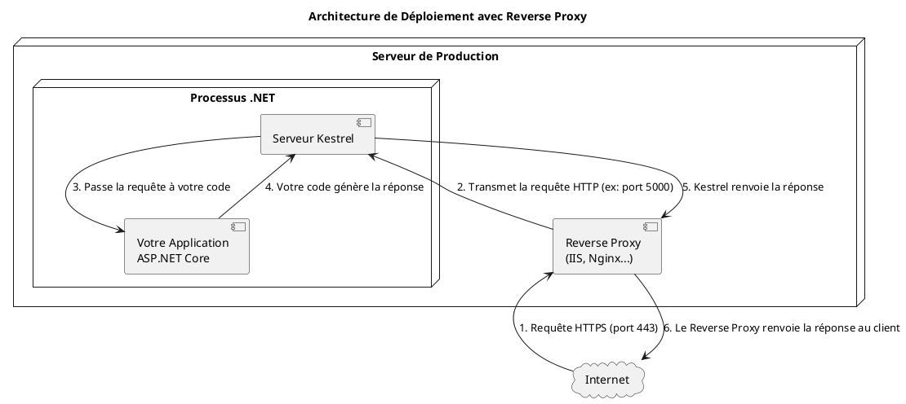

# Module 8 : Déploiement et Hébergement - L'essentiel

### Objectifs Pédagogiques

À la fin de ce module, vous serez capable de :

* **Différencier** les rôles de Kestrel et d'un reverse proxy comme IIS ou Nginx.
* **Comprendre** l'importance de la variable d'environnement `ASPNETCORE_ENVIRONMENT`.
* **Gérer** la configuration et les secrets pour les différents environnements (Développement, Production).
* **Publier** une application ASP.NET Core en utilisant le CLI `dotnet`.
* **Expliquer** le concept de conteneurisation avec Docker et ses avantages.
* **Créer** un `Dockerfile` simple pour votre application.

### Introduction : La crémaillère

Vous avez fini de construire votre maison. La peinture est sèche, les meubles sont en place. Maintenant, vous voulez
inviter des gens. Comment faites-vous ? Vous ne leur donnez pas simplement l'adresse. Vous devez vous assurer que la
route qui mène à votre maison est ouverte et sûre, que les lumières fonctionnent, que le chauffage est allumé, et que
vous avez un système en place pour gérer l'arrivée des invités.

Le **déploiement** est cette "crémaillère" pour votre application. C'est le processus qui consiste à prendre le code
source de votre machine et à le placer sur un serveur public, configuré et prêt à recevoir du trafic. C'est la dernière
étape, mais elle est cruciale. Une application fantastique qui est mal déployée sera lente, peu fiable et vulnérable.
Apprenons à bien faire les choses.

---

### 1. Les Serveurs Web : Kestrel et les Reverse Proxies

#### Kestrel : Le moteur ultra-rapide

Nous en avons déjà parlé, mais il est essentiel de bien comprendre son rôle. **Kestrel** est le serveur web intégré,
multiplateforme et ultra-performant fourni avec ASP.NET Core. C'est lui qui écoute les requêtes HTTP et les transmet à
votre application. Il est excellent pour ça.

Cependant, Kestrel n'est pas conçu pour être directement exposé à Internet. Il est comme un moteur de Formule 1 :
incroyablement rapide, mais il n'a pas de carrosserie, de phares ou de pare-chocs. Il a besoin d'être placé dans un "
châssis" plus robuste.

#### IIS, Nginx, Apache : Les Reverse Proxies

Un **reverse proxy** est un serveur web "complet" que l'on place *devant* Kestrel. C'est la carrosserie de la voiture.
Toutes les requêtes venant d'Internet arrivent d'abord sur le reverse proxy. Celui-ci les inspecte, les nettoie, et les
transmet ensuite à Kestrel.

**Rôles du reverse proxy :**

* **Sécurité :** Il agit comme une première ligne de défense.
* **Terminaison SSL :** Il gère le déchiffrement des requêtes HTTPS, déchargeant Kestrel de cette tâche.
* **Mise en cache (Caching) :** Il peut mettre en cache des réponses fréquentes pour ne pas déranger votre application.
* **Répartition de charge (Load Balancing) :** Si vous avez plusieurs instances de votre application, c'est lui qui
  distribue les requêtes entre elles.
* **Service de fichiers statiques :** Il est souvent plus efficace pour servir les fichiers CSS, JS et images.



---

### 2. Configuration pour la Production

Votre application ne doit pas se comporter de la même manière sur votre machine et en production.

#### La variable `ASPNETCORE_ENVIRONMENT`

C'est la variable d'environnement la plus importante. Elle indique à votre application dans quel mode elle s'exécute.
Les trois valeurs standard sont :

* `Development` : Sur votre machine. Active des fonctionnalités comme la page d'erreur détaillée pour les développeurs.
* `Staging` : Un environnement de pré-production, aussi similaire que possible à la production, pour les derniers tests.
* `Production` : Le serveur live. Active des optimisations de performance et de sécurité (ex: HSTS, compression).

Le code dans `Program.cs` utilise cette variable pour adapter son comportement :

```c#
if (app.Environment.IsDevelopment())
{
    app.UseDeveloperExceptionPage();
}
else
{
    app.UseExceptionHandler("/Home/Error");
    app.UseHsts();
}
```

#### Gestion des secrets : Ne jamais commiter vos mots de passe !

**Le problème :** Votre `appsettings.json` contient la chaîne de connexion à la base de données, avec le mot de passe.
Si vous mettez ce fichier sur un dépôt Git public, vous venez de donner les clés de votre base de données au monde
entier. C'est une erreur de sécurité catastrophique.

**La solution :** Externaliser les secrets. `appsettings.json` est pour la configuration non-sensible. Les secrets (mots
de passe, clés d'API...) doivent être stockés ailleurs.

<tabs>
<tab title="En Développement : Secret Manager">
    ASP.NET Core fournit un outil, le <strong>Secret Manager</strong>, qui stocke les secrets dans un fichier JSON sur votre machine, <strong>en dehors</strong> de votre répertoire de projet. Votre application y a accès de manière transparente.
    <br/>
    <code-block lang="bash">
    # Initialise le Secret Manager pour le projet
    dotnet user-secrets init
    # Ajoute un secret
    dotnet user-secrets set "ConnectionStrings:DefaultConnection" "votre_secret_string"
    </code-block>
</tab>
<tab title="En Production : Variables d'Environnement">
    La méthode la plus courante et la plus sûre est de fournir les secrets via des <strong>variables d'environnement</strong> sur le serveur de production.
    <br/>
    Les plateformes d'hébergement modernes (comme Azure, AWS, Heroku) ont des interfaces dédiées pour gérer ces variables de manière sécurisée.
</tab>
</tabs>

Le système de configuration d'ASP.NET Core est hiérarchique. Il va chercher les valeurs dans plusieurs sources, et la
dernière qui est trouvée "gagne". L'ordre par défaut est :

1. `appsettings.json`
2. `appsettings.{Environnement}.json` (ex: `appsettings.Production.json`)
3. Secret Manager (en développement)
4. Variables d'environnement
5. Arguments de ligne de commande

Donc, une variable d'environnement écrasera toujours une valeur de `appsettings.json`.

---

### 3. Le Déploiement

#### Publier l'application

Vous ne copiez pas vos fichiers de code source sur le serveur. Vous devez d'abord **publier** votre application. C'est
un processus qui compile votre code, résout toutes les dépendances, et rassemble tous les fichiers nécessaires à
l'exécution dans un seul dossier.

La commande magique est `dotnet publish`.

```bash
# Publie l'application pour la configuration de Production
dotnet publish -c Release
```

Cette commande crée un dossier `bin/Release/netX.X/publish`. C'est le contenu de **ce dossier** que vous devez copier
sur votre serveur.

#### Déploiement sur Azure App Service (Exemple)

Azure App Service est une plateforme de Microsoft qui simplifie énormément l'hébergement d'applications ASP.NET Core.

1. **Créer un App Service sur le portail Azure :** Vous choisissez un nom, une région, un système d'exploitation (Linux
   est souvent moins cher et très performant).
2. **Configurer les secrets :** Dans la section "Configuration" de votre App Service, vous ajoutez vos chaînes de
   connexion et autres secrets. Ils seront injectés dans votre application comme des variables d'environnement.
3. **Déployer :** Il existe de nombreuses méthodes, de la plus simple à la plus professionnelle :
    * **Clic droit > Publier** depuis Visual Studio (bien pour débuter, mais pas idéal pour la production).
    * **Intégration continue (CI/CD)** avec GitHub Actions ou Azure DevOps (la méthode professionnelle). À chaque
      `git push`, le code est automatiquement testé, publié et déployé.

---

### 4. Introduction au Déploiement avec Docker

**Le problème :** "Ça marche sur ma machine !". Vous avez déployé votre application, mais elle ne démarre pas sur le
serveur. Pourquoi ? Peut-être que la version de .NET n'est pas la bonne, ou qu'une dépendance système est manquante.

**La solution :** **Docker**. Docker vous permet de "mettre en boîte" votre application avec **toutes** ses
dépendances (le runtime .NET, les librairies, etc.) dans une unité autonome et portable appelée un **conteneur**. Ce
conteneur fonctionnera de manière identique, que ce soit sur votre machine, sur le serveur d'un collègue, ou en
production.

Pensez à un conteneur comme à une mini-machine virtuelle, mais beaucoup plus légère et rapide.

#### Le `Dockerfile` : La recette de votre conteneur

Un `Dockerfile` est un simple fichier texte qui contient les instructions pour construire l'image de votre conteneur.


```docker
# Étape 1: L'environnement de build (avec le SDK .NET complet)
FROM mcr.microsoft.com/dotnet/sdk:8.0 AS build
WORKDIR /src

# Copie les fichiers de projet et restaure les dépendances
COPY ["MonAppMvc.csproj", "."]
RUN dotnet restore "./MonAppMvc.csproj"

# Copie le reste du code source et publie l'application
COPY . .
RUN dotnet publish "MonAppMvc.csproj" -c Release -o /app/publish

# Étape 2: L'environnement d'exécution (avec le runtime .NET plus léger)
FROM mcr.microsoft.com/dotnet/aspnet:8.0 AS final
WORKDIR /app
COPY --from=build /app/publish .

# Expose le port 8080 (le port interne au conteneur)
EXPOSE 8080
# La commande pour démarrer l'application
ENTRYPOINT ["dotnet", "MonAppMvc.dll"]
```

Ce `Dockerfile` utilise un "build en plusieurs étapes" (multi-stage build), une bonne pratique qui permet de créer une
image finale très légère, ne contenant que le strict nécessaire pour l'exécution.

**Les commandes de base :**

```bash
# 1. Construire l'image Docker à partir du Dockerfile
docker build -t mon-app-mvc .

# 2. Lancer un conteneur à partir de l'image
# -d : détaché (en arrière-plan)
# -p 8000:8080 : mappe le port 8000 de ma machine au port 8080 du conteneur
docker run -d -p 8000:8080 mon-app-mvc
```

Votre application est maintenant accessible sur `http://localhost:8000`, s'exécutant dans un environnement isolé et
reproductible !

---

### Conclusion

Vous avez accompli la dernière étape du voyage ! Vous savez maintenant comment préparer votre application pour le monde
réel en gérant la **configuration** et les **secrets**, comment l'empaqueter avec `dotnet publish`, et vous avez eu un
aperçu de deux des méthodes de déploiement les plus importantes : l'hébergement sur une plateforme cloud comme **Azure**
et la conteneurisation avec **Docker**.

Le déploiement n'est pas une réflexion après coup, c'est une partie intégrante du cycle de vie du développement.
Comprendre ces concepts vous donne une vision complète du processus, de la première ligne de code à l'application
fonctionnant en production et servant des milliers d'utilisateurs. Vous êtes maintenant prêt à non seulement construire
des applications, mais aussi à les livrer.

Le prochain et dernier chapitre sera la conclusion de ce cours, où nous récapitulerons tout ce que vous avez appris et
nous vous donnerons les pistes pour continuer votre progression.