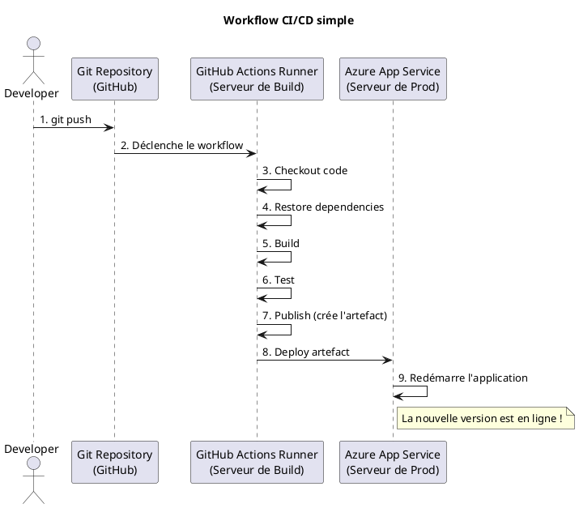

# Module 8 : Déploiement Robuste et Opérations (DevOps) - Pour aller plus loin

### Objectifs Pédagogiques

À la fin de ce module complémentaire, vous serez capable de :

* **Mettre en place** des "Health Checks" pour surveiller la santé de votre application et de ses dépendances.
* **Configurer** un système de logging structuré avec Serilog pour un suivi efficace en production.
* **Comprendre** les principes du CI/CD (Intégration Continue / Déploiement Continu).
* **Écrire** un workflow de base avec GitHub Actions pour automatiser le déploiement.
* **Utiliser** Docker Compose pour orchestrer plusieurs conteneurs en développement local.

### Introduction : La maison auto-suffisante et intelligente

Votre maison est construite et ouverte au public. Mais que se passe-t-il si une canalisation fuit pendant la nuit ? Ou
si vous voulez ajouter une nouvelle pièce ? Allez-vous surveiller les canalisations manuellement 24h/24 et construire
chaque nouvelle pièce à la main ? Certainement pas.

Une maison moderne est équipée de capteurs (un détecteur de fuite, une alarme incendie), d'un journal de bord détaillé
et, idéalement, d'un système qui peut construire et installer de nouvelles pièces préfabriquées automatiquement dès que
les plans sont validés. C'est précisément ce que nous allons mettre en place pour notre application : des **Health
Checks** (les capteurs), le **logging structuré** (le journal de bord), et le **CI/CD** (la chaîne de montage
robotisée). Ces pratiques sont au cœur de la philosophie DevOps, qui vise à unifier le développement et les opérations
pour livrer de la valeur plus rapidement et plus sûrement.

---

### 1. Health Checks : Le pouls de votre application

**Le problème :** Votre application est déployée et répond aux pings. Mais est-elle vraiment "en bonne santé" ?
Peut-elle encore se connecter à la base de données ? Le service de paiement externe est-il disponible ? Un simple "ça
tourne" ne suffit pas.

**La solution :** Les Health Checks d'ASP.NET Core. C'est un middleware qui expose un ou plusieurs endpoints (ex:
`/health`) qui peuvent être interrogés par des systèmes externes (un load balancer, un orchestrateur comme
Kubernetes...). Ces endpoints ne se contentent pas de dire "je suis en vie", ils peuvent exécuter des vérifications pour
s'assurer que l'application et ses dépendances sont opérationnelles.

C'est le bilan de santé de votre application.

**Comment les mettre en place :**

1. **Configurer dans `Program.cs` :**
   ```c#
   // Enregistre les services de Health Check
   builder.Services.AddHealthChecks()
       // Ajoute une vérification pour la base de données
       .AddDbContextCheck<ApplicationDbContext>();

   // ...
   var app = builder.Build();

   // ...
   // Expose l'endpoint de Health Check
   app.MapHealthChecks("/health");
   ```
2. **Tester :** Lancez votre application et naviguez vers `/health`. Vous obtiendrez une réponse textuelle simple :
   `Healthy`, `Degraded`, ou `Unhealthy`.

En ajoutant le paquet NuGet `AspNetCore.HealthChecks.UI`, vous pouvez même obtenir une interface utilisateur magnifique
pour visualiser l'état de santé de tous vos services.

---

### 2. Logging Structuré avec Serilog : La boîte noire

**Le problème :** En production, `Console.WriteLine` ne sert à rien. Les logs sont votre seule fenêtre sur ce qui se
passe à l'intérieur de votre application une fois déployée. Les logs par défaut de .NET sont corrects, mais le **logging
structuré** est bien plus puissant.

Au lieu d'écrire des lignes de texte plates comme `"Erreur en traitant le produit 5"`, le logging structuré écrit des
événements de log avec des propriétés, souvent en JSON :
`{ "Timestamp": "...", "Level": "Error", "Message": "Erreur en traitant le produit", "ProductId": 5 }`.

Cela rend vos logs **interrogeables**. Vous pouvez facilement filtrer tous les logs d'erreur pour un produit spécifique,
ou calculer le temps de traitement moyen par type d'opération. **Serilog** est la librairie la plus populaire pour cela.

<procedure title="Mettre en place Serilog">

<step>
    <p>Installez les paquets NuGet : <code>Serilog.AspNetCore</code>, <code>Serilog.Sinks.Console</code>, <code>Serilog.Sinks.File</code>.</p>
</step>
<step>
    <p>Modifiez <code>Program.cs</code> pour configurer Serilog avant même la création du <code>builder</code>.</p>
    
```c#
    using Serilog;

    // Configuration initiale du logger
    Log.Logger = new LoggerConfiguration()
        .WriteTo.Console()
        .CreateBootstrapLogger();

    try
    {
        var builder = WebApplication.CreateBuilder(args);
        
        // Remplace le logger par défaut par Serilog
        builder.Host.UseSerilog((context, services, configuration) => configuration
            .ReadFrom.Configuration(context.Configuration)
            .ReadFrom.Services(services)
            .WriteTo.Console()
            .WriteTo.File("logs/log-.txt", rollingInterval: RollingInterval.Day));
            
        // ... reste de la configuration
    }
    catch (Exception ex)
    {
        Log.Fatal(ex, "L'application a échoué au démarrage");
    }
    finally
    {
        Log.CloseAndFlush();
    }
```

</step>
</procedure>

---

### 3. CI/CD avec GitHub Actions : La chaîne de montage automatisée

**Le problème :** Déployer manuellement est lent, source d'erreurs et non reproductible. Chaque déploiement est une
aventure.

**La solution :** L'automatisation ! Le CI/CD (Continuous Integration / Continuous Deployment) est un processus où
chaque modification du code poussée sur le dépôt Git déclenche automatiquement une série d'actions :

1. **CI (Intégration Continue) :** Le code est récupéré, les dépendances sont restaurées, le projet est compilé, et les
   tests automatisés sont lancés. Si tout est vert, un "artefact" (le résultat de `dotnet publish`) est créé.
2. **CD (Déploiement Continu) :** L'artefact est automatiquement déployé sur un ou plusieurs environnements (Staging,
   puis Production).

**GitHub Actions** est un outil de CI/CD directement intégré à GitHub. Il fonctionne en décrivant le processus dans un
fichier YAML placé dans votre dépôt (`.github/workflows/main.yml`).



**Exemple de workflow `main.yml` pour déployer sur Azure App Service :**

```yaml
name: Deploy ASP.NET Core App to Azure

on:
  push:
    branches:
      - main

jobs:
  build-and-deploy:
    runs-on: ubuntu-latest
    steps:
      # 1. Récupère le code
      - uses: actions/checkout@v3

      # 2. Configure le SDK .NET
      - name: Setup .NET
        uses: actions/setup-dotnet@v3
        with:
          dotnet-version: '8.0.x'

      # 3. Restaure, build, et publie l'application
      - name: Build and publish
        run: |
          dotnet restore
          dotnet build --configuration Release
          dotnet publish -c Release -o ${{env.DOTNET_ROOT}}/myapp

      # 4. Déploie sur Azure App Service
      - name: Deploy to Azure
        uses: azure/webapps-deploy@v2
        with:
          app-name: 'votre-nom-d-app-service'
          publish-profile: ${{ secrets.AZURE_PUBLISH_PROFILE }}
          package: ${{env.DOTNET_ROOT}}/myapp
```

---

### 4. Docker Compose : L'orchestration locale

**Le problème :** Votre application Docker a besoin d'une base de données SQL Server pour fonctionner. Allez-vous lancer
deux commandes `docker run` séparées et les configurer manuellement pour qu'elles communiquent ? C'est compliqué.

**La solution :** `docker-compose`. C'est un outil pour définir et exécuter des applications Docker multi-conteneurs.
Vous décrivez tous vos services (votre application, votre base de données, un cache Redis...) dans un seul fichier
`docker-compose.yml`, et avec une seule commande, vous démarrez (ou arrêtez) tout l'environnement.

C'est l'outil parfait pour simuler votre environnement de production sur votre machine de développement.

**Exemple de `docker-compose.yml` :**

```yaml
version: '3.8'

services:
  # Le service pour notre application web
  webapp:
    build:
      context: .
      dockerfile: MonAppMvc/Dockerfile # Chemin vers le Dockerfile
    ports:
      - "8000:8080" # Mappe le port 8000 local au port 8080 du conteneur
    environment:
      # La chaîne de connexion pointe vers le service 'db'
      - ConnectionStrings__DefaultConnection=Server=db;Database=MonAppMvcDb;User Id=sa;Password=${DB_PASSWORD};TrustServerCertificate=true
    depends_on:
      - db # S'assure que la BDD démarre avant l'application

  # Le service pour la base de données
  db:
    image: "mcr.microsoft.com/mssql/server:2022-latest"
    environment:
      - ACCEPT_EULA=Y
      - SA_PASSWORD=${DB_PASSWORD} # Utilise une variable d'environnement
    ports:
      - "1433:1433" # Mappe le port SQL Server pour s'y connecter depuis l'extérieur
```

Vous créez un fichier `.env` à côté avec `DB_PASSWORD=VotreMotDePasseSuperSecret123`, puis vous lancez :

```bash
docker-compose up -d # Démarre tous les services en arrière-plan
docker-compose down # Arrête et supprime tous les conteneurs
```

Votre application et sa base de données tournent maintenant en parfaite harmonie, prêtes pour le développement.

---

### Conclusion

Vous avez atteint le sommet ! Vous ne savez pas seulement construire une application, vous savez aussi comment l'opérer
de manière professionnelle dans un environnement de production. Vous avez appris à la surveiller avec les **Health
Checks**, à l'ausculter avec le **logging structuré**, à l'améliorer en continu avec le **CI/CD**, et à recréer son
environnement de manière fiable avec **Docker Compose**.

Ces compétences sont au cœur des pratiques DevOps modernes. Elles sont ce qui permet aux entreprises de technologie de
livrer des logiciels de haute qualité à un rythme soutenu. En les intégrant à votre arsenal, vous vous positionnez non
seulement comme un développeur, mais aussi comme un contributeur précieux au cycle de vie complet d'un produit logiciel.

Votre voyage de formation structurée est terminé, mais votre apprentissage ne fait que commencer. Le monde du cloud, des
conteneurs et de l'automatisation est vaste et passionnant. Continuez d'explorer 