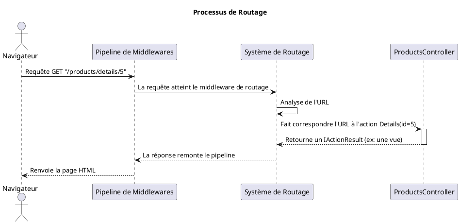
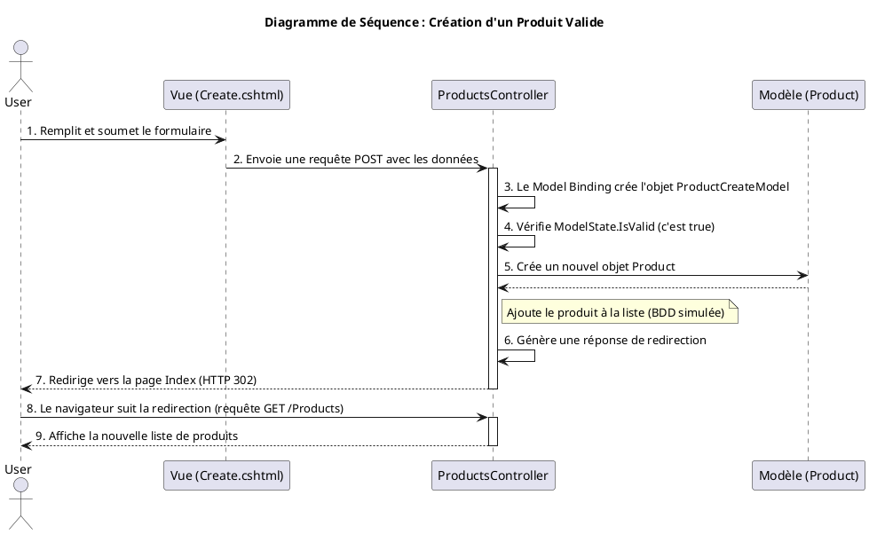

# Module 2 : Routage, Contrôleurs et Actions - L'essentiel

### Objectifs Pédagogiques

À la fin de ce module, vous serez en mesure de :

* **Maîtriser** le système de routage pour lier une URL à une action de contrôleur.
* **Différencier** et **utiliser** le routage par convention et le routage par attributs.
* **Créer** des contrôleurs et des actions pour gérer les requêtes des utilisateurs.
* **Retourner** des réponses appropriées en utilisant différents `IActionResult`.
* **Gérer** les données envoyées par l'utilisateur, que ce soit via l'URL (GET) ou via des formulaires (POST).
* **Implémenter** la validation des données pour garantir leur intégrité.
* **Passer** des données du contrôleur à la vue de manière sécurisée et efficace.

### Introduction : Le GPS de votre application

Imaginez que votre application est une grande ville. Les **contrôleurs** sont les quartiers (le quartier des finances,
le quartier commercial...) et les **actions** sont les bâtiments spécifiques à l'intérieur de ces quartiers (la banque,
le magasin de chaussures...). Quand un visiteur (une requête HTTP) arrive en ville avec une adresse (l'URL), comment
fait-il pour trouver le bon bâtiment ?

Il a besoin d'un GPS. Le **système de routage** d'ASP.NET Core est ce GPS. Il analyse l'URL et dit au visiteur : "Pour
cette adresse, vous devez aller dans le quartier `Products`, et chercher le bâtiment `Details`". Sans un bon système de
routage, toutes les requêtes seraient perdues. Maîtriser ce système est donc fondamental pour construire une application
qui fonctionne.

---

### 1. Le Système de Routage : Indiquer le chemin

Comment ASP.NET Core sait-il que l'URL `/Blog/Details/1` doit exécuter la méthode `Details(1)` à l'intérieur de la
classe `BlogController` ? C'est le travail du routage. Il existe deux manières principales de configurer ce GPS.

#### Le Routage par Convention : La Poste Standard

C'est l'approche classique, définie de manière centralisée dans `Program.cs`. Pensez-y comme le format d'adresse
standard de la poste : `Numéro Rue, Ville, Code Postal`. Toutes les adresses suivent le même modèle.

Dans `Program.cs`, vous avez cette ligne :

```c#
app.MapControllerRoute(
    name: "default",
    pattern: "{controller=Home}/{action=Index}/{id?}");
```

Ce `pattern` est une "recette" pour lire les URLs :

* `{controller=Home}` : Le premier segment de l'URL est le nom du contrôleur. S'il n'y en a pas, utilise "Home" par
  défaut.
* `{action=Index}` : Le deuxième segment est le nom de l'action (la méthode). S'il n'y en a pas, utilise "Index" par
  défaut.
* `{id?}` : Le troisième segment est un paramètre optionnel nommé "id". Le `?` le rend facultatif.

| URL demandée | Contrôleur | Action | Paramètre `id` |
| :--- | :--- | :--- | :--- |
| `/Products/List` | `ProductsController` | `List()` | `null` |
| `/Home/About` | `HomeController` | `About()` | `null` |
| `/Products/Details/5` | `ProductsController` | `Details()` | `5` |
| `/` | `HomeController` | `Index()` | `null` |

#### Le Routage par Attributs : Les Coordonnées GPS

C'est l'approche moderne, surtout pour les APIs. Au lieu d'une règle globale, vous placez "l'adresse" directement sur le
bâtiment (le contrôleur ou l'action) à l'aide d'attributs. C'est plus précis et plus lisible.

```c#
// On déclare une route de base pour tout le contrôleur
[Route("products")]
public class ProductsController : Controller
{
    // Cette action répond à GET /products
    [HttpGet]
    public IActionResult Index() { /* ... */ }

    // Cette action répond à GET /products/item/5
    [HttpGet("item/{id}")]
    public IActionResult Details(int id) { /* ... */ }
}
```

<tip>
Pour activer le routage par attributs, le middleware `app.MapControllers()` est souvent utilisé à la place ou en complément de `app.MapControllerRoute`. Les projets modernes (API, MVC) sont configurés pour que les deux fonctionnent.
</tip>




#### Exercice 1 : Associer les routes

Pour chacune des URLs suivantes, déterminez quel contrôleur et quelle action seraient appelés en utilisant la route par
convention `{controller=Home}/{action=Index}/{id?}`.

1. `/Store/Inventory`
2. `/User/Profile/123`
3. `/About`

##### Correction exercice 1 {collapsible='true'}

1. **URL :** `/Store/Inventory`

* **Contrôleur :** `StoreController`
* **Action :** `Inventory()`

2. **URL :** `/User/Profile/123`

* **Contrôleur :** `UserController`
* **Action :** `Profile(int id)` avec `id` valant `123`.

3. **URL :** `/About`

* **Contrôleur :** `AboutController` (le premier segment est le contrôleur)
* **Action :** `Index()` (car le deuxième segment est manquant, la valeur par défaut est utilisée)

---

### 2. Les Contrôleurs et les Actions : Les chefs d'orchestre

Un **contrôleur** est une classe C# qui hérite de `Microsoft.AspNetCore.Mvc.Controller`. Son rôle est de recevoir les
requêtes, d'effectuer des opérations (comme interroger un modèle) et de retourner une réponse. Une **action** est une
méthode publique à l'intérieur d'un contrôleur.

```c#
// Controllers/HomeController.cs
public class HomeController : Controller
{
    // Ceci est l'action "Index"
    public IActionResult Index()
    {
        // ... logique ...
        return View(); // Retourne la vue Index.cshtml
    }

    // Ceci est l'action "About"
    public IActionResult About()
    {
        // ... logique ...
        return View(); // Retourne la vue About.cshtml
    }
}
```

#### Les Résultats d'Actions (`IActionResult`)

Une action ne retourne pas directement du HTML. Elle retourne un "résultat", qui est un objet décrivant *ce qu'il faut
faire*. C'est `IActionResult`. Pensez-y comme un ordre donné par le chef d'orchestre.

Voici les ordres les plus courants :

* `View()` : "Génère le HTML à partir du fichier de vue correspondant et envoie-le."
* `RedirectToAction("Index", "Home")` : "Ne réponds rien, mais dis au navigateur d'aller immédiatement à l'action
  `Index` du `HomeController`."
* `NotFound()` : "Réponds que la ressource demandée n'existe pas (Erreur 404)."
* `Ok(data)` : "Réponds que tout s'est bien passé (Code 200) et envoie ces `data` (souvent utilisé pour les APIs)."
* `BadRequest()` : "Réponds que la requête du client était mal formée (Erreur 400)."

L'utilisation de `IActionResult` rend vos actions flexibles et faciles à tester.

#### Exercice 2 : Créer un contrôleur simple

Créez un nouveau contrôleur `FaqController` avec deux actions :

1. `Index()` qui retourne une simple `View()`.
2. `Help()` qui redirige l'utilisateur vers l'action `Index`.

##### Correction exercice 2 {collapsible='true'}

1. Créez un nouveau fichier `FaqController.cs` dans le dossier `Controllers`.
2. Ajoutez le code suivant :

   ```c#
   using Microsoft.AspNetCore.Mvc;

   namespace MonAppMvc.Controllers
   {
       public class FaqController : Controller
       {
           // Cette action sera accessible via /Faq ou /Faq/Index
           public IActionResult Index()
           {
               // Pour l'instant, on ne fait que retourner la vue.
               // ASP.NET Core cherchera le fichier /Views/Faq/Index.cshtml
               return View();
           }
   
           // Cette action sera accessible via /Faq/Help
           public IActionResult Help()
           {
               // On donne l'ordre de rediriger.
               return RedirectToAction("Index");
           }
       }
   }
   ```
   <tip>
   Pour que `return View()` fonctionne, vous devrez créer un dossier `Views/Faq` et un fichier `Index.cshtml` à l'intérieur, même s'il est vide.
   </tip>

---

### 3. Gestion des Données de la Requête : Écouter l'utilisateur

Une application devient intéressante quand l'utilisateur peut lui envoyer des informations. Voyons comment les
récupérer.

#### Données via GET (depuis l'URL)

* **Paramètres de route :** L'information fait partie de l'URL elle-même.
* URL : `/produit/details/5`
* Action : `public IActionResult Details(int id)`
* ASP.NET Core voit que le nom du paramètre dans la route (`{id?}`) correspond au nom du paramètre de la méthode (`id`)
  et fait le lien automatiquement.

* **Query String :** L'information est ajoutée à la fin de l'URL après un `?`.
* URL : `/produit/recherche?nom=livre&categorie=scolaire`
* Action : `public IActionResult Recherche(string nom, string categorie)`
* ASP.NET Core mappe les clés de la query string (`nom`, `categorie`) aux paramètres de la méthode.

#### Données via POST (depuis un formulaire) et le Model Binding

Pour des données plus complexes, comme un formulaire d'inscription, on utilise une requête POST. Mais comment récupérer
10 champs de formulaire dans une action sans écrire 10 paramètres ? C'est là qu'intervient le **Model Binding**.

Le Model Binding est un mécanisme automatique qui prend les données d'une requête (formulaire, query string...) et les
utilise pour remplir les propriétés d'un objet C#. C'est comme un assistant qui prend les post-its en désordre sur votre
bureau et les range proprement dans un classeur.

**Le processus :**

1. **Vous créez un Modèle :** Une classe C# qui représente les données que vous attendez.

   ```c#
   // Models/ProductCreateModel.cs
   public class ProductCreateModel
   {
       public string Name { get; set; }
       public decimal Price { get; set; }
       public int Stock { get; set; }
   }
   ```
2. **La Vue contient un formulaire** dont les champs (`<input>`) ont des attributs `name` qui correspondent aux
   propriétés du modèle.

   ```html
   <form asp-action="Create" method="post">
     <input type="text" name="Name" />
     <input type="number" name="Price" />
     <input type="number" name="Stock" />
     <button type="submit">Créer</button>
   </form>
   ```
3. **L'Action du contrôleur** accepte un objet de ce modèle en paramètre.

   ```c#
   public class ProductsController : Controller
   {
       [HttpPost] // Cette action ne répond qu'aux requêtes POST
       public IActionResult Create(ProductCreateModel model)
       {
           // Magie ! L'objet 'model' est automatiquement rempli
           // avec les données du formulaire.
           // model.Name aura la valeur de <input name="Name">
           
           // ... logique pour sauvegarder le produit ...
           
           return RedirectToAction("Index");
       }
   }
   ```

#### Validation des Données : Le garde du corps

Ne faites jamais confiance aux données de l'utilisateur ! La validation est essentielle. ASP.NET Core la rend très
simple avec les **Data Annotations**. Ce sont des attributs que vous placez sur les propriétés de votre modèle pour
définir des règles.

```c#
// Models/ProductCreateModel.cs
using System.ComponentModel.DataAnnotations;

public class ProductCreateModel
{
    [Required(ErrorMessage = "Le nom est obligatoire.")]
    [StringLength(50, MinimumLength = 3)]
    public string Name { get; set; }

    [Required]
    [Range(0.01, 10000.00, ErrorMessage = "Le prix doit être positif.")]
    public decimal Price { get; set; }

    [Range(0, 1000)]
    public int Stock { get; set; }
}
```

Dans l'action, avant de traiter les données, vous devez vérifier si elles sont valides en utilisant
`ModelState.IsValid`. C'est le rapport du garde du corps : "Chef, tout est en ordre !" ou "Chef, il y a un problème !".

```c#
[HttpPost]
public IActionResult Create(ProductCreateModel model)
{
    if (ModelState.IsValid)
    {
        // Le rapport est bon, on peut traiter les données
        // ... sauvegarder le produit ...
        return RedirectToAction("Index");
    }

    // Le rapport est mauvais. On ne traite rien.
    // On retourne à la vue du formulaire, en lui repassant le modèle.
    // La vue pourra ainsi afficher les erreurs ET les données déjà saisies.
    return View(model);
}
```

<warning>
Omettre la vérification `ModelState.IsValid` est une faille de sécurité et une source de bugs courante. Prenez l'habitude de toujours l'inclure dans vos actions qui reçoivent des données.
</warning>

---

### TP : Créer un gestionnaire de produits

Mettons tout cela en pratique en créant un contrôleur `ProductsController` pour lister, afficher et créer des produits,
avec validation.

#### Énoncé

<procedure>
<step title="Étape 1 : Créer le Modèle `Product` et le `ProductCreateModel`">
<p>Dans le dossier <code>Models</code>, créez un fichier <code>Product.cs</code> qui représentera un produit avec <code>Id</code>, <code>Name</code>, <code>Price</code>, <code>Stock</code>.
Créez également un <code>ProductCreateModel.cs</code> (similaire mais sans Id) avec les Data Annotations pour la validation (nom obligatoire, prix et stock positifs).</p>
</step>
<step title="Étape 2 : Créer le `ProductsController`">
<p>Créez le contrôleur et une fausse base de données (une liste statique de `Product`).</p>
<p>Implémentez deux actions :</p>
<ul>
    <li><code>Index()</code> : Récupère tous les produits et les passe à une vue.</li>
    <li><code>Details(int id)</code> : Récupère un produit par son Id et le passe à une vue. Gère le cas où le produit n'existe pas.</li>
</ul>
</step>
<step title="Étape 3 : Créer les Vues `Index` et `Details`">
<p>Créez les vues correspondantes pour afficher la liste des produits et les détails d'un produit. La liste doit contenir des liens vers les pages de détails.</p>
</step>
<step title="Étape 4 : Implémenter la création de produit">
<p>Ajoutez deux actions <code>Create</code> au contrôleur :</p>
<ul>
    <li>Une action <code>[HttpGet]</code> qui retourne simplement la vue du formulaire.</li>
    <li>Une action <code>[HttpPost]</code> qui reçoit un <code>ProductCreateModel</code>, vérifie <code>ModelState.IsValid</code>, crée le produit, l'ajoute à la liste et redirige vers <code>Index</code>. Si le modèle n'est pas valide, elle retourne la vue du formulaire.</li>
</ul>
</step>
<step title="Étape 5 : Créer la Vue `Create`">
<p>Créez la vue <code>Create.cshtml</code> avec un formulaire. Utilisez les Tag Helpers (<code>asp-for</code>, <code>asp-validation-for</code>) pour lier le formulaire au modèle et afficher les messages d'erreur.</p>
</step>
</procedure>



#### Correction TP : Créer un gestionnaire de produits {collapsible='true'}

<tabs>
<tab title="Modèles">
**`Models/Product.cs`**
```c#
namespace MonAppMvc.Models
{
    public class Product
    {
        public int Id { get; set; }
        public string Name { get; set; }
        public decimal Price { get; set; }
        public int Stock { get; set; }
    }
}
```

**`Models/ProductCreateModel.cs`**

```c#
using System.ComponentModel.DataAnnotations;

namespace MonAppMvc.Models
{
    public class ProductCreateModel
    {
        [Required(ErrorMessage = "Le nom du produit est obligatoire.")]
        [StringLength(100, MinimumLength = 3, 
            ErrorMessage = "Le nom doit faire entre 3 et 100 caractères.")]
        public string Name { get; set; }

        [Required(ErrorMessage = "Le prix est obligatoire.")]
        [Range(0.01, 10000.00, 
            ErrorMessage = "Le prix doit être compris entre 0.01 et 10000.")]
        public decimal Price { get; set; }

        [Range(0, int.MaxValue, ErrorMessage = "Le stock ne peut être négatif.")]
        public int Stock { get; set; }
    }
}
```

</tab>
<tab title="ProductsController.cs">

```c#
using Microsoft.AspNetCore.Mvc;
using MonAppMvc.Models;
using System.Collections.Generic;
using System.Linq;

namespace MonAppMvc.Controllers
{
    public class ProductsController : Controller
    {
        // BDD simulée. 'static' pour que la liste persiste.
        private static List<Product> _products = new List<Product>
        {
            new Product { Id = 1, Name = "Livre C#", Price = 29.99m, Stock = 50 },
            new Product { Id = 2, Name = "Clavier Mécanique", Price = 120m, Stock = 15 }
        };

        // GET: /Products
        public IActionResult Index()
        {
            return View(_products);
        }

        // GET: /Products/Details/1
        public IActionResult Details(int id)
        {
            var product = _products.FirstOrDefault(p => p.Id == id);
            if (product == null)
            {
                return NotFound(); // Retourne une erreur 404
            }
            return View(product);
        }

        // GET: /Products/Create
        // Affiche le formulaire de création
        public IActionResult Create()
        {
            return View();
        }

        // POST: /Products/Create
        // Traite le formulaire soumis
        [HttpPost]
        [ValidateAntiForgeryToken] // Sécurité contre les attaques CSRF
        public IActionResult Create(ProductCreateModel model)
        {
            if (ModelState.IsValid)
            {
                var newId = _products.Any() ? _products.Max(p => p.Id) + 1 : 1;
                
                var newProduct = new Product
                {
                    Id = newId,
                    Name = model.Name,
                    Price = model.Price,
                    Stock = model.Stock
                };

                _products.Add(newProduct);

                return RedirectToAction(nameof(Index)); // Redirige vers la liste
            }
            
            // Si le modèle n'est pas valide, on ré-affiche le formulaire
            return View(model);
        }
    }
}
```

</tab>
<tab title="Vues">

**`Views/Products/Index.cshtml`**

```html
@model IEnumerable<MonAppMvc.Models.Product>

@{ ViewData["Title"] = "Liste des Produits"; }

<h1>@ViewData["Title"]</h1>

<p><a asp-action="Create">Créer un nouveau produit</a></p>

<table class="table">
    <thead>
        <tr><th>Nom</th><th>Prix</th><th>Stock</th><th></th></tr>
    </thead>
    <tbody>
        @foreach (var item in Model) {
            <tr>
                <td>@item.Name</td>
                <td>@item.Price.ToString("C")</td>
                <td>@item.Stock</td>
                <td><a asp-action="Details" asp-route-id="@item.Id">Détails</a></td>
            </tr>
        }
    </tbody>
</table>
```

**`Views/Products/Details.cshtml`**

```html
@model MonAppMvc.Models.Product

@{ ViewData["Title"] = "Détails de " + Model.Name; }

<h1>@ViewData["Title"]</h1>

<div>
    <dl class="row">
        <dt class="col-sm-2">Nom</dt>
        <dd class="col-sm-10">@Model.Name</dd>
        <dt class="col-sm-2">Prix</dt>
        <dd class="col-sm-10">@Model.Price.ToString("C")</dd>
        <dt class="col-sm-2">En Stock</dt>
        <dd class="col-sm-10">@Model.Stock</dd>
    </dl>
</div>
<div>
    <a asp-action="Index">Retour à la liste</a>
</div>
```

**`Views/Products/Create.cshtml`**

```html
@model MonAppMvc.Models.ProductCreateModel

@{ ViewData["Title"] = "Créer un Produit"; }

<h1>@ViewData["Title"]</h1>
<hr/>
<div class="row">
    <div class="col-md-4">
        <form asp-action="Create" method="post">
            <div asp-validation-summary="ModelOnly" class="text-danger"></div>

            <div class="form-group">
                <label asp-for="Name" class="control-label"></label>
                <input asp-for="Name" class="form-control"/>
                <span asp-validation-for="Name" class="text-danger"></span>
            </div>
            <div class="form-group">
                <label asp-for="Price" class="control-label"></label>
                <input asp-for="Price" class="form-control"/>
                <span asp-validation-for="Price" class="text-danger"></span>
            </div>
            <div class="form-group">
                <label asp-for="Stock" class="control-label"></label>
                <input asp-for="Stock" class="form-control"/>
                <span asp-validation-for="Stock" class="text-danger"></span>
            </div>
            <br/>
            <div class="form-group">
                <input type="submit" value="Créer" class="btn btn-primary"/>
            </div>
        </form>
    </div>
</div>

<div>
    <a asp-action="Index">Retour à la liste</a>
</div>

@section Scripts {
@{await Html.RenderPartialAsync("_ValidationScriptsPartial");}
}
```

</tab>
</tabs>

---

### Auto-évaluation

1. Quelle est la route par convention par défaut dans un projet MVC ?
- a) `"{action}/{controller}/{id?}"`
- b) `"{controller=Home}/{action=Index}/{id?}"`
- c) `"/api/{controller}/{id}"`
- d) Il n'y en a pas par défaut.

2. Quel `IActionResult` utiliser pour renvoyer une erreur "Non trouvé" (404) ?
- a) `BadRequest()`
- b) `View("Error")`
- c) `NotFound()`
- d) `Ok(null)`

3. Quel est le rôle du "Model Binding" ?
- a) Lier une base de données au modèle.
- b) Lier une vue à un contrôleur.
- c) Convertir automatiquement les données d'une requête HTTP en un objet C#.
- d) Valider les données du modèle.

4. À quoi sert `ModelState.IsValid` ?
- a) À vérifier si la connexion à la base de données est active.
- b) À vérifier si le modèle de données respecte les règles de validation (Data Annotations).
- c) À vérifier si la vue correspond au modèle.
- d) À vérifier si l'URL est valide.

5. Expliquez la différence entre une action de contrôleur marquée avec `[HttpGet]` et une autre avec `[HttpPost]` pour
   une même route (ex: `/Products/Create`). Pourquoi avons-nous besoin des deux ?
6. Décrivez le flux de validation d'un formulaire, de la soumission par l'utilisateur jusqu'à l'affichage des messages
   d'erreur.
7. Quelle est la différence entre passer des données dans la route (ex: `/product/5`) et dans la query string (ex:
   `/product?id=5`) ? Quand utiliseriez-vous l'une ou l'autre ?

---

### Conclusion de "L'essentiel"

Vous avez fait d'énormes progrès aujourd'hui ! Vous êtes maintenant capable de tracer le parcours d'une requête, de la
barre d'adresse du navigateur jusqu'à la bonne méthode dans votre code. Vous savez comment créer des "intersections" (
contrôleurs) et des "destinations" (actions), et surtout, comment écouter et comprendre ce que l'utilisateur vous envoie
via des formulaires.

La validation des données est une compétence de sécurité et de robustesse fondamentale que vous venez d'acquérir. C'est
l'une des marques d'un développeur professionnel.

Dans le prochain module, nous allons nous concentrer sur la dernière pièce du puzzle MVC : la **Vue**. Nous verrons
comment, avec le moteur Razor, nous pouvons construire des interfaces HTML dynamiques et réutilisables pour présenter
joliment toutes les données que nous savons maintenant manipuler.

### Projets Suggérés pour Pratiquer

1. **Formulaire de Contact (Débutant)**

* **Description :** Créez un formulaire de contact simple (Nom, Email, Message).
* **Piste technique :** Créez un modèle `ContactViewModel` avec les Data Annotations (`[Required]`, `[EmailAddress]`).
  Créez un `ContactController` avec les actions `Create` (GET et POST). Dans l'action POST, si le modèle est valide,
  affichez une page de succès. Sinon, ré-affichez le formulaire avec les erreurs.

2. **Gestionnaire de Tâches Simplifié (Intermédiaire)**

* **Description :** Développez une application de "To-Do list". L'utilisateur doit pouvoir voir la liste des tâches,
  voir les détails d'une tâche, et en ajouter une nouvelle via un formulaire.
* **Piste technique :** Reprenez la structure du TP Produits. Créez un modèle `TodoItem` (Id, Title, Description,
  IsDone). Le `TodoController` gérera la liste en mémoire. Implémentez les actions `Index`, `Details` et `Create` (
  GET/POST) avec la validation.