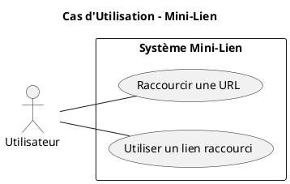
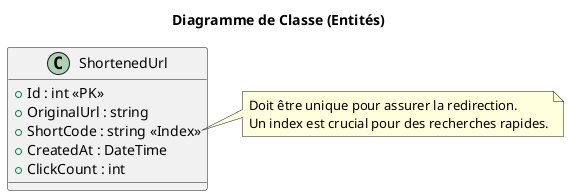

# Projet 1 : "Mini-Lien"

### Description du Projet

Vous en avez assez de partager des URLs longues, complexes et peu esthétiques ? Le projet **"Mini-Lien"** a pour but de
créer un service de raccourcissement d'URL. C'est une application web simple mais très formatrice, qui vous permettra de
mettre en pratique les compétences clés du développement ASP.NET Core.

L'utilisateur pourra soumettre une URL longue via un formulaire. L'application générera un code court unique,
l'enregistrera dans une base de données, et fournira à l'utilisateur un nouveau lien "mini". Lorsque quelqu'un visitera
ce mini-lien, il sera automatiquement et de manière transparente redirigé vers l'URL longue originale.

Nous utiliserons ASP.NET Core MVC, Entity Framework Core avec une base de données SQLite (très simple à mettre en place)
et le pattern Repository pour une architecture propre.

### Liste des Fonctionnalités

1. **Page d'accueil :** Une page simple avec un formulaire pour soumettre une URL à raccourcir.
2. **Raccourcissement d'URL :**
    * Validation de l'URL soumise.
    * Génération d'un code alphanumérique court et unique.
    * Enregistrement de la paire (URL originale, code court) en base de données.
3. **Page de succès :** Affichage du nouveau mini-lien généré à l'utilisateur.
4. **Redirection :**
    * Gestion des requêtes vers les mini-liens (ex: `http://mon-site.com/xYz123`).
    * Recherche du code court en base de données.
    * Redirection (HTTP 301) vers l'URL originale correspondante.
    * Gestion d'un code court inexistant (HTTP 404).
5. **Suivi des clics :** À chaque redirection réussie, incrémenter un compteur de clics pour le lien concerné.

### Diagramme de Cas d'Utilisation

### Diagramme de Classe des Entités

Nous n'aurons besoin que d'une seule entité pour ce projet, qui stockera toutes les informations nécessaires.

### User Stories

---

#### **User Story 1 : Raccourcir une URL**

**En tant qu'** utilisateur,
**Je veux** soumettre une URL longue dans un formulaire,
**Afin de** recevoir en retour une version courte et facile à partager.

* **Critères d'Acceptation :**
    1. La page d'accueil doit afficher un champ de saisie et un bouton "Raccourcir".
    2. Le champ de saisie ne doit accepter que des URLs valides et absolues (commençant par `http://` ou `https://`).
    3. Si l'URL soumise n'est pas valide, un message d'erreur clair doit être affiché sous le champ, sans quitter la
       page.
    4. Si l'URL est valide, un code unique de 6 caractères alphanumériques est généré.
    5. La nouvelle association (URL originale, code court) est sauvegardée en base de données.
    6. L'utilisateur est redirigé vers une page de succès qui affiche le nouveau lien complet (ex:
       `https://mini-lien.com/abcdef`).

* **Tests de Comportement (Given/When/Then) :**

  **Scénario 1 : Succès**
    * **Étant donné que** je suis sur la page d'accueil de "Mini-Lien"
    * **Quand** je saisis une URL valide comme "https://www.google.com" dans le formulaire et que je clique sur "
      Raccourcir"
    * **Alors** je suis redirigé vers une page de succès
    * **Et** cette page affiche un nouveau lien qui contient le nom de domaine du site et un code court.

  **Scénario 2 : Échec (URL invalide)**
    * **Étant donné que** je suis sur la page d'accueil de "Mini-Lien"
    * **Quand** je saisis un texte invalide comme "ceci-nest-pas-une-url" et que je clique sur "Raccourcir"
    * **Alors** la page d'accueil se recharge
    * **Et** un message d'erreur "Veuillez fournir une URL valide." s'affiche sous le champ de saisie.

* **Tâches Techniques :**
    1. Créer un projet ASP.NET Core MVC.
    2. Installer EF Core et le fournisseur SQLite (`Microsoft.EntityFrameworkCore.Sqlite`).
    3. Créer l'entité `ShortenedUrl`.
    4. Créer le `ApplicationDbContext` et l'enregistrer dans `Program.cs`.
    5. Créer un ViewModel `ShortenUrlViewModel` avec les Data Annotations (`[Required]`, `[Url]`).
    6. Créer un `HomeController` avec une action `Index()` [GET] pour afficher le formulaire.
    7. Créer une vue `Index.cshtml` avec le formulaire (`<form asp-action="Index">`).
    8. Modifier l'action `Index()` [POST] dans `HomeController` qui prend le ViewModel en paramètre.
    9. Dans l'action `Index` [POST], vérifier `ModelState.IsValid`.
    10. Créer un service (`UrlShorteningService`) pour la génération du code court unique (à injecter dans le
        contrôleur).
    11. Dans l'action `Index` [POST], si le modèle est valide, utiliser le service pour générer le code, créer une
        nouvelle entité `ShortenedUrl`, la sauvegarder avec EF Core, puis rediriger vers une action `Success`.
    12. Créer une action `Success(string shortCode)` et sa vue `Success.cshtml` pour afficher le résultat.

---

#### **User Story 2 : Utiliser un Lien Raccourci**

**En tant qu'** utilisateur,
**Je veux** visiter un lien raccourci que j'ai reçu,
**Afin d'** être redirigé vers le site web original.

* **Critères d'Acceptation :**
    1. Le système doit pouvoir intercepter les requêtes à la racine du site suivies d'un code court (ex: `/abcdef`).
    2. Le système doit rechercher le code court dans la base de données.
    3. Si le code est trouvé, le système doit effectuer une redirection HTTP 301 (Redirection Permanente) vers l'URL
       originale associée.
    4. Si le code est trouvé, le compteur de clics pour ce lien doit être incrémenté de 1 en base de données.
    5. Si le code n'est pas trouvé, le système doit retourner une page d'erreur HTTP 404 (Non Trouvé).

* **Tests de Comportement (Given/When/Then) :**

  **Scénario 1 : Redirection réussie**
    * **Étant donné qu'** un lien raccourci avec le code "g00gl3" existe et pointe vers "https://www.google.com"
    * **Et que** son compteur de clics est à 10
    * **Quand** je visite l'URL `http://mini-lien.com/g00gl3`
    * **Alors** mon navigateur est redirigé vers "https://www.google.com"
    * **Et** le compteur de clics pour le code "g00gl3" en base de données est maintenant de 11.

  **Scénario 2 : Lien inexistant**
    * **Étant donné qu'** il n'existe aucun lien associé au code "inconnu"
    * **Quand** je visite l'URL `http://mini-lien.com/inconnu`
    * **Alors** je vois une page d'erreur 404.

* **Tâches Techniques :**
    1. Configurer une route personnalisée dans `Program.cs` pour intercepter les requêtes de la forme `/{shortCode}`.
    2. Cette route doit pointer vers une nouvelle action, par exemple `RedirectToUrl(string shortCode)` dans un
       `RedirectController`.
    3. Dans cette action, utiliser EF Core pour rechercher une entité `ShortenedUrl` dont le `ShortCode` correspond au
       paramètre.
    4. Si aucune entité n'est trouvée, retourner `NotFound()`.
    5. Si une entité est trouvée :
        * Incrémenter la propriété `ClickCount`.
        * Appeler `_context.SaveChanges()`.
        * Retourner `RedirectPermanent(shortenedUrl.OriginalUrl)`.

---

### User Stories Bonus (pour les plus rapides)

#### **User Story 3 : Afficher les statistiques d'un lien**

**En tant qu'** utilisateur,
**Je veux** pouvoir voir les statistiques de mon lien raccourci (URL originale, date de création, nombre de clics),
**Afin de** savoir à quel point il est populaire.

* **Critères d'Acceptation :**
    1. La page de succès doit contenir un lien vers une page de statistiques.
    2. La page de statistiques est accessible via une URL comme `/stats/{shortCode}`.
    3. Cette page affiche l'URL originale, le lien raccourci, la date de création et le nombre total de clics.
    4. Si le code n'existe pas, une erreur 404 est affichée.

* **Tâches Techniques :**
    1. Créer une nouvelle action `Stats(string shortCode)` dans `HomeController`.
    2. Créer une vue `Stats.cshtml` qui prend un `ShortenedUrl` en modèle.
    3. Mettre à jour la vue `Success.cshtml` pour inclure un `<a>` pointant vers la nouvelle action.

#### **User Story 4 : Fournir une API de raccourcissement**

**En tant que** développeur,
**Je veux** pouvoir raccourcir une URL en faisant un appel API,
**Afin d'** intégrer le service dans mes propres applications.

* **Critères d'Acceptation :**
    1. Un endpoint d'API `POST /api/shorten` doit être disponible.
    2. Il doit accepter un corps de requête JSON contenant l'URL originale (ex: `{ "url": "https://..." }`).
    3. En cas de succès, il doit retourner une réponse JSON `201 Created` contenant le nouveau lien raccourci.
    4. En cas d'échec de validation, il doit retourner une réponse `400 Bad Request`.

* **Tâches Techniques :**
    1. Créer un `ApiController` nommé `ShortenController`.
    2. Créer une action `Post` qui prend un DTO `ShortenRequestDto` en `[FromBody]`.
    3. Réutiliser le `UrlShorteningService` pour générer le code et sauvegarder l'entité.
    4. Retourner un `CreatedAtActionResult` avec l'URL du nouveau mini-lien.

