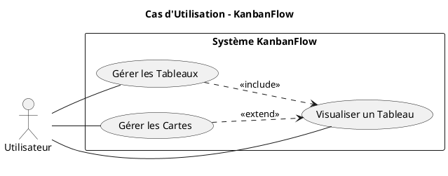
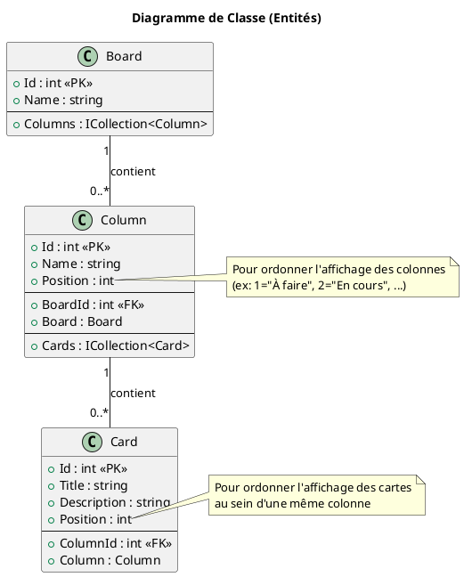

# Projet 2 : "KanbanFlow"

### Description du Projet

Le projet **"KanbanFlow"** vise à créer une application web de type tableau Kanban, une version simplifiée de Trello. L'objectif est de permettre aux utilisateurs de gérer des projets en organisant des tâches sous forme de cartes réparties dans différentes colonnes (ex: "À faire", "En cours", "Terminé").

Ce projet est plus ambitieux car il nécessite la gestion de plusieurs entités interdépendantes (`Board`, `Column`, `Card`) avec des relations un-à-plusieurs. Il vous demandera de concevoir une logique pour afficher et manipuler des données hiérarchiques, ainsi que pour gérer l'ordre des éléments. C'est un cas d'usage réel et très courant dans le développement d'applications.

L'architecture s'appuiera sur ASP.NET Core MVC, Entity Framework Core (avec SQLite pour la simplicité) et une structure de services bien définie pour la logique métier.

### Liste des Fonctionnalités

1.  **Gestion des Tableaux (Boards) :**
    *   Afficher la liste de tous les tableaux de projets.
    *   Créer un nouveau tableau avec un nom.

2.  **Affichage d'un Tableau :**
    *   Visualiser un tableau spécifique avec ses colonnes et les cartes qu'elles contiennent.
    *   Les colonnes et les cartes doivent être affichées dans un ordre défini.
    *   Chaque colonne doit avoir un formulaire pour ajouter rapidement une nouvelle carte.

3.  **Gestion des Cartes (Cards) :**
    *   Ajouter une nouvelle carte (avec un titre et une description) à une colonne spécifique.
    *   Déplacer une carte d'une colonne à une autre pour représenter l'avancement de la tâche.
    *   Supprimer une carte.

### Diagramme de Cas d'Utilisation

### Diagramme de Classe des Entités

Ce projet repose sur une hiérarchie claire de trois entités principales.

### User Stories

---

#### **User Story 1 : Gérer les Tableaux de Projets**

**En tant qu'** utilisateur,
**Je veux** créer et visualiser différents tableaux,
**Afin de** pouvoir organiser mes différents projets de manière séparée.

*   **Critères d'Acceptation :**
    1.  Une page d'accueil (`/boards`) liste tous les tableaux existants.
    2.  Chaque nom de tableau dans la liste est un lien cliquable vers la page de ce tableau.
    3.  La page d'accueil contient un formulaire simple pour créer un nouveau tableau en fournissant simplement un nom.
    4.  La création d'un tableau génère automatiquement 3 colonnes par défaut : "À faire", "En cours", "Terminé".
    5.  Après la création, l'utilisateur est redirigé vers la liste des tableaux où le nouveau tableau apparaît.

*   **Tests de Comportement (Given/When/Then) :**
    *   **Étant donné que** je suis sur la page de la liste des tableaux
    *   **Quand** je saisis "Projet Phoenix" dans le champ de création et que je clique sur "Créer"
    *   **Alors** la page se recharge
    *   **Et** "Projet Phoenix" apparaît dans la liste des tableaux.
    *   **Et** si je clique sur ce lien, j'arrive sur un tableau contenant les colonnes "À faire", "En cours" et "Terminé".

*   **Tâches Techniques :**
    1.  Créer le projet et installer les dépendances (EF Core, SQLite).
    2.  Créer les 3 entités : `Board`, `Column`, `Card`.
    3.  Créer le `DbContext`, ajouter les `DbSet` pour les 3 entités et le configurer dans `Program.cs`.
    4.  Exécuter une première migration pour créer la base de données.
    5.  Créer un `BoardController`.
    6.  Implémenter l'action `Index()` [GET] qui récupère et affiche tous les `Board`.
    7.  Créer la vue `Index.cshtml` pour `Board` avec la liste et le formulaire de création.
    8.  Implémenter une action `Create()` [POST] dans `BoardController`.
    9.  Cette action doit créer le `Board`, puis créer les 3 `Column` par défaut associées à ce `Board` (avec `Position` 1, 2 et 3).
    10. Sauvegarder les changements et rediriger vers l'action `Index`.

---

#### **User Story 2 : Visualiser un Tableau et Ajouter des Cartes**

**En tant qu'** utilisateur,
**Je veux** afficher un tableau spécifique avec ses colonnes et ses cartes,
**Afin de** avoir une vue d'ensemble de l'avancement de mon projet et pouvoir ajouter de nouvelles tâches.

*   **Critères d'Acceptation :**
    1.  En accédant à l'URL `/boards/details/{id}`, la page affiche le nom du tableau.
    2.  Les colonnes du tableau sont affichées horizontalement, ordonnées par leur `Position`.
    3.  À l'intérieur de chaque colonne, les cartes sont affichées verticalement, ordonnées par leur `Position`.
    4.  Chaque colonne contient un petit formulaire (titre, description) pour ajouter une nouvelle carte directement dans cette colonne.
    5.  L'ajout d'une carte la place en dernière position dans la colonne.

*   **Tests de Comportement (Given/When/Then) :**
    *   **Étant donné que** je suis sur la page du tableau "Projet Phoenix"
    *   **Quand** je remplis le formulaire d'ajout de la colonne "À faire" avec le titre "Créer la page de login" et que je clique sur "Ajouter"
    *   **Alors** la page du tableau se recharge
    *   **Et** une nouvelle carte intitulée "Créer la page de login" apparaît en bas de la colonne "À faire".

*   **Tâches Techniques :**
    1.  Dans `BoardController`, créer une action `Details(int id)`.
    2.  Cette action doit effectuer une requête EF Core pour récupérer le `Board` avec son `Id`, mais aussi ses `Columns` et les `Cards` de chaque colonne. **Indice :** `Include(...).ThenInclude(...)` sera votre meilleur ami.
    3.  La requête doit s'assurer que les colonnes et les cartes sont triées par leur `Position`.
    4.  Créer un ViewModel `BoardDetailsViewModel` pour transmettre ces données hiérarchiques à la vue.
    5.  Créer la vue `Details.cshtml` pour `Board`. Utiliser des boucles `@foreach` imbriquées pour afficher les colonnes, puis les cartes.
    6.  Dans la boucle des colonnes, inclure un `<form>` qui poste vers une nouvelle action `Create` d'un futur `CardController`. Ce formulaire doit inclure un champ caché pour `ColumnId`.
    7.  Créer un `CardController` avec une action `Create()` [POST].
    8.  Cette action doit calculer la `Position` de la nouvelle carte (le `Max(Position) + 1` pour cette colonne), créer l'entité `Card`, la sauvegarder, et rediriger vers la page `Details` du tableau parent.

---

#### **User Story 3 : Déplacer des Cartes**

**En tant qu'** utilisateur,
**Je veux** déplacer une carte d'une colonne à une autre,
**Afin de** mettre à jour le statut d'une tâche.

*   **Critères d'Acceptation :**
    1.  Chaque carte doit afficher des contrôles (ex: boutons "<" et ">") pour la déplacer dans la colonne précédente ou suivante.
    2.  Les contrôles de déplacement sont désactivés s'il n'y a pas de colonne cible (ex: pas de bouton "<" dans la première colonne).
    3.  Cliquer sur un bouton de déplacement met à jour la `ColumnId` de la carte en base de données.
    4.  Après le déplacement, la page du tableau est rechargée et la carte apparaît dans sa nouvelle colonne.

*   **Tests de Comportement (Given/When/Then) :**
    *   **Étant donné que** la carte "Créer la page de login" est dans la colonne "À faire" (Position 1)
    *   **Quand** je clique sur le bouton ">" (déplacer à droite) de cette carte
    *   **Alors** la page du tableau se recharge
    *   **Et** la carte "Créer la page de login" est maintenant visible dans la colonne "En cours" (Position 2).

*   **Tâches Techniques :**
    1.  Dans la vue `Details.cshtml` du tableau, à l'intérieur de la boucle des cartes, ajouter deux formulaires (un pour chaque bouton "<" et ">").
    2.  Ces formulaires posteront vers une nouvelle action `Move()` dans `CardController`. Ils enverront l'ID de la carte.
    3.  L'action `Move(int id, string direction)` recevra l'ID de la carte et une chaîne indiquant la direction ("left" ou "right").
    4.  La logique de l'action `Move` sera la suivante :
        a. Récupérer la carte et sa colonne actuelle (`Include(c => c.Column)`).
        b. Déterminer la `Position` de la colonne cible (Position actuelle +/- 1).
        c. Trouver la colonne cible dans la BDD qui a cette nouvelle position et le même `BoardId`.
        d. Si une colonne cible est trouvée, mettre à jour la `ColumnId` de la carte.
        e. Sauvegarder les changements.
        f. Rediriger vers la page `Details` du tableau (`/boards/details/{boardId}`).

---

### User Stories Bonus (pour les plus rapides)

#### **User Story 4 : Ré-ordonner les cartes dans une colonne**

**En tant qu'** utilisateur,
**Je veux** pouvoir changer l'ordre des cartes au sein d'une même colonne,
**Afin de** prioriser mes tâches.

*   **Tâches Techniques :**
    *   Ajouter des boutons "Monter" et "Descendre" sur chaque carte.
    *   Créer une action `Reorder(int id, string direction)` dans `CardController`.
    *   La logique devra intervertir les valeurs de `Position` entre la carte sélectionnée et sa voisine dans la même colonne. Attention aux transactions pour garantir la cohérence des données.

#### **User Story 5 : Authentification et Tableaux par Utilisateur**

**En tant qu'** utilisateur enregistré,
**Je veux** que mes tableaux de projets ne soient visibles et modifiables que par moi,
**Afin de** garder mes informations privées.

*   **Tâches Techniques :**
    *   Intégrer ASP.NET Core Identity.
    *   Ajouter une relation entre `ApplicationUser` et `Board` (un utilisateur a plusieurs tableaux).
    *   Modifier toutes les requêtes et logiques pour filtrer les tableaux par l'ID de l'utilisateur connecté.
    *   Sécuriser les contrôleurs avec l'attribut `[Authorize]`.

#### **User Story 6 : Interface Drag and Drop**

**En tant qu'** utilisateur,
**Je veux** pouvoir déplacer et ré-ordonner mes cartes par glisser-déposer,
**Afin d'** avoir une expérience utilisateur plus fluide et intuitive.

*   **Tâches Techniques :**
    *   Intégrer une librairie JavaScript comme `SortableJS`.
    *   Créer des endpoints d'API (plutôt que des actions MVC postant des formulaires) pour mettre à jour la position et la colonne d'une carte.
    *   Utiliser JavaScript pour appeler ces APIs en arrière-plan lorsque l'utilisateur a fini de glisser une carte.